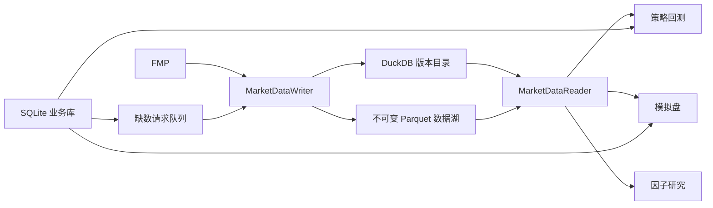

# Multi-Factor Quant Research Platform

这是一个美股多因子研究、策略回测和日线模拟盘平台。当前生产数据架构是：



核心原则：FMP 日线只有一个写入入口；研究、回测、排行和模拟盘只读取已经通过质量门禁的
明确数据版本，不允许直接调用 FMP，也不允许回退到旧行情目录。

## 主要模块

| 模块 | 入口或目录 | 职责 |
|---|---|---|
| 配置 | `configs/default.yaml` | 股票池、数据、因子、回测、费用、Web 和定时参数 |
| 行情基础设施 | `src/data/foundation.py` | 摄取、质量校验、不可变版本发布和统一读取 |
| 全美宽基数据 | `src/data/security_master_store.py`、`src/data/broad_coverage.py` | 稳定证券身份、全美行情覆盖和月分片发布 |
| 宽基 PIT/因子数据 | `src/data/derived_universe.py`、`src/factors/broad_pipeline.py` | `US_LIQUID_5M` PIT 比较池和可浏览 raw/clean/rank |
| PIT 股票池 | `src/data/sp500_pit.py`、`src/data/pit.py` | 重建并校验历史成分，防止幸存者偏差 |
| 因子 | `src/factors/` | raw factor 计算和因子注册 |
| 因子清洗 | `src/preprocessing/` | 去极值、中性化、横截面 z-score |
| 因子评估 | `src/analysis/` | IC、ICIR、统计置信、稳定性和可交易性 |
| 策略 | `src/strategies/` | 多因子权重配方，主记录保存在 SQLite |
| 回测 | `src/backtest/` | 版本绑定、逐票目标权重、成交、成本和净值 |
| 模拟盘 | `src/papertrading/` | 订单、pending、成交、持仓、现金和每日净值 |
| Web | `src/webapp/` | FastAPI 页面与 API |
| 独立运维监控 | `src/operations/`、`src/operations_web/` | 汇总结构化运行证据，在独立端口提供只读状态页面 |
| 缺数队列 | `src/data/request_worker.py` | 为 Watchlist 创建并发布专属行情版本 |
| 动量与独立研究 | `src/breakouts/`、`src/market_regime_research/` | 独立扫描和大盘状态研究，不暗中修改多因子分数 |

## 存储职责

| 路径 | 内容 | 是否可直接修改 |
|---|---|---|
| `data/catalog/quant.duckdb` | ingestion、质量检查、数据版本和正式发布指针 | 否，只由 writer 更新 |
| `data/lake/` | 不可变 OHLCV、股票池和 PIT 快照 Parquet | 否 |
| `data/pit_universes/` | 当前正式 SP500 PIT 发布文件 | 否，只由 PIT writer 更新 |
| `outputs/quant_app.sqlite3` | 策略、Watchlist、回测任务、模拟盘账本、缺数队列 | 通过业务 API 修改 |
| `outputs/universes/` | 因子矩阵、IC、置信评估、分组回测和研究发布清单 | 由研究任务重建 |
| `outputs/backtests/<id>/` | 大型回测结果 Parquet、日志和决策回放 | 由回测任务生成 |

旧 `data/raw/ohlcv`、`data/processed` 以及业务 JSON/Parquet 影子已经退出项目目录。完整说明见
[`docs/unified_data_storage.md`](docs/unified_data_storage.md)。

## 本地启动

在项目根目录执行：

```bash
cd /Users/huozhihong/Documents/Quant
python3 -m venv .venv
source .venv/bin/activate
pip install -r requirements.txt
```

FMP key 只用于数据 writer 和合法的实时接口：

```bash
export FMP_API_KEY="你的_key"
```

查看已有正式数据版本和 SQLite 健康状态：

```bash
python scripts/run_data_pipeline.py status
python scripts/check_app_storage.py
```

只启动已有页面，不更新数据或研究：

```bash
python scripts/run_mvp.py --serve-only --host 127.0.0.1 --port 18823
```

浏览器访问 `http://127.0.0.1:18823`。

独立运维站不挂到主业务页面。先生成状态快照，再在 `18825` 启动：

```bash
python scripts/run_operations_watchdog.py --no-systemd
python scripts/run_operations_web.py --host 127.0.0.1 --port 18825
```

浏览器访问 `http://127.0.0.1:18825`。完整证据口径和 SG 安装方式见
[`docs/operations_observability.md`](docs/operations_observability.md)。

## 数据与研究更新

手动执行完整主链时，顺序如下：

```bash
# 1. 重建并严格发布 SP500 PIT
python scripts/run_data_pipeline.py pit

# 2. 增量摄取并发布 SP500、MAG7 行情版本
python scripts/run_data_pipeline.py update

# 3. 只读取刚发布的版本，重建因子研究
python scripts/run_factor_research.py
```

`scripts/run_mvp.py --update` 只重算研究，不负责向 FMP 摄取行情。测试少量静态池可使用：

```bash
python scripts/run_mvp.py --no-web --only-universe MAG7 --universe 5
```

动态 SP500 不允许用 `--universe N` 截断后伪装成正式 PIT 研究。

全美宽基代码已经独立实现，但 2019 起正式全量数据和 SG 五日影子尚未完成。首次回填、11:30
日常增量和页面默认切换不能混入上面的指数研究命令，必须按
[`docs/us_broad_factor_research_implementation.md`](docs/us_broad_factor_research_implementation.md)
执行。当前 latest-known 行业不能发布正式宽基 IC/ICIR/confidence。

## Web 业务对象

| 页面 | 作用 |
|---|---|
| `/factors` | 因子定义、研究结果和置信评估 |
| `/strategies` | 创建多因子权重策略 |
| `/watchlists` | 创建自定义股票池并触发行情缺数请求 |
| `/backtests` | 创建异步回测并查看逐票持仓、交易和成本 |
| `/paper` | 创建和查看日线模拟盘账户 |

策略、Watchlist、回测任务和模拟盘账户只保存在 `outputs/quant_app.sqlite3`。回测的大型时间序列
仍使用 Parquet；这属于分析存储设计，不是旧业务存储回退。

## 研究与成交约束

- 动态股票池必须有有效 PIT 成分，静态 MAG7 才允许没有 PIT。
- `next_open` 必须使用下一交易日真实 `open`，缺失时任务失败，不回退 `close`。
- 因子清洗顺序是 raw factor、去极值、中性化、横截面 z-score，再计算 IC。
- 回测和模拟盘共用 `src/execution/` 的滑点与费用模型。
- 每次回测和模拟盘运行保存明确的行情版本、因子发布版本和校验摘要。
- Watchlist 缺数时进入 `WAITING_FOR_DATA`，由统一 worker 发布数据后再恢复，不直接联网补洞。

交易费用和滑点参数见 [`docs/trading_costs.md`](docs/trading_costs.md)，PIT 契约见
[`docs/point_in_time_universe.md`](docs/point_in_time_universe.md)。

## 推荐阅读顺序

1. [`docs/code_reading_guide.md`](docs/code_reading_guide.md)
2. [`configs/default.yaml`](configs/default.yaml)
3. [`scripts/run_data_pipeline.py`](scripts/run_data_pipeline.py)
4. [`src/data/foundation.py`](src/data/foundation.py)
5. [`scripts/run_mvp.py`](scripts/run_mvp.py)
6. [`docs/unified_data_storage.md`](docs/unified_data_storage.md)
7. [`docs/project_architecture.md`](docs/project_architecture.md)

## SG 运维

当前服务器的时间线、服务状态和检查命令见
[`docs/sg_operations_overview.md`](docs/sg_operations_overview.md)；日常命令见
[`docs/server_daily_runbook.md`](docs/server_daily_runbook.md)。本地修改不会自动出现在 SG，必须经过
明确的代码发布、依赖检查、systemd 校验、服务重启和页面验收。

## 测试

```bash
python -m pytest -q
```

## License

MIT
