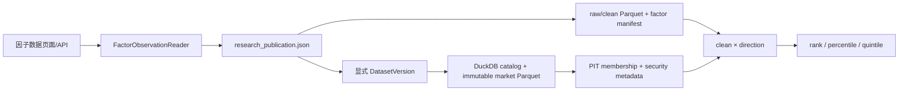

# 因子数据浏览器实现说明

更新日期：2026-08-12
状态：指数池浏览器已在 SG 验收；全美宽基 adapter 本地完成但正式数据和 SG 影子尚未上线

## 1. 用户入口

左侧导航的“研究”组新增“因子数据”：

```text
GET /research/factor-data
```

页面有两个视图：

- 日期截面：某个正式交易日中，完整 PIT 股票池内所有历史证券的 raw、clean、单因子排名和百分位；
- 单股历史：某只股票在 factor generation 全区间内逐日的 raw、clean、排名、百分位和 PIT 状态。

因子详情和研究股票池详情可以进入该页面。旧 `/stock/{ticker}`、旧 `/api/stock/{ticker}`、旧
`single_stock.py` 和旧单股模板已经删除，不再保留 FMP 临时重算或 raw 升序排名口径。

## 2. 代码边界

| 文件 | 职责 |
|---|---|
| `src/factors/observations.py` | 校验 publication、generation、行情版本和 PIT；派生 rank、percentile、quintile |
| `src/factors/broad_observations.py` | 查询宽基 long Parquet、Security Master 和完整 PIT 截面 |
| `src/factors/data_publication.py` | 校验宽基 factor-data publication 及全部父版本/子分片哈希 |
| `src/webapp/research_routes.py` | meta、snapshot、history、CSV 和页面路由 |
| `src/webapp/templates/factor_data.html` | 两个视图的结构与可访问控件 |
| `src/webapp/static/js/factor_data.js` | URL 状态、查询、表格、Plotly、分页和 fail-closed 状态 |
| `src/webapp/static/css/style.css` | 桌面、移动端、宽表滚动和状态样式 |
| `tests/test_factor_observations.py` | 方向、PIT、版本篡改、并发切换、API、导出和旧入口回归 |

Web 路由不读取 Parquet 路径，也不自己计算排名。页面、JSON API 和 CSV 全部经过同一个
`FactorObservationReader`。

## 3. 严格数据流



SP500/NASDAQ100/MAG7 读取 `research_publication.json`；全美宽基读取独立
`factor_data_publication.json`。两个 backend 返回同一结果类型，但后者只能声明因子数据可用，不能
声明置信研究通过。

每次冷读取会校验：

1. 当前正式 publication 的 schema、状态、股票池和截止交易日；
2. 因子 generation ID、manifest SHA-256、raw/clean 文件哈希和矩阵严格对齐；
3. publication 绑定的明确行情 version，不读取另一个 latest；
4. bars、universe、membership、manifest 四类行情版本完整性；
5. 当前日期的 PIT membership；
6. 因子注册表方向与 generation manifest 中方向一致。

查询返回前再次核对 publication 身份。若查询期间发布切换，完整重试一次；仍变化则返回
`409 PUBLICATION_CHANGED`。缓存键包含 universe、publication、factor、generation、factor
manifest 和 dataset version，不能跨版本复用。

## 4. 排名口径

```text
eligible = 当日 PIT 成分 AND clean 为有限数
oriented = clean × direction
rank = oriented 降序排名，ties=min
percentile = oriented 升序百分位，ties=average
```

- `rank=1` 永远表示按预设方向最优；
- 正向因子 clean 越高越优，负向因子 clean 越低越优；
- 同值共享数学排名，同排名只用 ticker 升序确定显示顺序；
- 搜索、状态筛选和分页发生在完整截面排名之后，不改变分母；
- rank 不写 SQLite，由 clean、direction 和 PIT membership 确定性派生。

## 5. API

```text
GET /api/research/factor-data/meta
GET /api/research/factor-data/snapshot
GET /api/research/factor-data/history
GET /api/research/factor-data/export
GET /api/securities/search
```

证券搜索查询 Security Master，不再要求输入 ticker 先属于当前指数 generation。宽基正式发布后，
MDB、AEVA 等非指数股票可在 `US_LIQUID_5M` 查询；影子期页面仍默认 SP500，用户可以显式选择宽基。

snapshot 与 history 共用同一逐行构造函数，所以同一个 `date × ticker` 的 raw、clean、rank、
percentile、quintile、PIT 和状态完全一致。CSV 每行附带 publication ID、factor generation ID、
dataset version ID 和 factor manifest SHA-256。

## 6. Fail-closed 行为

下列情况不会调 FMP、不会读旧 `data/raw/ohlcv`、不会换股票池，也不会换成另一个行情版本：

- 研究未发布、已过期或完整性无效；
- 因子不在当前 publication；
- raw/clean 或 PIT 文件哈希不匹配；
- 日期不是该 generation 的正式观测日；
- 股票从未出现在该 generation；
- 查询过程中 publication 切换。

页面显示中文业务状态。非交易日会展示前后正式观测日并允许显式跳转；NASDAQ100 未发布时会
说明仍需 PIT、行情版本和因子研究发布。

宽基页面另有 `web_default_enabled` 灰度门槛。正式数据存在但五日影子尚未通过时，宽基仍可被显式
选择验收，但不会自动成为默认股票池。

## 7. 本地与 SG 验收

- 完整测试：`409 passed`；
- 隔离的已签名 publication 样本：正向/负向排名、PIT 加入退出、分页、单股历史、图表、日期回跳通过；
- SP500 正式 DatasetVersion：`6d080d2a1822440f8b64ea536a246d50`，范围
  `2020-01-02` 至 `2026-08-07`，970,339 行、619 个历史证券；
- SP500 正式研究 publication：`7f0472d3-8c8e-447c-af98-70d91a469218`，8 个因子的
  generation 均为 `2021-08-09` 至 `2026-08-07`；
- MAG7 正式 DatasetVersion：`4da3efdf67624a1db7c559d764917387`；正式研究 publication：
  `0522bac7-5b94-4e64-b0db-c214f5306b74`；
- SG NASDAQ100 DatasetVersion：`9c5abc4b58a5414e911153cdda6a429c`，范围
  `2020-01-02` 至 `2026-08-10`，248,893 行、165 个历史/当前证券；
- SG NASDAQ100 research publication：`763f89c3-3b62-4fd2-9d6b-968f3bf4b4b2`；
- 最新 `MOM_12M` 截面绑定上述 publication、factor generation、dataset manifest 和 PIT hash，
  102 个 PIT 成员中 100 个 clean 有效；
- 真实 SP500 `MOM_12M/AAPL` 冷查询 1.65 秒、热查询 0.09 秒；单股历史热查询 0.02 秒以内；
- 负向 `VOL_60D` 的前三名已确认按 `clean × -1` 排名；`FRC` 在 2023-05-03 显示
  `NOT_PIT_MEMBER`，不参与当日排名；
- 浏览器控制台：无未处理错误；
- 1440px 页面无整体横向溢出，宽表只在自身容器内保留 74px 横向滚动；
- 390px 页面无整体横向溢出，宽表仅在自己的滚动容器内横向滚动，筛选器和按钮均在视口内。

## 8. 尚未完成的性能门槛

SG 功能、哈希合同和页面验收已经完成。重启 Web 后实测：

```text
冷 snapshot  2.558781s
热 snapshot  0.076481s - 0.077047s
history       0.201320s
```

热缓存和 history 达标；单次冷缓存高于 `<2s` 目标。后续应对首次 publication/hash 校验和矩阵加载
做启动预热或性能剖析，再采集多次冷启动样本计算 p95。优化完成前只能声明“生产功能可用”，不能
声明“生产性能验收完成”。
