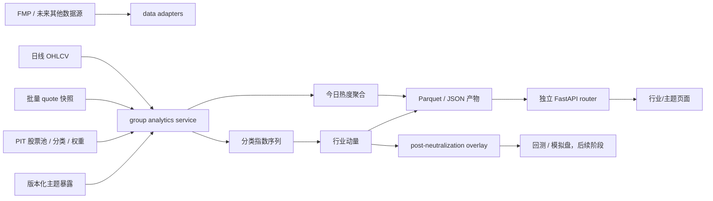

# 行业/主题今日热度与行业动量需求文档

> 文档状态：开发需求基线  
> 版本：1.1  
> 日期：2026-07-15  
> 适用项目：Quant 多因子研究平台  
> 目标读者：产品、量化研究、后端、前端、测试、运维

需求关键词定义：

- **MUST / 必须**：缺失即不能通过对应阶段验收；
- **SHOULD / 应当**：默认实现，只有记录明确原因后才可延期；
- **MAY / 可选**：不阻塞当前阶段，可以后续迭代。

阶段适用规则：本文描述完整目标态；某项 MUST 只对 §30 指定的实施阶段生效。阶段 1 的签收范围以 §30.1 的范围基线和 §31.1 为最高优先级，不能用后续阶段的 MUST 阻塞阶段 1。

## 1. 文档目的

本文档定义“行业/主题今日热度”和“行业动量”两项能力的产品范围、数据要求、算法、接口、页面、测试、上线门槛与项目接入方式，可直接作为开发设计和验收依据。

本功能来自对参考 Google Sheet“今日分類漲跌”的逐格审计，但不复制其实现。参考表的核心是：

```text
人工 Cat. 分类
-> GOOGLEFINANCE 个股当日涨跌
-> 分类内简单等权平均
-> 按平均涨跌降序
-> 展示 Top 10 / Bottom 10
```

这种方案适合快速观察热点，但存在小样本、极端股票、缺失值按 0、股票与 ETF 混合、静态分类和榜单字段错位等风险。本项目应保留其“看多数股票往哪里走”的直觉，同时补齐可审计性、数据质量和正式行业动量方法。

参考表：

- [Google Sheet：gid=1226858951](https://docs.google.com/spreadsheets/u/0/d/18EWLoHkh2aiJIKQsJnjOjPo63QFxkUE2U_K8ffHCn1E/htmlview?pli=1#gid=1226858951)
- [Google Sheet：gid=1056652701](https://docs.google.com/spreadsheets/u/0/d/18EWLoHkh2aiJIKQsJnjOjPo63QFxkUE2U_K8ffHCn1E/htmlview?pli=1#gid=1056652701)

## 2. 核心结论与产品边界

本模块必须将以下概念严格分开：

1. **今日分类热度**：描述某个行业或主题在同一快照时点的整体涨跌，主要服务盘面监控。
2. **分类市场宽度**：描述上涨是否由多数成分共同参与，用于识别“单一股票拉动”。
3. **行业动量**：描述行业在 6 个月、12 个月等中期窗口上的风险调整相对强弱，属于研究信号。
4. **策略行业倾斜**：把经过验证的行业动量叠加到已经行业中性化的个股 Alpha，属于策略层能力。

禁止以下混淆：

- 不得把“今日上涨第一”直接称为“行业动量第一”。
- 不得把分类内个股 RS 排名的平均值当成行业指数的历史收益。
- 不得把主题、标准行业、ETF 代理放在同一个排行榜中。
- 不得把当前市值称为历史自由流通市值。
- 不得把缺失报价填成 0% 后参加平均。
- 不得在当前行业中性化之前加入行业动量，否则该信号会被回归消除。

## 3. 与当前项目的关系

### 3.1 当前已有能力

当前项目已经具备：

- `SP500`、`US_ACTIVE` 等股票池；
- `ticker / name / sector / sub_industry` 元数据；
- 日线 `open / close / adj_close / volume / returns` 宽表；
- FMP 批量实时报价 `price / previousClose / volume / marketCap / timestamp`；
- 1M、3M、6M、12M 个股动量；
- MAD 去极值、行业/市值中性化和横截面 Z-score；
- point-in-time 股票池成员支持；
- FastAPI + Jinja 页面；
- Parquet/JSON 本地产物、systemd 定时任务和 `unittest` 测试模式。

### 3.2 当前缺口

当前项目尚不具备：

- 分类级等权、中位数、市值加权和市场宽度计算；
- 历史分类指数序列；
- point-in-time 行业分类历史；
- 历史自由流通市值；
- 发行主体级去重；
- 行业动量因子；
- 行业/主题独立页面与 API；
- 因子级预处理策略，现有预处理是全局行业中性化。

### 3.3 必须遵守的接入原则

- 新领域代码放在 `src/group_analytics/`，不得放入 Web router。
- 页面与 CLI 只调用领域 service；领域模块不得反向导入 FastAPI。
- 不继续向已经过大的 `src/webapp/routes_v2.py` 增加业务；使用独立 router。
- Web 请求只读预计算产物，不得在请求中批量联网或全市场重算。
- 新功能默认关闭策略接入，不改变现有个股因子、回测、模拟盘或动量告警结果。
- 历史行业动量在 PIT 分类和滞后权重不合格时只能标记为研究版，严格模式必须失败。

## 4. 产品目标

### 4.1 今日热度

回答以下问题：

- 今天哪些标准行业或自定义主题普遍上涨或下跌？
- 结果是由多数股票共同推动，还是由一两只股票主导？
- 等权、中位数和市值加权是否一致？
- 样本量、报价覆盖和报价新鲜度是否足以相信这个排名？
- 哪些股票是最大正贡献和最大负贡献来源？

### 4.2 行业动量

回答以下问题：

- 哪些行业在跳过最近 1 个月后，6M、12M 相对基准持续领先？
- 领先是否只是高波动造成？
- 行业动量是否有足够历史覆盖和横截面可比性？
- 该信号加入当前个股 Alpha 后，样本外收益、IC、换手和行业集中度是否改善？

### 4.3 成功标准

- 用户能够清楚区分今日热度与中期行业动量。
- 每个分类行都包含 `N、coverage、confidence、数据时间`。
- 每个分类数值都可追溯到成员、权重、原始收益、截尾后收益和贡献度。
- Top/Bottom 从同一个已排序对象动态截取，不存在不同列错位。
- 结果可通过 `run_id + parameter_hash + taxonomy_version` 复现。
- 页面失败时可显示上一次成功结果，但必须明确标记过期或上次任务失败。

## 5. 用户故事

- 作为研究员，我希望切换 `SP500 / US_ACTIVE / Watchlist`，查看标准行业、子行业和自定义主题今日热度。
- 作为研究员，我希望同时看到截尾等权、中位数、市值加权、上涨比例和样本数，避免被单票极端行情误导。
- 作为研究员，我希望点击分类查看所有成员、异常值、缺失原因和贡献度。
- 作为因子研究人员，我希望取得按日期保存、版本化的分类指数和行业动量矩阵。
- 作为策略开发人员，我希望行业动量作为个股行业中性 Alpha 之后的显式 overlay，而不是隐藏在普通因子预处理中。
- 作为运维人员，我希望知道快照是否新鲜、任务是否成功、覆盖率是否异常，并能回滚到上一成功产物。

## 6. 非目标

首期明确不包含：

- 自动交易或自动修改模拟盘仓位；
- Discord 买卖信号；
- 交易所级低延迟行情或逐笔订单流；
- 将 OHLCV 推断值称为真实“资金净流入”；
- 自动由大模型修改生产主题分类；
- ETF 持仓穿透；
- 在没有历史数据时，用当前分类或当前市值回填历史并称为正式回测；
- 修改现有 MOM_1M/MOM_3M/MOM_6M/MOM_12M 定义；
- 改变现有行业中性化默认行为；
- 宣称 FMP 的 `sector/sub_industry` 是获得许可的官方 GICS 数据。

## 7. 术语与核心符号

设：

- (i)：证券或 ticker；
- (j)：统计单位 counting unit；阶段 1 为 `security_with_overrides`，完整主数据上线后可迁移为 issuer/company；
- (g)：行业或主题分类；
- (t)：交易日；
- (s)：盘中快照时点；
- (a_{j,g,t})：统计单位对分类的暴露；
- (r_{j,t})：统计单位收益；
- (M_{j,t-1})：上一交易日可得市值；
- (N_{g,t})：预期成员数；
- (N^{valid}_{g,t})：有效收益成员数。

标准行业同层互斥：

\[
a_{j,g,t}\in\{0,1\}
\]

主题允许多标签：

\[
a_{j,g,t}\in[0,1]
\]

同一公司可以属于多个主题，不要求不同主题暴露之和等于 1。

## 8. 总体架构



### 8.1 推荐模块

```text
src/group_analytics/
  __init__.py
  models.py              # dataclass / schema / reason codes
  settings.py            # group_analytics 配置解析
  classification.py      # 当前与 PIT 分类、主题暴露、发行主体去重
  returns.py             # EOD/live 个股与发行主体收益
  aggregation.py         # EW/RobustEW/Median/Cap/Breadth/RVOL/Contribution
  index_series.py        # 分类指数链式计算
  momentum.py            # 6M-1M、12M-1M、风险调整和截面标准化
  confidence.py          # coverage/freshness/quality/confidence
  artifacts.py           # 中立产物读写、版本和原子发布
  service.py             # CLI/Web 共用的业务编排

src/webapp/group_analytics_routes.py
src/webapp/templates/group_analytics.html
src/webapp/templates/group_detail.html
src/webapp/static/js/group_analytics.js

scripts/run_group_analytics.py

tests/test_group_analytics.py
tests/test_group_pit.py
tests/test_group_momentum.py
tests/test_group_analytics_routes.py
```

`src/webapp/app.py` 只负责注册 `group_analytics_routes`。分类、行情聚合、缓存判断和历史计算一律不得在 router 中实现。

### 8.2 领域接口

数据源与算法之间 MUST 使用接口隔离，避免业务逻辑绑定 FMP：

```python
class ClassificationProvider(Protocol):
    def snapshot(self, *, universe, taxonomy, level, asof, knowledge_cutoff): ...

class QuoteSnapshotProvider(Protocol):
    def snapshot(self, *, symbols, cutoff_time): ...

class HistoricalWeightProvider(Protocol):
    def weights(self, *, symbols, asof, weight_type): ...

class GroupArtifactStore(Protocol):
    def publish(self, run): ...
    def load_latest(self, key): ...
```

FMP 只作为 provider 实现；测试使用内存 fixture provider，不发真实网络请求。

## 9. 分类与主数据设计

### 9.1 标准行业层

标准行业用于归因、风控和行业动量，同一发行主体在同一日期、taxonomy、level 下最多一个有效分类。

支持层级：

```text
sector
industry_group       # 数据源支持后启用
industry             # 数据源支持后启用
sub_industry
```

当前 FMP 数据只能标记为：

```text
taxonomy = FMP
source = FMP universe/profile metadata
```

只有在确认授权和字段语义后，才允许使用 `GICS` 或 `ICB` 名称。

请求 `taxonomy=FMP` 时，分类 provider 禁止静默回退 Wikipedia。若确需使用 Wikipedia，必须发布为独立 `taxonomy=WIKIPEDIA` 组合和版本；来源不明旧缓存只能标 `UNKNOWN_LEGACY_CACHE`，不得进入阶段 1 Release Gate。

### 9.2 主题层

主题用于 AI、Cyber Security、SaaS、Semi-Equip 等跨行业概念：

- 同一发行主体可同时属于多个主题；
- 必须保存暴露分数、来源、证据、审核状态和有效期；
- 主题收益不能相加到 100%；
- 主题不得用于标准行业风险归因；
- 行业与主题不得混合做横截面 Z-score。

默认主题纳入阈值：

```yaml
min_theme_exposure: 0.20
```

### 9.3 发行主体与证券主表

目标表：

```text
security_master
- security_id
- issuer_id
- ticker
- name
- asset_type
- exchange
- currency
- share_class
- primary_listing
- valid_from
- valid_to
- source
- source_version
```

阶段 1 尚无可靠 `issuer_id` 数据源，因此固定采用 `security_with_overrides`：默认每个 ticker 一票，版本化人工 override 可合并已确认的多股类。必须：

- 输出 `issuer_dedupe_status=NONE|PARTIAL_OVERRIDES|FULL`；阶段 1 只能是前两种，不能误报 FULL；
- 对 GOOG/GOOGL 等已知多股类使用版本化人工 override；
- 输出 `counting_unit=security_with_overrides`、`issuer_overrides_applied`、`issuer_override_count`、`issuer_dedupe_source` 和 `issuer_override_version`；
- 不得把临时结果称为发行主体等权。

完整 issuer master/provider 是后续目标态；启用后必须提升 taxonomy/algorithm version，不得在同一版本内静默改变计数单位。

### 9.4 分类成员表

```text
classification_membership
- issuer_id
- security_id               # 阶段1必填；完整 issuer provider 后可由 issuer 级记录派生
- taxonomy                  # FMP / GICS / ICB / INTERNAL_THEME
- taxonomy_version
- level
- group_id
- group_name
- exposure                  # 行业恒为1；主题0~1
- primary_flag
- valid_from
- valid_to                  # 左闭右开
- available_at              # 系统何时可得
- source
- source_version
- evidence
- review_status
- reviewer
- created_at
```

有效条件：

\[
valid\_from\le t<valid\_to
\]

且：

\[
available\_at\le signal\_knowledge\_cutoff(t,s)
\]

`signal_knowledge_cutoff` 是该信号在历史上实际允许知道信息的时点：EOD 默认是信号日收盘及供应商既定发布延迟之后，盘中是 snapshot watermark；绝不能使用本次重跑程序的当前时间。`available_at` 用于防止后来补录的分类被提前用于回测。现有 PIT 股票池接口并不自动提供该字段，新 ClassificationProvider 必须显式实现和测试。

### 9.5 数据文件建议

```text
data/reference/security_master.parquet
data/pit_classifications/<TAXONOMY>/<UNIVERSE>.parquet
data/theme_exposures/<THEME_SET>/<VERSION>.parquet
data/processed/<UNIVERSE>/market_cap.parquet
data/processed/<UNIVERSE>/free_float_market_cap.parquet
```

历史行业动量必须同时满足：

```yaml
require_point_in_time_universe: true
require_point_in_time_classification: true
```

缺少任一项时：

- 可以生成 `STATIC_MAPPING_RESEARCH_ONLY`；
- 不允许标记为生产回测；
- strict 模式必须失败；
- 不允许静默使用当前分类回填历史。

## 10. 有效成员与资产范围

必须区分“预期成员”和“有效观察”。预期成员只由当时股票池、分类、证券有效性和显式资产范围决定，不能先按是否有报价、收益、市值或移动平均数据过滤，否则 coverage 会被虚高。

预期成员必须同时满足：

1. 是当时的股票池成员；
2. 是当时的分类成员；
3. 证券当时有效挂牌；
4. 满足资产类型条件；
5. 满足预先声明的资产范围。

\[
E_{j,g,t}=U_{j,t}\cdot C_{j,g,t}\cdot L_{j,t}\cdot A_{j,t}
\]

在此集合上定义 `n_expected`。报价、收益、市值、RVOL 或移动平均缺失只会使成员进入相应指标的 invalid 集合，不得从 `n_expected` 消失。若另设可交易流动性范围，必须命名为 `tradable_scope`，用 t-1 可得数据筛选，并使用独立 universe/version，不能临时改变分类统计分母。

阶段 1 只计算“最新完整 EOD 的 current-snapshot heat”，允许 `pit_universe_applied=false`、`pit_classification_applied=false`，但必须如实记录分类快照和来源。任何跨历史日分类指数、动量或回测在阶段 3 前只能标记 `STATIC_MAPPING_RESEARCH_ONLY`，不得冒充 PIT 结果。对于 PIT 股票池，若旧快照没有独立 `available_at`，strict 模式必须使用其发布/落盘时间作为 known-at 证据，无法证明时拒绝生产回测。

### 10.1 多股类

阶段 1 默认统计单位：

```yaml
counting_unit: security_with_overrides
```

人工 override 已确认同一发行主体的多个股类时：

1. 有股类市值时，按上一日股类市值聚合为发行主体收益；
2. 无股类市值时，选择截至上一交易日 60 日平均成交额最高的股类；
3. 代表股类选择不得依据当日涨跌临时切换；
4. breadth 只给合并后的单位一票；
5. 未被 override 覆盖的 ticker 保持 security 口径，并在 run diagnostics 报告可能重复的候选。

若同一 override 下的证券在相同 taxonomy/level 出现冲突分类，禁止静默合并；该 counting unit 对相关分类无效并记录 `ISSUER_CLASSIFICATION_CONFLICT`，待人工修正 override/provider。

完整 issuer provider 上线后，目标口径改为 `issuer`，但属于独立数据迁移，必须提供新旧口径并行对账。

### 10.2 ADR

- 股票池只有 ADR 时，ADR 可作为代表证券；
- ADR 与本土主上市同时存在时，根据目标市场和截至上一日的成交额确定代表证券；
- 同一发行主体不得重复计入 breadth。

### 10.3 ETF

默认：

```yaml
include_etfs: false
```

ETF 不直接混入股票行业或主题，因为会产生底层股票重复暴露。ETF 代理应单独分类：

```text
ETF_SECTOR_PROXY
ETF_THEME_PROXY
```

MVP 不做 ETF 持仓穿透。

## 11. 收益计算

### 11.1 EOD 最终收益

使用复权收盘价：

\[
r^{total}_{i,t}=\frac{AdjClose_{i,t}}{AdjClose_{i,t-1}}-1
\]

批量实现 MUST 显式使用 `pct_change(fill_method=None)` 或等价直接除法，禁止由 Pandas 默认前向填充把价格断档变成 0% 收益。

规则：

- 缺失收益保持 `NaN`，禁止填 0；
- 新上市没有前一日价格时为缺失；
- 原始收益必须保留；
- 截尾只作用于聚合，不改写底层收益；
- EOD 结果标记 `return_status=FINAL`；
- 历史行业动量只能使用 FINAL 数据。

退市证券禁止无限前填最后价格。若 provider 无法提供退市现金/合并对价等最终回报，记录 `MISSING_DELISTING_RETURN`；阶段 1 从当日聚合排除并降低 coverage，阶段 3 strict 因子构建必须拒绝该受影响窗口。

### 11.2 盘中今日收益

使用一次逻辑快照中的 `price` 和 `previousClose` 自行计算：

\[
r^{live}_{i,t,s}=\frac{Price_{i,t,s}}{PreviousClose_{i,t}}-1
\]

不得直接依赖供应商 `changePercentage` 的单位。

有效条件：

```text
price > 0
previousClose > 0
quote_timestamp 属于当前交易日
quote_age <= max_quote_age_seconds
current_session_volume > 0
```

默认：

```yaml
max_quote_age_seconds: 300
max_future_clock_skew_seconds: 60
max_snapshot_span_seconds: 120
```

FMP batch quote 会按 chunk 串行返回“各证券最新值”，不是真正同一微秒快照。每次 run 必须记录 `retrieval_started_at`、`retrieval_ended_at`、每票 timestamp 和 fresh quotes 上的 `snapshot_span_seconds=max(ts)-min(ts)`；超过 `max_snapshot_span_seconds` 时 run 验证失败、记录 `SNAPSHOT_SPAN_EXCEEDED` 且不切 latest pointer。headline 接受 watermark 前每票最新且 age 合格的报价。如果产品未来要求严格 as-of cutoff，必须切换到支持历史 cutoff 的 provider，或使用同一个已完成 5 分钟 bar，不能声称 batch quote 已实现精确同步。

输出必须区分：

```text
return_1d_price_live
return_1d_total_eod
return_status = PROVISIONAL | FINAL
```

### 11.3 供应商字段交叉校验

`changePercentage` 只用于交叉检查。FMP adapter 必须先按供应商契约把百分数统一转换为小数收益，领域层不得猜单位。自行计算值与归一化供应商值差异超过 5bp 时产生：

```text
QUOTE_RETURN_MISMATCH
```

不得自动选择“更好看”的一个值。

### 11.4 公司行动检查

若有公司行动事件源，必须先按证券和 session 查询拆股、合股、特别分红等事件，不能只靠收益阈值触发。事件源暂不可用时使用保守启发式：

\[
|r^{live}|>30\%
\]

并检查价格比是否接近常见拆合股比例、前收盘是否已调整。这样可覆盖 2:1 的约 -50% 和 3:2 的约 -33% 假收益。无法确认时：

```text
quality_flag = CORPORATE_ACTION_UNVERIFIED
valid_for_group_return = false
```

EOD 使用复权数据重新计算后可覆盖临时判断。

## 12. 分类今日涨跌聚合

分类有效成员集合：

\[
S_{g,t}=\{j:E_{j,g,t}=1,\ r_{j,t}\text{有效}\}
\]

统一零样本规则：若 `n_expected=0` 或 `n_valid=0`，所有收益、Median、MAD/Std、Breadth、Contribution 和 direction confidence 均为 null，`quality_status=NO_DATA`、`eligible_for_ranking=false`，并记录 `NO_EXPECTED_MEMBERS` 或 `NO_VALID_MEMBERS`；任何公式不得除以 0。

### 12.1 原始等权收益

\[
R^{EW}_{g,t}=\frac{1}{N^{valid}_{g,t}}\sum_{j\in S_{g,t}}r_{j,t}
\]

该字段用于审计和保持与参考表可比，但不是默认主榜字段。

### 12.2 MAD 截尾等权收益

计算：

\[
m_{g,t}=Median(r_{j,t})
\]

\[
MAD_{g,t}=Median(|r_{j,t}-m_{g,t}|)
\]

\[
\sigma^{robust}_{g,t}=1.4826\times MAD_{g,t}
\]

默认边界：

\[
Lower=m-3\sigma^{robust},\quad Upper=m+3\sigma^{robust}
\]

\[
\tilde r_{j,t}=\min(\max(r_{j,t},Lower),Upper)
\]

\[
R^{RobustEW}_{g,t}=\frac1{N^{valid}_{g,t}}\sum_{j\in S_{g,t}}\tilde r_{j,t}
\]

默认：

```yaml
winsorize_method: mad
winsorize_n: 3.0
min_members_for_winsorize: 5
headline_method: ROBUST_EW
```

边界条件：

- `N<5`：不做截尾，但标记低置信度；
- `MAD=0`：保持原值，不报错；
- 输出原始和截尾后收益；
- 输出每只股票是否被截尾、截尾前后值和截尾边界；
- 主榜默认按 `robust_ew_return_1d` 排序。

### 12.3 中位数收益

\[
R^{Median}_{g,t}=Median(r_{j,t})
\]

中位数用于表示“典型成员”，不能命名为可投资组合收益。

### 12.4 主题暴露加权收益

主题可额外计算：

\[
R^{ExposureEW}_{g,t}=\frac{\sum_{j\in S_{g,t}} a_{j,g,t}r_{j,t}}{\sum_{j\in S_{g,t}} a_{j,g,t}}
\]

求和只遍历有效收益主题成员；分母为 0 时返回 null。该字段必须明确命名为暴露加权，不能称为等权。

### 12.5 市值加权收益

目标算法使用上一交易日自由流通市值：

\[
w^{cap}_{j,g,t}=\frac{a_{j,g,t}M_{j,t-1}}{\sum_{k\in S_{g,t}}a_{k,g,t}M_{k,t-1}}
\]

\[
R^{Cap}_{g,t}=\sum w^{cap}_{j,g,t}r_{j,t}
\]

数据源优先级：

```text
historical_free_float_cap
historical_total_market_cap
unavailable
```

必须输出：

```text
cap_type = FREE_FLOAT | TOTAL | UNAVAILABLE
```

分别计算：

\[
CapAvailabilityCoverage=
\frac{\#\{j\in Expected:M_{j,t-1}\ valid\}}{N^{expected}}
\]

\[
CapReturnCoverage=
\frac{\sum_{j:M\ valid,r\ valid}M_{j,t-1}}{\sum_{j:M\ valid}M_{j,t-1}}
\]

上式对标准行业 `a=1`；主题 CAP 必须用基础权重 `b_j=a_{j,g,t}M_{j,t-1}` 替换 M 的分子和分母。

两项都达到配置门槛后才允许输出正式 CAP；否则 `cap_return_1d=null`、`cap_status=UNAVAILABLE`。`ESTIMATED` 首版删除，除非未来单独定义来源、推导公式和允许用途，并禁止进入正式历史因子。

一日热度可以按上述优先级选择并显式展示 `cap_type`；但历史序列必须分成 `CAP_FF` 与 `CAP_TOTAL` 两个冻结方法，禁止把逐日 fallback 后的混合序列用于动量。

约束：

- 当前 FMP `marketCap` 不能向历史回填；
- 当前 `marketCap` 不能称为自由流通市值；
- 当日权重必须使用 t-1 可得数据；
- 数据缺失时结果为 null，不得静默回退等权。

当前 `cleaner.py` 只会在已有 `market_cap.parquet` 时读取，项目没有历史市值生产 job，且尚未接入自由流通市值文件。阶段 3 前必须新增 `HistoricalWeightProvider`、下载/校验任务和数据许可记录；不得假设现有 MVP pipeline 会生成这些权重。

### 12.6 封顶市值权重

同时提供可选封顶版本，默认单一发行主体上限：

```yaml
max_constituent_weight: 0.25
```

必须使用迭代再分配，不能简单 clip 后归一，因为归一后可能再次超限。

参考伪代码：

```python
def capped_weights(base_weight: Series, configured_cap: float) -> Series:
    if not isfinite(configured_cap) or not (0 < configured_cap <= 1):
        raise ValueError("configured_cap must be finite and in (0, 1]")
    if base_weight.empty or not isfinite(base_weight).all() or (base_weight < 0).any():
        raise ValueError("base weights must be non-empty, finite and non-negative")
    base = base_weight[base_weight > 0]
    if base.empty:
        return Series(dtype=float)

    base = base / base.sum()
    effective_cap = max(configured_cap, 1.0 / len(base))
    remaining = set(base.index)
    remaining_mass = 1.0
    result = Series(0.0, index=base.index)

    while remaining:
        denominator = base.loc[list(remaining)].sum()
        candidate = {
            i: remaining_mass * base[i] / denominator
            for i in remaining
        }
        over = {i for i, weight in candidate.items() if weight > effective_cap}

        if not over:
            for i, weight in candidate.items():
                result[i] = weight
            break

        for i in over:
            result[i] = effective_cap
        remaining_mass -= effective_cap * len(over)
        remaining -= over

    assert abs(result.sum() - 1.0) <= 1e-12
    assert result.max() <= effective_cap + 1e-12
    return result
```

若：

\[
N<\lceil1/cap\rceil
\]

原上限数学上不可行，可使用：

\[
cap_{effective}=\max(cap,1/N)
\]

并输出：

```text
cap_relaxed = true
cap_effective
```

### 12.7 权重有效成分数

\[
N^{effective}=\frac1{\sum w_j^2}
\]

名义成员很多但 `N_effective` 很低，说明分类被少数龙头主导。

## 13. 市场宽度

默认设置 1bp 不变区间：

```yaml
unchanged_band_bps: 1
```

\[
Advance_j=1(r_j>0.0001)
\]

\[
Decline_j=1(r_j<-0.0001)
\]

\[
Unchanged_j=1-Advance_j-Decline_j
\]

核心指标：

\[
UpPct=\frac{\#Advance}{N^{valid}}
\]

\[
DownPct=\frac{\#Decline}{N^{valid}}
\]

\[
BreadthNet=\frac{\#Advance-\#Decline}{N^{valid}}
\]

\[
ADRatio=\frac{\#Advance+0.5}{\#Decline+0.5}
\]

趋势宽度：

```text
pct_above_ma20
pct_above_ma50
pct_above_ma200
pct_positive_20d
pct_positive_60d
```

每个宽度指标保存自己的有效分母。覆盖率低于配置阈值时输出 null，不得共用其他指标的分母。

## 14. 覆盖率、新鲜度和质量

### 14.1 Count Coverage

\[
CountCoverage=\frac{N^{valid}}{N^{expected}}
\]

### 14.2 Weight Coverage

\[
WeightCoverage=\frac{\sum_{j\in valid}b_j}{\sum_{j\in expected}b_j}
\]

其中 (b_j) 是目标指标的基础权重；等权时每个当前 counting unit 的基础权重为 1。

必须分别输出：

```text
quote_count_coverage
return_count_coverage
cap_availability_coverage
cap_return_coverage
ma20_coverage
ma50_coverage
ma200_coverage
rvol_coverage
```

### 14.3 盘中新鲜度

\[
FreshQuote_j=1(-MaxFutureSkew\le QuoteAgeSeconds_j\le MaxQuoteAgeSeconds)
\]

\[
FreshQuoteCoverage=\frac{\sum b_jFreshQuote_j}{\sum b_j}
\]

门槛使用二元 `fresh_quote_coverage`，因此“5 分钟内有效”不会被误写成“平均只能 1 分钟”。另输出连续诊断分数，但不用于有效性 gate：

\[
QuoteAgeScore_j=Clip\left(1-\frac{\max(QuoteAgeSeconds_j,0)}{MaxQuoteAgeSeconds},0,1\right)
\]

\[
MeanQuoteAgeScore=\frac{\sum b_jQuoteAgeScore_j}{\sum b_j}
\]

输出：

```text
oldest_quote_timestamp
newest_quote_timestamp
max_quote_age_seconds
median_quote_age_seconds
snapshot_span_seconds
fresh_quote_coverage
mean_quote_age_score
```

只有 `QuoteAgeSeconds < -MaxFutureSkew` 才标 `FUTURE_QUOTE_TIMESTAMP`。`snapshot_span_seconds` 只在先通过 future-skew 和 max-age 校验的 fresh quotes 上计算；已判 stale/future 的异常票不应二次把整个 run 的 span 拉爆。

### 14.4 数据质量分数

\[
NScore=\min\left(1,\frac{HeadlineN^{effective}}{10}\right)
\]

\[
SnapshotQuality=100\times(
0.35CountCoverage+
0.25WeightCoverage+
0.20FreshQuoteCoverage+
0.20NScore)
\]

EOD 模式下 `FreshQuoteCoverage=1`，但这只表示 FINAL 日线输入通过；产物是否过期由独立的 `freshness_status` 表达。

分类行的 `snapshot_quality_score/grade` MUST 以 headline `RobustEW` 的等权基础权重计算；此时 `headline_n_effective=n_valid`。市值方法单独输出 `cap_n_effective`；`Cap`、`RVOL`、`MA breadth` 另有各自 coverage 和可用状态，不能因为 headline quality 为 A 就推断所有附加指标都可用。

质量等级：

```text
A: SnapshotQuality >= 90 且 N_valid >= 10
B: SnapshotQuality >= 75 且 N_valid >= 5
C: SnapshotQuality >= 60 且 N_valid >= 3
D: 其他
```

默认主榜门槛：

```yaml
min_rank_members: 5
min_rank_count_coverage: 0.80
min_rank_freshness_coverage: 0.80
allowed_quality_grades: [A, B]
```

不满足门槛的分类仍可在“显示低置信度”模式查看，但 `eligible_for_ranking=false` 并列出原因。

### 14.5 方向置信度

\[
Agreement=|2UpPct-1|
\]

\[
SE^{robust}=\frac{1.4826MAD}{\sqrt{HeadlineN^{effective}}}
\]

\[
SNR=\frac{|R^{RobustEW}|}{|R^{RobustEW}|+SE^{robust}+10^{-8}}
\]

\[
DirectionConfidence=SnapshotQuality\times(0.6Agreement+0.4SNR)
\]

输出字段为 `direction_confidence_score`。该值表示分类方向的一致性和数据可靠性，不能解释为上涨概率，也不参与阶段 1 ranking gate；阶段 1 页面可不展示。

## 15. RVOL

### 15.1 盘中同时间 RVOL

不得把当前累计成交量除以过去完整日均量。对 5 分钟桶 (m)：

\[
RVOL_{i,t,m}=\frac{CumVolume_{i,t,m}}{Median(CumVolume_{i,t-k,m}),k=1,\dots,20}
\]

默认：

```yaml
rvol:
  interval_minutes: 5
  lookback_sessions: 20
  min_history_sessions: 10
  lower_clip: 0.20
  upper_clip: 5.00
  regular_hours_only: true
```

要求：

- 当前与历史使用相同交易分钟；
- 使用 `America/New_York` 处理夏令时；
- 开盘第一个桶完成前标记预热；
- 半日市使用有效交易分钟；
- 历史不足 10 日时为 null；
- 历史同分钟累计量中位数 `<=0`、当前累计量 `<=0` 或计算后 RVOL `<=0` 时为 invalid，禁止对 0/负数取对数；
- batch quote 累计量若无法确认是否含盘前，只能标记 `QUOTE_APPROXIMATION`，不得进入正式评分。

### 15.2 分类 RVOL

RVOL 强右偏，分类层使用对数截尾几何平均：

\[
GroupRVOL=\exp(Mean(Clip(\ln RVOL_i,\ln0.2,\ln5)))
\]

额外输出：

\[
RVOLBreadth=\frac{\#(RVOL_i\ge1.5)}{N^{valid\ RVOL}}
\]

\[
VolumeConfirmation=
\frac{\#(RVOL_i\ge1.5\land sign(r_i)=sign(R^{RobustEW}_g))}{N^{valid\ RVOL}}
\]

当 `|R^{RobustEW}_g|<=1bp` 时方向不明确，`VolumeConfirmation=null`。RVOL 覆盖率低于 60% 时不展示分类 RVOL。当前仓库没有覆盖 SP500×20 日同分钟历史的缓存/provider；RVOL 不属于阶段 2 必做项，只有 intraday history provider、配额和缓存验收后才启用。

## 16. 贡献度与驱动股票

贡献必须绑定 `return_method`：

```text
RAW_EW      contribution = raw_return / n_valid
ROBUST_EW   contribution = winsorized_return / n_valid
CAP_FF/CAP_TOTAL = 对应 cap 权重 × raw_return
CAPPED_CAP_FF_M/Q 或 CAPPED_CAP_TOTAL_M/Q = 对应再平衡权重 × raw_return
MEDIAN      不存在可加总 contribution
```

对每个可加总方法均要求：

\[
R^{method}_{g,t}=\sum_j Contribution^{method}_{j,g,t}
\]

成员输出：

```text
weight
raw_return
winsorized_return
contribution
contribution_bps
contribution_rank
was_winsorized
missing_reason
quote_timestamp
```

\[
ContributionBps=10000\times Contribution
\]

Top/Bottom driver 必须按贡献度排序，不是按个股涨跌幅排序。

阶段 1 headline driver 固定使用 `driver_method=ROBUST_EW`；贡献同分按 ticker 升序形成确定性顺序。单票贡献集中度定义为：

\[
SingleNameConcentration=
\frac{\max_j|Contribution_j|}{\sum_j|Contribution_j|}
\]

分母为 0 时返回 null。默认警告阈值为 0.35，并输出 `SINGLE_NAME_CONCENTRATION`。

分类总收益接近 0 时不展示“贡献占总收益百分比”，只展示贡献 bp。

## 17. 基准和相对强弱

### 17.1 单日相对收益

\[
RelativeReturn_{g,t}=\frac{1+R_{g,t}}{1+R_{benchmark,t}}-1
\]

不得用简单差值作为正式累计相对收益。

默认基准：

```text
SP500 / 标准行业：SPY
US_ACTIVE：VTI，SPY 为可选
科技主题：主基准仍为 SPY，QQQ 为辅助基准
```

分类与基准必须使用相同截止时间和一致收益口径。

### 17.2 多周期相对强弱

显示：

```text
headline_relative_return_1d
headline_relative_return_5d
headline_relative_return_20d
headline_relative_return_60d
```

这些展示字段均跟随 envelope 的 `headline_method`；阶段 3 长表则必须显式包含 `return_method`。

分类指数必须按每日分类收益链式计算：

\[
Index_{g,t}=Index_{g,t-1}(1+R_{g,t})
\]

不得对“当前成员”的多日收益做一次平均来冒充历史分类指数。

### 17.3 Leave-one-group-out 诊断

大型行业与包含自身的基准比较会机械压缩相对强弱。研究模式应提供：

\[
R_{b,-g}=\frac{\sum_{k\notin g}w_kr_k}{\sum_{k\notin g}w_k}
\]

该诊断只适用于互斥、近似穷尽，且能在证券层以同一权重口径重构基准的标准行业；必须从基准证券集合排除 g 后重算。重叠主题不得使用该公式。

该指标作为诊断，不替代默认统一基准。

## 18. 分类指数序列

### 18.1 日频指数

至少生成以下独立序列，禁止静默切换方法：

```text
GROUP_ROBUST_EW_DAILY
GROUP_EW_DAILY
GROUP_CAP_FF
GROUP_CAP_TOTAL
GROUP_CAPPED_CAP_FF_M
GROUP_CAPPED_CAP_FF_Q
THEME_EXPOSURE_EW
THEME_EXPOSURE_CAP_FF
THEME_EXPOSURE_CAP_TOTAL
```

`GROUP_ROBUST_EW_DAILY` 是每日重新形成并等权的研究热度序列，不宣称为低换手可投资指数。

`GROUP_CAP_* / GROUP_CAPPED_CAP_*` 使用 t-1 权重、公司行动处理和成员变更，作为正式行业动量优先数据源。整条正式序列必须冻结 cap type；自由流通市值缺失时该 `*_FF` 日无效，不得中途切为 TOTAL。TOTAL 必须使用独立 method/factor ID。

日收益进入指数前必须通过方法专属 gate：默认 `index_min_count_coverage=0.80`，CAP/CAPPED_CAP 另要求 `index_min_cap_return_coverage=0.90`。不合格日 `index_level=null`、`is_continuous=false`；禁止前填后把该日解释成 0% 市场收益。下一有效日递增 `segment_id` 并从 100 重启，任何端点收益都只能在同一 segment 内计算。行业动量的成对日 log-sum 可按 §19 容忍少量缺日，但不能借用跨 segment 端点。

`GROUP_CAP_FF/TOTAL` 每日使用 t-1 可得的对应 cap 权重。`GROUP_CAPPED_CAP_FF_M` 默认在每月最后一个交易日收盘后，以当日可得自由流通市值执行迭代封顶，下一交易日生效；同时研究 `*_Q` 版本。非再平衡日权重漂移为：

\[
w_{i,t}=\frac{w_{i,t-1}(1+r_{i,t})}{1+R_{g,t}}
\]

月中发生成员新增、删除或跨行业变更时，在分类变更实际可得且生效日前一收盘触发该受影响组的特殊再平衡：以 t-1 冻结 cap 对新成员赋初始权重、删除旧成员并对全部当前成员重新执行封顶，下一交易日生效。无法提前知道的变更按 `available_at` 后首个可交易 session 生效。特殊再平衡必须记录 event type、turnover 和交易成本。cap type 与再平衡频率必须进入 `return_method`、factor ID、manifest 和成本模型，例如 `IND_MOM_CAPPED_CAP_FF_M`，不得共用一个 ID。

### 18.2 成员变更

- 日期 t 使用 t 当时有效成员；
- 权重只使用 t-1 及之前已知信息；
- 增删成分不得造成非市场指数跳变；
- 本项目选择“每日组合收益链”作为连续化实现，归一权重变化直接形成下一日组合；不得再叠加第二套除数调整造成双重修正。若未来实现真正 shares/divisor 指数，必须使用新的 method ID；
- 每次成员和分类版本变更写入 manifest。

## 19. 行业动量算法

### 19.1 因子 ID

不同收益构造必须使用不同 ID：

```text
IND_MOM_CAP_FF
IND_MOM_CAP_TOTAL
IND_MOM_CAPPED_CAP_FF_M       # 自由流通市值、月末封顶
IND_MOM_CAPPED_CAP_FF_Q       # 自由流通市值、季末封顶
IND_MOM_CAPPED_CAP_TOTAL_M    # 总市值研究对照
IND_MOM_CAPPED_CAP_TOTAL_Q
IND_MOM_EW
IND_MOM_EW_STATIC             # 仅研究，静态分类
THEME_MOM_EXPOSURE_CAP_FF
THEME_MOM_EXPOSURE_CAP_TOTAL
THEME_MOM_EXPOSURE_EW
```

不得因自由流通市值缺失而让 `IND_MOM_CAP_FF` 切换为 TOTAL 或静默回退等权。

### 19.2 跳过最近一个月

与当前项目个股 Momentum 的语义一致：

一般形式，lookback 为 h、跳过期为 s：

\[
Return_{h,s,g,t}=\frac{Index_{g,t-s}}{Index_{g,t-s-h}}-1
\]

\[
K_{h,s,g,t}=\{k:t-s-h+1\le k\le t-s,\ R_{g,k},R_{b,k}\text{ 成对有效}\}
\]

默认 h=126、s=21 时，6M 端点等价式为：

\[
Return6M_{g,t}=\frac{Index_{g,t-21}}{Index_{g,t-147}}-1
\]

默认 h=252、s=21 时，12M 端点等价式为：

\[
Return12M_{g,t}=\frac{Index_{g,t-21}}{Index_{g,t-273}}-1
\]

即：

- 6M 窗口 126 个交易日；
- 12M 窗口 252 个交易日；
- 最近 21 个交易日不参加。

正式实现不直接依赖端点相除，因为允许少量数据缺失。定义 group 与 benchmark 成对有效日期集合：

\[
K_{h,g,t}=\{k\in K_{h,s,g,t}:group\ 日级\ gate\ 通过\}
\]

\[
WindowCoverage_{h,g,t}=|K_{h,g,t}|/h
\]

缺失日不填 0，不允许 group 与 benchmark 单边跳过；覆盖不足则整个窗口无效。

### 19.3 相对对数收益

\[
ELR6_{g,t}=\sum_{k\in K_{126,g,t}}[\ln(1+R_{g,k})-\ln(1+R_{b,k})]
\]

12M 同理。

相对对数日收益用于波动率：

\[
ERLog_{g,k}=\ln(1+R_{g,k})-\ln(1+R_{b,k})
\]

\[
Vol6_{g,t}=Std_{k\in K_{126,g,t},ddof=1}(ERLog_{g,k})\sqrt{252}
\]

\[
Vol12_{g,t}=Std_{k\in K_{252,g,t},ddof=1}(ERLog_{g,k})\sqrt{252}
\]

若任一输入收益 `<= -1`，该观察无效并产生数据质量标记，不允许对无效值取对数。

默认波动率下限：

```yaml
annualized_volatility_floor: 0.05
```

风险调整动量：

\[
RAM6=\frac{ELR6}{\max(Vol6,0.05)}
\]

\[
RAM12=\frac{ELR12}{\max(Vol12,0.05)}
\]

### 19.4 横截面标准化

可比集合必须同时满足：

```text
相同 universe
相同 taxonomy
相同 level
相同 date
相同 return_method
```

行业和主题不得混合标准化。

步骤：

1. 分别对 RAM6、RAM12 做截面 MAD ±3 倍去极值；MAD=0 时保持原值；
2. 对合格分类计算截面均值和样本标准差，固定 `ddof=1`；
3. 计算 Z-score；
4. 截断至 [-3,3]；
5. 组合后再次标准化并截断。

\[
Z6_g=\frac{RAM6_g-\mu(RAM6)}{\sigma(RAM6)}
\]

\[
Z12_g=\frac{RAM12_g-\mu(RAM12)}{\sigma(RAM12)}
\]

\[
RawIndustryMomentum_g=w_6Z6_g+w_{12}Z12_g
\]

\[
IndustryMomentum_g=Clip(Z(RawIndustryMomentum_g),-3,3)
\]

百分位：

\[
Percentile_g=100\times\frac{N_{groups}-RankDesc_g}{N_{groups}-1}
\]

其中 `RankDesc=1` 表示最强分类，因此最强分类百分位为 100，最弱分类为 0；同分使用平均 rank，并保留确定性的 `group_id` 展示排序。

组合 cohort 只包含 Z6、Z12 均有效的分类。校验 `w_6>=0`、`w_12>=0` 且 `|w_6+w_12-1|<=1e-12`；默认两者均为 0.5。

默认：

```yaml
lookback_6m: 126
lookback_12m: 252
skip_days: 21
weight_6m: 0.50
weight_12m: 0.50
z_clip: 3.0
min_groups_for_zscore: 5
min_window_coverage: 0.95
annualized_volatility_floor: 0.05
benchmark: auto             # SP500->SPY；US_ACTIVE->VTI
```

有效观察门槛：

```text
6M >= 120 / 126
12M >= 240 / 252
```

横截面少于 5 个分类或标准差为 0 时，动量为 null，不填 0。
实现使用 `std_epsilon=1e-12`；标准差小于等于该值同样返回 null。

### 19.5 Breadth/RVOL 确认项

第一版不把 breadth 和 RVOL 硬编码进正式行业动量，避免未经验证的任意权重。

阶段 3 正式产物只要求 `industry_momentum_z`。`breadth_z/rvol_z/SectorState` 暂不进入 Schema，因为 breadth 尚未冻结 20D、60D 或 6M/12M 窗口，而当前 GroupRVOL 是盘中量，不能直接混入 EOD 动量。

若未来立项，必须先通过 ADR 冻结 EOD 可复现的原变量、窗口、cutoff、cohort、缺失策略和权重，并满足：

- 默认关闭；
- 使用独立 ID；
- 与纯行业动量做样本外对照；
- 权重被冻结并通过 walk-forward 后才允许进入策略。

## 20. 与当前个股多因子系统组合

当前流程：

```text
raw factor
-> MAD winsorize
-> industry/mcap neutralize
-> cross-sectional zscore
-> stock alpha
```

行业动量广播给同一行业股票后，如果再次进入行业中性化，理论上会被行业 dummy 几乎完全回归掉。

正确顺序：

```text
个股原始因子
-> 个股去极值
-> 个股行业/市值中性化
-> 个股标准化
-> 多因子个股 Alpha
-> 行业动量 overlay
-> 组合约束
```

\[
FinalScore_{i,t}=StockAlpha_{i,t}+\lambda_I IndustryMomentum_{g(i),t}
\]

主题 overlay：

\[
ThemeOverlay_{i,t}=\frac{\sum_g a_{i,g,t}ThemeMomentum_{g,t}}{\sum_g a_{i,g,t}}
\]

若分母为 0，定义 `ThemeOverlay=0` 并记录 `NO_THEME_EXPOSURE`，不得让 NaN 污染 `FinalScore`。

完整候选：

\[
FinalScore=StockAlpha+\lambda_I IndustryMomentum+\lambda_T ThemeOverlay
\]

默认：

```yaml
industry_overlay.enabled: false
theme_overlay.enabled: false
```

若进入策略层，必须：

- 先在 group 横截面标准化，再映射到股票；
- 明确 `application_stage=post_neutralization`；
- 同时接入回测和 paper target，保证一致；
- 信号 t 日收盘后计算，最早 t+1 open 成交；
- 保留无 overlay 基线；
- 配置最大行业权重和最大主动行业偏离。

若未来坚持把行业动量放入因子库，必须先扩展 FactorBase 和预处理配置，使每个因子拥有独立 preprocessing policy，不能依赖现有全局开关。

### 20.1 策略 Schema v2 建议

策略 overlay 属于后续独立阶段。建议保持现有 schema v1 可读，并在 v2 增加：

```yaml
schema_version: 2
components:
  - factor_id: MOM_6M
    weight: 0.50
  - factor_id: VOL_20D
    weight: -0.20

group_overlay:
  enabled: false
  taxonomy: FMP
  level: sector
  score_id: IND_MOM_CAPPED_CAP_FF_M
  lambda: 0.0
  application_stage: post_neutralization
  require_pit: true
  max_group_weight: 0.30
  max_active_group_deviation: 0.10
```

约束：

- overlay 先在 group 截面标准化，再映射到股票；
- 映射后不得按成员数量重新加权 group 分数；
- composer、backtest runner、paper target MUST 使用相同实现；
- `StrategyDefinition.new()`、`normalized()`、`to_dict()`、`from_dict()` MUST 全部保留可选 `group_overlay`；尤其现有 `normalized()` 会重建对象，若漏改会静默丢字段；
- v1 策略没有 `group_overlay` 时行为完全不变；
- 回测产物必须保存 overlay 日期、分数版本、lambda 和风险约束。

阶段 5 不只是 composer 增加一列：现有 quintile 组合为组内等权，尚无 `max_group_weight` 或相对基准主动行业偏离优化器，paper target 也需补 PIT mask。因此该阶段必须同时改造 portfolio construction、backtest runner、持仓诊断和 paper target，并以同一冻结策略快照验收。

## 21. 聚合伪代码

```python
def build_group_snapshot(asof, universe, taxonomy, level, mode, strict_pit=False):
    universe_members = resolve_universe_membership(
        universe=universe,
        asof=asof,
        strict_pit=strict_pit,
    )
    classifications = resolve_classification_snapshot(
        universe=universe,
        asof=asof,
        knowledge_cutoff=signal_knowledge_cutoff(asof, snapshot_time),
        taxonomy=taxonomy,
        level=level,
        strict_pit=strict_pit,
    )

    securities = join_security_master(universe_members, classifications)
    securities = apply_asset_scope(securities, include_stocks=True, include_etfs=False)

    # 先按 t-1 可得信息形成 counting unit，再冻结 expected 分母
    counting_members = apply_versioned_share_class_overrides(
        securities,
        selection_data_through=previous_session,
    )
    expected_by_group = build_expected_members(counting_members)

    if mode == "live":
        security_returns = compute_live_returns_from_quotes(
            price, previous_close, quote_timestamp, current_session_volume
        )
    else:
        security_returns = compute_total_returns_from_adjusted_close(asof)

    counting_rows = attach_and_aggregate_security_returns(
        counting_members,
        security_returns,
    )

    output = []
    for group in active_groups:
        expected = expected_by_group[group.id]
        expected = attach_returns_and_optional_metrics(expected, counting_rows)
        valid = filter_valid_returns(expected)

        metrics = {
            "n_expected": len(expected),
            "n_valid": len(valid),
            "raw_ew_return_1d": mean(valid.return),
            "robust_ew_return_1d": mean(mad_clip(valid.return)),
            "median_return_1d": median(valid.return),
            "cap_return_1d": cap_weighted_return_or_null(valid),
            **compute_breadth(valid),
            **compute_coverage(expected, valid),
            **compute_freshness(expected, valid),
            **compute_rvol(valid),
            **compute_contributions(valid, return_method="ROBUST_EW"),
        }

        metrics.update(compute_quality_and_confidence(metrics))
        # 阶段3/4 feature gate 开启后，才附加 capped-cap / exposure 指标及各自 status
        metrics.update(compute_enabled_later_stage_metrics_or_empty(valid))
        metrics["eligible_for_ranking"] = ranking_gate(metrics)
        output.append(metrics)

    ranked = stable_sort(
        [row for row in output if row["eligible_for_ranking"]],
        keys=[
            descending("robust_ew_return_1d"),
            descending("up_pct"),
            descending("n_valid"),
            ascending("group_id"),
        ],
    )

    effective_n = min(configured_top_bottom_n, len(ranked) // 2)
    return {
        "groups": output,
        "top": ranked[:effective_n],
        "bottom": [] if effective_n == 0 else list(reversed(ranked[-effective_n:])),
    }
```

`resolve_universe_membership()` 是新领域适配层：阶段 1 current snapshot 调用现有 universe loader；阶段 3 strict 模式内部适配现有 `load_point_in_time_membership(universe)` / `build_membership_mask(..., universe, required=True)`，并补齐 historical known-at 诊断。业务伪代码不得调用仓库中不存在的 `load_pit_universe(asof)`。

Bottom N 必须根据有效结果长度动态截取，禁止硬编码行号。

## 22. 数据产物与发布协议

### 22.1 目录与版本边界

输出根必须复用项目统一 storage root：优先读取未来统一的 `CONFIG.storage.output_dir`，未配置时兼容 `CONFIG.webapp.output_dir`。唯一拼接公式为：

```text
OUTPUT_ROOT   = Path(storage.output_dir or webapp.output_dir)
ARTIFACT_ROOT = OUTPUT_ROOT / group_analytics.output_subdir
```

后续路径均从 `ARTIFACT_ROOT` 开始，禁止再次手工追加 `universes`，避免生成 `universes/universes`。

EOD 和 live 必须物理分区，避免两个 writer 互相覆盖：

```text
<ARTIFACT_ROOT>/<UNIVERSE>/group_analytics/<TAXONOMY>/<LEVEL>/<MODE>/
  latest_success.json                 # 仅指向最后一次完整成功 run
  last_attempt.json                   # 每次尝试均原子更新
  runs/<RUN_ID>/
    run.json                          # 执行状态与 diagnostics
    manifest.json
    daily_metrics.parquet
    members.parquet
    member_contributions.parquet
    group_returns_long.parquet        # 阶段3起
    group_index_levels.parquet        # 阶段3起
    momentum_scores.parquet           # 阶段3起

<OUTPUT_ROOT>/_group_analytics_attempts/<RUN_ID>/
  run.json                            # 每次成功/失败尝试的全局可寻址记录
  diagnostics.json                   # 可选分页诊断；失败也保留
```

`RUN_ID` 在整个 output root 内必须全局唯一；自动 ID 使用 UTC 时间+随机后缀，CLI 自定义 ID 也必须先检查全局 attempts 目录。combo 下的 `last_attempt.json` 只保存该全局 attempt 的 run_id。成功 attempt 的 `run.json` 包含受校验的 combo key 和相对 `artifact_locator`；失败 attempt 也始终可由 `/runs/{run_id}` 解引用。

`MODE` 的持久化枚举只能是 `eod|live`。CLI 的 `both` 只是依次发起两个独立 run 的编排动作，不得写入任何 run 的 mode。

### 22.2 Canonical Field Registry

以下名称是 Parquet、JSON、API Query、排序 allowlist 和测试的唯一契约，禁止再引入同义字段：

| 概念 | 唯一字段/枚举 |
|---|---|
| 预期/有效成员 | `n_expected`、`n_valid` |
| 成员覆盖 | `count_coverage` |
| headline 有效 N | `headline_n_effective`；RobustEW 等权时等于 `n_valid` |
| 市值有效 N | `cap_n_effective` |
| 质量 | `snapshot_quality_score`、`snapshot_quality_grade`、`quality_status` |
| 收益 | `raw_ew_return_1d`、`robust_ew_return_1d`、`median_return_1d`、`exposure_ew_return_1d`、`cap_return_1d`、`capped_cap_return_1d` |
| 宽度 | `up_pct`、`down_pct`、`breadth_net`、`ad_ratio` |
| 模式 | `eod|live` |
| 去重状态 | `issuer_dedupe_status=NONE|PARTIAL_OVERRIDES|FULL`；另记 override count/version |
| 收益方法 | `RAW_EW|ROBUST_EW|EXPOSURE_EW|CAP_FF|CAP_TOTAL|CAPPED_CAP_FF_M|CAPPED_CAP_FF_Q|CAPPED_CAP_TOTAL_M|CAPPED_CAP_TOTAL_Q`；Median 不属于可加总组合方法 |
| 驱动方法 | `driver_method`，默认 `ROBUST_EW` |
| 任务状态 | `last_attempt_status=RUNNING|SUCCESS|FAILED` |
| 新鲜度 | `freshness_status=FRESH|DELAYED|STALE` |
| 快照质量 | `quality_status=OK|LOW_COVERAGE|NO_DATA` |

`group_id` 必须来自 provider 稳定 ID 或版本化映射，不能每次由展示名称临时 slug。名称修改可沿用 ID；合并、拆分或语义变化必须产生新的 ID/version，不能硬接历史动量。classification hash 在固定列、类型、null 表示和稳定排序后计算，不能因源文件行序变化而改变。

### 22.3 manifest.json

每个成功 run 的 manifest 至少包含：

```text
schema_version
algorithm_version
run_id
parameter_hash
runtime_config_hash
code_version/git_commit/dirty_hash
generated_at
asof
snapshot_id
snapshot_time
mode
universe/universe_version
taxonomy/taxonomy_level/taxonomy_version
classification_asof/classification_hash
classification_provider/fallback/fetched_at
pit_universe_applied/pit_classification_applied
counting_unit/issuer_dedupe_status/issuer_overrides_applied/issuer_override_count/issuer_override_version
weight_source
benchmark
input_paths/mtime/max_date/row_count
snapshot_watermark/normalized_quote_payload_hash   # live
quality_summary
output_files/file_hashes/row_counts
```

`parameter_hash` 只覆盖规范化后的算法配置子树，使用 sorted-key JSON；路径、日志级别、worker 数等运行参数不得混入。运行配置另记 `runtime_config_hash`。不得把缓存命中的 `sector.parquet` 自动当成 FMP 真值：当前 SP500 loader 可能从 FMP 回退 Wikipedia，需新增 provenance sidecar/列记录 provider、fallback、fetched_at 和 payload hash；Wikipedia 必须使用独立 taxonomy，旧缓存来源未知时标记 `UNKNOWN_LEGACY_CACHE` 并阻止正式发布。

### 22.4 daily_metrics.parquet：宽表

主键：

```text
(date, universe, taxonomy, level, mode, snapshot_id, group_id)
```

EOD 的 `snapshot_id=EOD`，`snapshot_time` 为目标 session 的正式收盘时点；live 使用稳定 ISO 时间 ID。至少包含：

```text
group_name
n_expected/n_valid/count_coverage
headline_n_effective
snapshot_quality_score/snapshot_quality_grade/quality_status
raw_ew_return_1d/robust_ew_return_1d/median_return_1d
cap_return_1d
cap_availability_coverage/cap_return_coverage/cap_n_effective/cap_type/cap_status
up_pct/down_pct/breadth_net/ad_ratio
dispersion_mad/dispersion_std
benchmark_return_1d/headline_relative_return_1d
rvol/rvol_coverage/rvol_status
driver_method/top_driver_ticker/bottom_driver_ticker
single_name_concentration
eligible_for_ranking/reason_codes
```

阶段 1 是宽表；不存在含 `return_method` 的主键。5D/20D/60D 字段若预留，历史不足必须为 null 并带 `INSUFFICIENT_HISTORY`，不能用当前成员回填。

阶段 1 不落 `exposure_ew_return_1d` 或 `capped_cap_return_1d`。阶段 3 Schema migration 才增加 CAPPED_CAP value/status/coverage/rebalance 字段；阶段 4 才增加 EXPOSURE_EW value/status/coverage/reason 字段。任何 nullable 方法指标都必须成组发布，不能只有 value 没有 availability status。

### 22.5 成员、贡献与历史长表

`members.parquet` 主键：

```text
(date, universe, taxonomy, level, mode, snapshot_id, group_id, security_id)
```

包含 security/issuer 标识、成员有效期、原始/截尾收益、截尾标记、headline 权重、报价/日线时点和无效原因。

`member_contributions.parquet` 主键：

```text
(date, universe, taxonomy, level, mode, snapshot_id, group_id, security_id, return_method)
```

包含 `weight`、`input_return`、`contribution`、`rank_within_group`。ROBUST_EW 使用 `1/n_valid × winsorized_return`；CAP_* / CAPPED_CAP_* 使用对应权重乘原始有效收益；Median 不生成可加总 contribution。

阶段 3 的 `group_returns_long.parquet` 和 `group_index_levels.parquet` 主键均包含 `return_method`。指数表至少保存 `daily_return`、`index_level`、`segment_id`、`is_continuous`、count/weight coverage、quality status、run_id、algorithm/parameter/taxonomy version。`momentum_scores.parquet` 主键为：

```text
(date, universe, taxonomy, level, group_id, return_method, benchmark)
```

其字段统一为 `relative_log_return_6m_1m`、`relative_log_return_12m_1m`、`relative_vol_6m_1m`、`relative_vol_12m_1m`、`ram_6m_1m`、`ram_12m_1m`、`momentum_z`、`momentum_percentile`、窗口覆盖、signal/trade date 和 reason codes。

### 22.6 整套原子发布

1. 申请全局唯一 run_id，在 `_group_analytics_attempts/<RUN_ID>/run.json` 原子写入 `RUNNING`；
2. 获得 `(universe,taxonomy,level,mode)` 单 writer 锁；
3. 在同文件系统临时目录写完整 run bundle；
4. 对所有 JSON 递归把 NaN/Inf 转 null，并用 `allow_nan=False`；不得把 NumPy 标量转成含义不明的字符串；
5. 校验 Schema、主键唯一、row count、文件 hash、贡献对账和 run_id 一致；
6. 将临时目录原子改名为不可变 `runs/<RUN_ID>/`；
7. 仅在全部成功后用 `atomic_save_json` 切换 `latest_success.json` 指针；
8. 在全局 attempt 记录最终 `SUCCESS|FAILED`、combo key、diagnostics 和成功时的 artifact locator；
9. 无论成功失败都原子更新 combo 的 `last_attempt.json`，其中 run_id 必须可由 `/runs/{run_id}` 解引用。

禁止逐个替换顶层共享 Parquet，因为那会让 Web 混读不同 run。Web 先读一次 pointer，再只读该 run 目录；一次请求内固定 `data_run_id`。`last_attempt.json` 至少包含 run_id、`last_attempt_status`、started/finished_at、error_stage、error_code 和 error_summary。

HTTP 语义：有旧成功数据且最后尝试失败时返回旧数据 200，并同时返回两个 run ID 和三维状态；从未成功且最后尝试失败返回 503；请求的 taxonomy/level/mode 组合从未配置则 404。

### 22.7 稳定原因码

```text
SMALL_GROUP
NO_EXPECTED_MEMBERS
NO_VALID_MEMBERS
LOW_COUNT_COVERAGE
LOW_WEIGHT_COVERAGE
LOW_FRESHNESS
STALE_QUOTE
FUTURE_QUOTE_TIMESTAMP
SNAPSHOT_SPAN_EXCEEDED
QUOTE_RETURN_MISMATCH
QUOTE_APPROXIMATION
MISSING_PRICE
MISSING_PREVIOUS_CLOSE
MISSING_RETURN
MISSING_DELISTING_RETURN
MISSING_CLASSIFICATION
MISSING_MARKET_CAP
MARKET_CAP_PROXY_ONLY
CORPORATE_ACTION_UNVERIFIED
ETF_EXCLUDED
SHARE_CLASS_DEDUPED
ISSUER_DEDUPE_UNAVAILABLE
ISSUER_CLASSIFICATION_CONFLICT
PIT_UNIVERSE_UNAVAILABLE
PIT_CLASSIFICATION_UNAVAILABLE
STATIC_MAPPING_RESEARCH_ONLY
SINGLE_NAME_CONCENTRATION
INSUFFICIENT_HISTORY
INSUFFICIENT_GROUPS_FOR_ZSCORE
BENCHMARK_UNAVAILABLE
NO_THEME_EXPOSURE
UNKNOWN_LEGACY_CACHE
FAILED_LAST_ATTEMPT
```

reason code MUST 稳定、可用于 API 契约和测试；中文说明由页面映射，不把自由文本作为程序判断条件。

## 23. API 需求

### 23.1 原则与版本

- 使用独立 `APIRouter`，固定技术前缀 `/api/group-analytics`；中文导航文案变化不得修改 API；
- API 只读 §22 的同一不可变 run，页面请求不得调用 FMP、provider 或全市场计算；
- JSON 发布已在 artifact 层保证 NaN/Inf→null；收益保持小数，前端格式化百分比；
- 时间戳一律为带时区 ISO-8601；EOD 的 quote age/time 为 null，使用 `asof`、`source_max_date` 和 `session_status`；
- MVP 不开放匿名 `POST /refresh`，刷新只由 CLI/systemd 触发。

路由：

```text
GET /group-analytics
GET /group-analytics/groups/{group_id}
GET /api/group-analytics/metadata                         # 阶段1
GET /api/group-analytics/heat                             # 阶段1
GET /api/group-analytics/groups/{group_id}                # 阶段1
GET /api/group-analytics/runs/{run_id}                    # 阶段1
GET /api/group-analytics/groups/{group_id}/history        # 阶段3
GET /api/group-analytics/momentum                         # 阶段3
```

### 23.2 metadata 与只读组合

`/metadata` 返回实际已经预计算且允许查询的组合，而不是理论配置：

```json
{
  "schema_version": "1.1.0",
  "defaults": {"universe":"SP500","taxonomy":"FMP","level":"sector","mode":"eod"},
  "features":{"heat":true,"live":false,"momentum":false,"themes":false,"history":false},
  "member_sort_fields":["ticker","raw_return_1d","headline_contribution","is_valid_for_headline"],
  "available_combinations": [
    {
      "universe":"SP500","taxonomy":"FMP","level":"sector","mode":"eod",
      "latest_asof":"2026-07-15",
      "benchmarks":["SPY"],"return_methods":["ROBUST_EW"],
      "sort_fields":["robust_ew_return_1d","up_pct","n_valid","group_name"]
    }
  ]
}
```

benchmark/return_method 只能从 metadata 的已生成组合选择；API 不按任意 Query 重算。语法/枚举非法返回 422；值合法但组合未启用返回 404；两者都在 error details 列出 allowed/enabled values。

### 23.3 Heat Query、排序与 rank

```text
universe, taxonomy, level, asof=latest, mode
data_run_id                  # 可选；指定后固定读取该 immutable run
sort_by, sort_order=asc|desc
view_min_members
show_low_confidence=false
view=all|top|bottom
limit
```

阶段 1 不建立历史 catalog：未传 `data_run_id` 时 `asof` 只接受 `latest`；传入后以 immutable run 为准并返回其实际 asof。服务端验证该 run 的 universe/taxonomy/level/mode 与请求完全一致。阶段 3 才开放日期 history 查询。

`view_min_members`、`show_low_confidence`、sort 和 view 只是展示层过滤/重排，不改写产物的 ranking gate、质量或 parameter hash。返回 `headline_rank` 固定表示完整合格 cohort 的 RobustEW 排名；`view_rank` 仅表示当前请求顺序，按名称排序时也只是序号。展示过滤不改变 `headline_rank`。默认稳定排序键为：

```text
robust_ew_return_1d DESC, up_pct DESC, n_valid DESC, group_id ASC
```

`view=top|bottom` 固定使用上述 headline 排序；若同时传非默认 `sort_by/sort_order` 返回 422。任意排序仅允许 `view=all`。Top/Bottom 从同一 headline rows 派生，Bottom 最弱优先。默认 `top_n=bottom_n=5`，且运行时 `effective_n=min(configured_n,floor(n_ranked/2))`，避免约 11 个 sector 的 Top/Bottom 大面积重叠。所有 Query 值使用 allowlist，`group_id` 不得直接拼接文件路径。

### 23.4 Heat 响应外壳

```json
{
  "schema_version":"1.1.0",
  "algorithm_version":"group-analytics-1.1.0",
  "data_run_id":"ga_20260715T201500Z_a13f9c2d",
  "last_attempt_run_id":"ga_20260715T202000Z_failed",
  "last_attempt_status":"FAILED",
  "freshness_status":"FRESH",
  "quality_status":"OK",
  "reason_codes":["FAILED_LAST_ATTEMPT"],
  "parameter_hash":"sha256:...",
  "generated_at":"2026-07-15T20:15:08Z",
  "asof":"2026-07-15",
  "snapshot_time":"2026-07-15T16:00:00-04:00",
  "source_max_date":"2026-07-15",
  "session_status":"FINAL",
  "mode":"eod",
  "universe":"SP500",
  "universe_version":"2026-07-15",
  "taxonomy":"FMP",
  "taxonomy_level":"sector",
  "taxonomy_version":"fmp-sp500-2026-07-15",
  "benchmark":"SPY",
  "methodology":{
    "headline_method":"ROBUST_EW",
    "driver_method":"ROBUST_EW",
    "counting_unit":"security_with_overrides",
    "issuer_dedupe_status":"PARTIAL_OVERRIDES",
    "issuer_overrides_applied":true,
    "issuer_override_count":1,
    "issuer_override_version":"2026-07-01",
    "pit_universe_applied":false,
    "pit_classification_applied":false
  },
  "quality_summary":{
    "n_expected":503,"n_valid":499,"count_coverage":0.992,
    "n_groups_expected":11,"n_groups_ranked":11,"n_groups_low_confidence":0
  },
  "sort":{"sort_by":"robust_ew_return_1d","sort_order":"desc","view":"all"},
  "rows":[]
}
```

### 23.5 分类行 Schema

```json
{
  "group_id":"fmp:sector:technology",
  "group_name":"Technology",
  "level":"sector",
  "headline_rank":1,
  "view_rank":1,
  "snapshot_quality_score":96.4,
  "snapshot_quality_grade":"A",
  "quality_status":"OK",
  "reason_codes":[],
  "n_expected":70,
  "n_valid":69,
  "headline_n_effective":69.0,
  "count_coverage":0.9857,
  "raw_ew_return_1d":0.0183,
  "robust_ew_return_1d":0.0148,
  "median_return_1d":0.0121,
  "cap_return_1d":null,
  "cap_type":"UNAVAILABLE",
  "cap_status":"UNAVAILABLE",
  "cap_availability_coverage":null,
  "cap_return_coverage":null,
  "cap_n_effective":null,
  "up_pct":0.7681,
  "down_pct":0.1594,
  "breadth_net":0.6087,
  "dispersion_mad":0.0104,
  "benchmark_return_1d":0.0062,
  "headline_relative_return_1d":0.0086,
  "driver_method":"ROBUST_EW",
  "top_driver":{"ticker":"NVDA","contribution":0.00031},
  "bottom_driver":{"ticker":"XYZ","contribution":-0.00007},
  "single_name_concentration":0.189,
  "quote_age_seconds_max":null,
  "eligible_for_ranking":true
}
```

5D/20D/60D 和 momentum 字段不属于阶段 1 响应。后续字段必须有自己的 `status/coverage/reason_codes`，不能从 headline quality 推断。所有分类行作为完整对象生成，禁止前端按数组位置从不同表拼列。

### 23.6 Detail、History 与 Run Diagnostics

`/groups/{group_id}` Query：与 heat 相同的组合键，另加 `data_run_id`、`page>=1`、`page_size=1..200`、`member_sort_by`、`member_sort_order`。概览链接 MUST 携带其 `data_run_id`；服务端优先读取该 immutable run 并验证其 combo key，只有省略时才读取 latest。响应固定为：

```json
{
  "data_run_id":"ga_20260715T201500Z_a13f9c2d",
  "summary":{
    "group_id":"fmp:sector:technology",
    "group_name":"Technology",
    "n_expected":70,
    "n_valid":69,
    "count_coverage":0.9857,
    "robust_ew_return_1d":0.0148,
    "snapshot_quality_grade":"A",
    "reason_codes":[]
  },
  "methodology":{"headline_method":"ROBUST_EW","driver_method":"ROBUST_EW"},
  "members":{
    "page":1,"page_size":50,"total":70,"has_next":true,
    "rows":[
      {
        "security_id":"US67066G1040","counting_unit_id":"override:nvidia",
        "ticker":"NVDA","name":"NVIDIA Corp","issuer_id":null,
        "membership_valid_from":null,"membership_valid_to":null,
        "is_valid_for_headline":true,
        "raw_return_1d":0.0214,"winsorized_return_1d":0.0214,
        "was_winsorized":false,"headline_weight":0.0144927536,
        "headline_contribution":0.0003101449,
        "t_1_weight":null,"theme_exposure":null,
        "data_asof":"2026-07-15","quote_timestamp":null,"reason_codes":[]
      },
      {
        "security_id":"US0000000001","counting_unit_id":"security:MISS",
        "ticker":"MISS","name":null,"issuer_id":null,
        "membership_valid_from":null,"membership_valid_to":null,
        "is_valid_for_headline":false,
        "raw_return_1d":null,"winsorized_return_1d":null,
        "was_winsorized":false,"headline_weight":null,
        "headline_contribution":null,
        "t_1_weight":null,"theme_exposure":null,
        "data_asof":"2026-07-15","quote_timestamp":null,
        "reason_codes":["MISSING_RETURN"]
      }
    ]
  }
}
```

`members.total` 必须等于 `summary.n_expected`，分页覆盖全部 expected counting units，包括无效成员；有效行数必须等于 `n_valid`。阶段 1 的 issuer_id、membership 有效期、t-1 weight、theme exposure、quote timestamp 均允许 null；EOD 使用 `data_asof`。成员排序 allowlist 来自 metadata。

阶段 3 `/history` Query 固定 `metrics,start,end,limit`，只允许 metadata 声明的 metrics，返回 `series:[{date,value,status,coverage}]`；默认不 downsample，超上限 422。阶段 1 不提供过去一年历史；若只自然积累少量 FINAL 快照，字段不足即 null + `INSUFFICIENT_HISTORY`，不得静态回填。

`/runs/{run_id}` 从全局 attempts 目录读取，最小响应 Schema：

```json
{
  "run_id":"ga_...",
  "last_attempt_status":"FAILED",
  "started_at":"2026-07-15T20:20:00Z",
  "finished_at":"2026-07-15T20:20:08Z",
  "combination":{"universe":"SP500","taxonomy":"FMP","level":"sector","mode":"eod"},
  "asof":"2026-07-15",
  "algorithm_version":"group-analytics-1.1.0",
  "parameter_hash":"sha256:...",
  "artifact_locator":null,
  "input_row_counts":{"universe":503,"returns":499},
  "output_row_counts":{},
  "diagnostic_counts":{"missing_members":4,"low_confidence_groups":0},
  "error":{"code":"INPUT_COVERAGE_BELOW_GATE","stage":"validate_inputs","summary":"..."}
}
```

成功 run 的 `artifact_locator` 指向受校验的 combo run；失败为 null。Query 可加 `diagnostic_type`、`page`、`page_size<=200` 取得 `missing_members`、`low_confidence_groups`、`classification_diagnostics`，分页同样返回 total/has_next。数据质量 Tab 从该端点读取，`last_attempt_run_id` 必须永远可解引用。

### 23.7 错误契约

```json
{
  "error":{
    "code":"UNSUPPORTED_COMBINATION",
    "message":"Requested precomputed combination is unavailable",
    "details":{"allowed_values":{}},
    "request_id":"req_..."
  }
}
```

- 语法或枚举非法：422；
- 枚举合法但不在 metadata 的 enabled combinations：404；
- enabled 组合既无成功也无失败 attempt：404；
- 没有成功 run 且最后尝试失败：503；
- 有旧成功 run 且最后尝试失败：200，状态轴与 reason code 同时呈现；
- 未捕获异常：500，不向客户端暴露本地路径、token 或 traceback。

## 24. 页面需求

### 24.1 导航

侧边栏新增一级入口：

```text
行业/主题
```

目标态四个 Tab：

1. 今日热度；
2. 行业动量；
3. 数据质量；
4. 方法说明。

阶段 1 开放“今日热度、数据质量、方法说明”三个 Tab；“行业动量”固定置灰并显示“阶段 3：需 PIT 分类与历史权重”，不得请求 momentum API。阶段 3 启用后才开放。

### 24.2 顶部筛选

所有可交互筛选由 `/metadata` 驱动并写入 URL Query；未来能力关闭时不得静态显示不可用选项：

| 字段 | 默认 | 说明 |
|---|---|---|
| universe | SP500 | US_ACTIVE/Watchlist 后续启用 |
| taxonomy | FMP | 标准行业与主题分开 |
| level | sector | 阶段1仅 sector/sub_industry；theme 由 feature gate |
| asof | latest | 阶段1只读；历史复现用 data_run_id，阶段3开放日期 |
| mode | eod | eod/live；阶段 1 只有 eod |
| benchmark | SPY | 阶段1只读显示，不可切换；阶段3按 metadata 开放 |
| sort_by | robust_ew_return_1d | 当前排序必须显示 |
| view_min_members | 5 | 仅显示过滤，不改产物排名 gate |
| show_low_confidence | false | 显示低置信分类 |

### 24.3 今日热度页

状态带显示：

- asof 交易日；
- 美东与上海时间；
- EOD/盘中模式；
- 基准当日收益；
- 股票覆盖率；
- 有效/低置信分类数量；
- `last_attempt_status / freshness_status / quality_status` 三个独立状态；
- 算法和分类版本。

主视图：

- 零中心横向条形图或等尺寸热力格；
- 正负颜色以 0 为中心；
- 默认固定对称色阶；
- 默认绝对色阶上限由 `heatmap.default_abs_limit=0.05` 冻结，超出值饱和显示并保留精确 tooltip；
- 允许切换自动范围，但必须标记；
- 可切换全表、Top N、Bottom N；sector 默认 N=5，且不允许两榜重叠；
- Top/Bottom 必须与全表同源。

主表字段：

```text
分类名称
质量等级/原因
N有效/N总数
coverage
截尾等权1D
原始等权1D
中位数1D
市值加权1D及cap_type（阶段1通常为 unavailable）
上涨比例
breadth_net
MAD离散度
相对基准1D
最大正/负贡献
数据时间
```

5D/20D/60D 只允许从模块上线后自然积累的 FINAL 快照计算，历史不足时为 null；不属于阶段 1 DoD。动量分数不进入阶段 1 表格。

交互：

- 标题明确写“按截尾等权1D排序”等；
- 不允许使用含糊的“RS Top 10”；
- `N<5`、coverage 不足、报价过期、单票贡献过高时明显警告；
- null 显示 `—`，不得显示 0%；
- 点击分类进入详情，链接必须携带当前 `data_run_id`，避免 pointer 切换后概览与详情错版；
- 点击股票固定进入 `/stock/{ticker}?universe=SP500`；只有已存在对应 Setup 时才额外显示“突破详情”按钮；
- 支持搜索、排序、URL 分享；
- 收益正负必须有文字或符号，不能只依赖颜色。

### 24.4 行业动量页

本节从阶段 3 起生效。

默认按 `momentum_score` 排序，字段：

```text
分类
有效成分数
coverage
6M-1M相对动量
12M-1M相对动量
风险调整值
momentum_score
percentile
20D/60D breadth
波动率
近20日回撤
信号日期
最早可成交日期
return_method
PIT/权重质量
monitor_only/research_pass/strategy_enabled
```

阶段 3 所有结果默认 `monitor_only`。

### 24.5 分类详情页

必须包含：

- 摘要指标和质量原因；
- 成员表；
- 前 5 正贡献和前 5 负贡献；
- 收益分布、中位数、截尾边界和异常值；
- 过去一年分类指数和排名时序（阶段 3 起；阶段 1 不要求）；
- 分类版本和来源；
- 成员有效期与过去一年时序从阶段 3 起；多标签主题说明从阶段 4 起。

阶段 1 MUST 成员字段：

```text
ticker/name
security_id/counting_unit_id
is_valid_for_headline
当日原始收益
截尾后收益
是否被截尾
headline权重
贡献bp
EOD data_asof
缺失/无效原因
```

阶段 1 `issuer_id`、成员有效期、t-1权重、主题暴露、quote timestamp 均可为 null；阶段 3/4 数据上线后再变为相应视图的 MUST。

## 25. CLI、刷新与调度

### 25.1 CLI

新增：

```bash
python scripts/run_group_analytics.py \
  --mode eod \
  --universe SP500 \
  --taxonomy FMP \
  --level sector \
  --asof latest

python scripts/run_group_analytics.py \
  --mode live \
  --universe SP500 \
  --taxonomy FMP \
  --level sector
```

参数：

```text
--mode eod|live|both
--universe
--taxonomy
--level
--asof
--history
--start YYYY-MM-DD
--end YYYY-MM-DD
--force
--strict-pit
--dry-run
--limit N
--output-run-id
```

要求：

- `--dry-run` 执行计算和校验，可写 `smoke/<run_id>/run.json` diagnostics，但不写正式 run 目录、不发布 `latest_success`；成功/失败退出码仍为 0/非0；
- 默认幂等，输入和算法参数相同则跳过；live 的输入身份必须包含 `snapshot_watermark + normalized_quote_payload_hash`，否则新行情不得被误判为旧输入；
- `--strict-pit` 缺 PIT 数据即失败；
- `--limit` 用于确定性 smoke test，输入 ticker 先稳定排序；该参数自动隐含 `--dry-run`，任何子集结果绝不能切换正式 pointer；
- `--history` 从阶段 3 起启用，必须同时给 `--start/--end`；阶段 1 使用时报 422/参数错误；
- `--asof latest` 由 CLI 自行解析：用美股交易所日历取得最新已完整收盘 session，再检查完整目标 universe 与 benchmark 的 adjusted-close 覆盖；不满足冻结阈值则本次失败、保留上一成功 pointer，API 将旧数据标记 DELAYED/STALE，禁止在同一 run 内静默改算更早日期；
- 阶段 1 正式调度只允许 `--asof latest`。显式历史日期只有在该日的 universe/classification snapshot 已归档时才可发布；否则自动 dry-run 并标 `STATIC_MAPPING_RESEARCH_ONLY`；
- `--output-run-id` 必须匹配 `^[A-Za-z0-9][A-Za-z0-9._-]{0,79}$`，且 `_group_analytics_attempts/<id>` 在全局不存在，防止路径穿越、跨 combo 重名和覆盖；
- 使用进程锁避免并发发布。

### 25.2 EOD 调度

- 新 job 不能假设现有 `refresh_us_active.py` 已准备完整 SP500 和 SPY/VTI；启动时必须校验目标 universe + benchmark 对目标 session 的覆盖，不足则通过明确的 provider 补齐或失败；
- 通过同一 pipeline dependency/完成标记启动；固定 07:45 SGT 只能作为建议 timer，不能证明上游已成功，当前 07:15 刷新最长可运行 3 小时；
- 脚本必须检查目标美股交易日，不能只相信定时器；
- 新增并锁定 `exchange-calendars`（或项目批准的等价 provider）处理节假日、提前收盘和 DST，并增加相应 fixture；
- 失败不得覆盖上一成功 latest。

### 25.3 盘中调度

第二阶段默认：

```text
America/New_York 09:45 至 15:55
每15分钟一次
```

约束：

- 开盘前 15 分钟不进入默认排名；
- 使用 §11.2 定义的 watermark、quote age 和 snapshot span；batch quote 不得宣传为精确同刻 cutoff；
- 过期报价无效；
- 配额或覆盖不足时标记 DELAYED/LOW_COVERAGE；
- 页面不得称低覆盖结果为实时；
- MVP 优先 SP500，US_ACTIVE 全池需单独评估 FMP 配额。

### 25.4 systemd

建议新增：

```text
deploy/systemd/quant-group-analytics-eod.service
deploy/systemd/quant-group-analytics-eod.timer
```

盘中阶段再增加 live service/timer。业务调用必须进入 `src.group_analytics.service`，不得导入 Web 私有函数。

`After=` 只表示 systemd 启动顺序，不证明上游 timer 已成功。service 必须在 `ExecStartPre` 或脚本内部核验上游完成标记、目标 session 和输入 coverage。新 router 若自建 `Jinja2Templates`，还要复用共享 templating/`asset_ver` 注入，避免第三套模板环境遗漏静态资源版本。

## 26. 推荐配置

在 `configs/default.yaml` 顶层新增：

```yaml
group_analytics:
  enabled: false
  default_universe: SP500
  universes: [SP500]
  output_subdir: "universes"

  classification:
    default_taxonomy: FMP
    default_level: sector
    require_pit_for_current_snapshot: false
    security_master_path: "data/reference/security_master.parquet"
    pit_classification_root: "data/pit_classifications"
    theme_exposure_root: "data/theme_exposures"
    issuer_override_path: "configs/classifications/issuer_overrides.yaml"
    counting_unit: security_with_overrides
    include_etfs: false
    min_theme_exposure: 0.20

  history:
    enabled: false
    require_point_in_time_universe: true
    require_point_in_time_classification: true

  benchmarks:
    SP500: SPY
    US_ACTIVE: VTI

  daily_return:
    headline_method: ROBUST_EW
    winsorize_method: mad
    winsorize_n: 3.0
    min_members_for_winsorize: 5
    unchanged_band_bps: 1

  ranking:
    top_n: 5
    bottom_n: 5
    min_members: 5
    min_count_coverage: 0.80
    min_freshness_coverage: 0.80
    allowed_quality_grades: [A, B]

  cap_weight:
    preferred_type: free_float
    max_constituent_weight: 0.25
    min_availability_coverage: 0.80
    min_return_coverage: 0.90
    allow_silent_equal_weight_fallback: false

  index_series:
    enabled: false
    min_count_coverage: 0.80
    min_cap_return_coverage: 0.90
    capped_rebalance_frequency: month_end

  live:
    enabled: false
    interval_minutes: 15
    quote_chunk_size: 100
    max_quote_age_seconds: 300
    max_future_clock_skew_seconds: 60
    max_snapshot_span_seconds: 120
    start_et: "09:45"
    end_et: "15:55"
    timezone: America/New_York

  rvol:
    enabled: false
    interval_minutes: 5
    lookback_sessions: 20
    min_history_sessions: 10
    min_group_coverage: 0.60
    lower_clip: 0.20
    upper_clip: 5.00

  momentum:
    enabled: false
    benchmark: auto
    production_score_id: null
    research_return_methods: [CAP_FF, CAP_TOTAL, CAPPED_CAP_FF_M]
    lookback_6m: 126
    lookback_12m: 252
    skip_days: 21
    weight_6m: 0.50
    weight_12m: 0.50
    min_window_coverage: 0.95
    annualized_volatility_floor: 0.05
    min_groups_for_zscore: 5
    std_epsilon: 1.0e-12
    z_clip: 3.0

  overlays:
    industry:
      enabled: false
      lambda: 0.0
      application_stage: post_neutralization
    theme:
      enabled: false
      lambda: 0.0
      application_stage: post_neutralization

  freshness:
    eod_publish_sla_minutes: 180
    live_stale_after_minutes: 30

  heatmap:
    default_abs_limit: 0.05
```

配置要求：

- 内部百分比统一使用小数；
- 只有 canonical 算法配置子集进入 `parameter_hash`；路径、日志、worker 等进入 `runtime_config_hash`；
- 参数变化必须生成新 run；
- 配置路径使用 `CONFIG.abs_path()`；
- `market_cap` 不得静默冒充 `float_market_cap`。

`benchmark:auto` 按 `benchmarks.<universe>` 解析，显式 CLI 参数优先，但只能选择 metadata 已预计算组合。顶层 overlay 配置只是功能 gate/默认值；实际研究和交易的 lambda 必须来自冻结 strategy snapshot。

供应商大文件目录 `data/reference`、`data/pit_classifications`、`data/theme_exposures` 应加入 `.gitignore` 并用文档/`.gitkeep` 描述；需要 Git 版本化的小型人工 override/主题定义放在 `configs/classifications/`，不得与供应商数据混放。

## 27. 性能与稳定性

### 27.1 性能目标

不含外部下载：

| 场景 | 目标 |
|---|---:|
| SP500 单日 EOD | p95 <= 5 秒 |
| US_ACTIVE 单日 EOD | p95 <= 60 秒 |
| latest API | p95 <= 300ms |
| 分类详情 API | p95 <= 500ms |
| 页面已有产物首屏 | p95 <= 1.5 秒 |

历史 API 最大 100,000 数据点，超过时返回 422 并要求缩小范围。

验收报告必须记录硬件、Python/依赖版本、数据规模、CPU/内存和 cold/warm 条件。SP500 EOD 用本地固定数据连续运行 20 次取 p95；latest/detail API 各发 100 次 warm request。US_ACTIVE 目标只在该 universe 启用阶段生效，不阻塞阶段 1。

### 27.2 数据一致性

- 同一 run 的 metrics、members、diagnostics 通过 run_id 绑定；
- 记录输入路径、mtime、最大日期、行数和参数 hash；
- API 期间不得访问外部行情；
- 所有分类行从同一个对象序列化；
- 同一写入目标单 writer，多 reader；
- Web 只读完整成功版本。

### 27.3 日志字段

每次运行至少记录：

```text
run_id
mode
universe
taxonomy
level
asof
cutoff_time
algorithm_version
parameter_hash
duration_ms
input_symbol_count
valid_return_count
count_coverage
group_count
low_confidence_group_count
missing_price_count
missing_classification_count
latest_input_date
output_path
last_attempt_status
freshness_status
quality_status
error_stage
```

run diagnostics 还需保存：

- 缺失股票及原因；
- 低置信分类及原因；
- 分类成员数量变化；
- 被截尾股票；
- 单票贡献过高分类；
- 行情、分类、市值来源；
- PIT 是否实际应用。

### 27.4 告警条件

- EOD `asof` 落后于交易所日历的 `latest_completed_session`，且超过当日发布 SLA；周末/长假不得按自然 36 小时误报；
- 盘中快照超过 30 分钟；
- 整体 coverage 低于 80%；
- coverage 较过去 20 日中位数下降超过 10 个百分点；
- 有效分类数较上一成功 run 减少超过 `max_group_count_drop_pct`；
- taxonomy 成员变化超过 `max_membership_change_pct`；
- job 非零退出或原子发布失败。

阶段 1 告警渠道定义为结构化日志、非零退出和 systemd journal；外部通知渠道另立项。两个变化阈值必须在影子期开始前冻结。

## 28. 测试要求

沿用当前 `unittest.TestCase + unittest.mock.patch + TemporaryDirectory` 风格。后续阶段测试不是阶段 1 的阻塞项。

### 28.1 阶段 1 阻塞测试

```text
test_equal_weight_return
test_mad_winsorized_return
test_median_resists_single_outlier
test_missing_return_is_not_zero
test_pct_change_does_not_fill_price_gap
test_small_group_excluded_from_ranking
test_industry_membership_is_mutually_exclusive
test_etf_excluded_by_default
test_versioned_share_class_override
test_split_does_not_create_fake_return
test_missing_delisting_return_is_flagged
test_bottom_ten_is_dynamic_and_weakest_first
test_robust_contributions_sum_to_robust_return
test_driver_uses_robust_contribution
test_failed_run_preserves_latest_success
test_no_cross_run_artifact_read
test_json_normalizes_non_finite_values
test_parameter_hash_uses_algorithm_config_only
test_limit_implies_dry_run_and_cannot_publish
```

### 28.2 后续阶段测试

```text
# 阶段2
test_stale_quote_reduces_fresh_quote_coverage
test_future_quote_is_rejected
test_snapshot_span_is_enforced
test_live_company_action_guard
test_live_rvol_same_time_bucket                 # RVOL provider 启用时

# 阶段3
test_cap_weight_uses_lagged_market_cap
test_cap_missing_does_not_fallback_silently
test_capped_weights_sum_to_one_and_respect_cap
test_monthly_cap_rebalance_effective_next_session
test_pit_classification_available_at_uses_historical_cutoff
test_pit_universe_no_survivorship_leakage
test_momentum_skips_latest_21_days
test_momentum_uses_paired_valid_dates_without_zero_fill
test_momentum_requires_window_coverage
test_zscore_is_within_same_taxonomy_cohort_and_ddof_one

# 阶段4/5
test_theme_multi_membership
test_zero_theme_exposure_maps_to_zero_overlay
test_overlay_survives_post_neutralization_stage
test_backtest_and_paper_use_same_overlay_snapshot
```

### 28.3 金样 fixture

阶段 1 构建 3 个分类、连续 10 个历史 session 的固定小数据集，包含极端上涨、缺收益、缺分类、价格断档、拆股、退市回报缺失、单成员小组、ETF 和 GOOG/GOOGL 式 override。阶段 2 另加过期/未来报价、跨 chunk 时间跨度和公司行动；阶段 3 另加 PIT 分类切换、市值缺失、单票超上限、窗口缺日；阶段 4 再加多标签主题。

要求：

- 与手算 golden JSON/CSV 一致；
- headline 成员贡献与 RobustEW 对账；
- 相同输入和配置重复运行数值一致；
- 修改算法配置后 parameter_hash 改变，修改日志路径时不改变；
- API 测试断言没有外部网络调用；
- 故障注入不能覆盖上一成功 pointer，也不能产生跨 run 混读。

### 28.4 数值容差

```text
纯权重单元测试：权重和误差 <= 1e-12
序列化/端到端：abs error <= 1e-10
贡献之和与分类收益：abs error <= 1e-10
收益链式指数：abs error <= 1e-10
```

### 28.5 Web/API 验收

浏览器验收冻结为 Python Playwright + Chromium，新增 dev dependency 和 `tests/test_group_analytics_e2e.py`；CI 先执行 `python -m playwright install chromium`，再用 unittest 运行该文件。390×844、URL 同步、键盘操作和 XSS 用自动断言，失败保存 screenshot/trace 到测试产物目录，不能只靠人工口头验收。

- 侧边栏可进入页面，阶段 1 行业动量 Tab 置灰且不发 API；
- 默认展示最新完整 EOD，不伪装陈旧数据；
- 切换排序后标题、表头、`view_rank` 和 URL 同步，`headline_rank` 保持不变；
- Top/Bottom 与全表同源，Bottom 最弱优先；
- 低置信默认不混入主榜；
- null、无数据、旧快照、最后任务失败有独立状态；
- 390×844 viewport 控件可达，宽表可横向滚动，键盘可操作；
- 正负值除颜色外还有符号/文本；
- Query、group_id、ticker 做 allowlist/转义，防路径穿越和 XSS；
- 非法参数/组合 422，不存在资源 404，无成功且任务失败 503；
- metadata/heat/detail/runs 和 error body 通过 Schema 契约测试。

### 28.6 向后兼容

- 运行现有完整测试集通过；
- `group_analytics.enabled=false` 时不注册入口、不生成产物，现有输出完全不变；
- 不改变多因子、突破告警、回测和模拟盘；
- overlay 不得隐式进入现有行业中性化流程。

## 29. 回测与研究验收

“代码实现正确”与“行业动量有效”必须分开验收。

### 29.1 工程验收

- t 日信号只使用 t 日及以前已知数据；
- 最早 t+1 open 成交；
- PIT 股票池、PIT 分类、t-1 权重、复权价格均有诊断；
- strict 模式缺任一核心数据即失败；
- 保存参数、分类版本、交易成本、基准和结果；
- 提供无行业倾斜、纯行业动量、行业动量+个股 Alpha 三个对照。

### 29.2 研究 Gate

在策略启用前必须：

- 预先冻结训练、验证和样本外区间；
- 覆盖多个市场状态；
- 报告 Rank IC、ICIR、Top-Bottom、单调性、子区间稳定性；
- 报告行业集中度、换手、交易成本后表现和最大回撤；
- 复用当前 factor_confidence 的预测力、稳定性、经济意义、可交易性、数据质量五维思想，但新增 group-level adapter 和独立 `min_groups`；现有股票截面实现不能无改造直接复用；
- 根据行业分类数量重新校准最小截面门槛；
- 不在看到结果后修改门槛；
- Gate 前保持 `strategy_enabled=false`。

不把 Sharpe 或收益必须为正作为代码验收条件。信号失败是合法研究结果，不能通过调参掩盖。

## 30. 分阶段实施

### 30.1 阶段 1 范围基线（EOD 今日热度 MVP）

除本表标为 MUST 的内容外，本文其他算法与产品要求均不阻塞阶段 1；发生冲突时，优先级为：本表 > §31.1 Engineering DoD > 通用 MUST > SHOULD/MAY。

| 领域 | 阶段 1 状态 | 阶段 1 固定口径 | 后续阶段 |
|---|---|---|---|
| 股票池 | MUST | 仅 SP500 | US_ACTIVE/Watchlist 完成配额和质量评估后 |
| 分类 | MUST | `taxonomy=FMP`、`level=sector|sub_industry`；保存 provider/hash/version；禁止 Wikipedia 静默回退 | PIT 分类阶段 3；主题阶段 4 |
| 计数单位 | MUST | `security_with_overrides`，版本化合并已知多股类并输出 dedupe 状态 | 完整 issuer provider 独立迁移 |
| 资产 | MUST | 股票；ETF 默认排除并记录原因 | ETF proxy/穿透不在首期 |
| 时间模式 | MUST | 仅 `mode=eod`，FINAL 复权日收益 | live 阶段 2 |
| 当日聚合 | MUST | RawEW、MAD RobustEW、Median、Up/DownPct、BreadthNet、ADRatio、MAD/Std | ExposureEW 阶段 4 |
| 样本/质量 | MUST | n_expected/n_valid/count_coverage、snapshot quality、ranking eligibility、reason codes | live freshness 阶段 2 |
| 排名 | MUST | headline=ROBUST_EW；固定 tie-break；Top/Bottom 同源、Bottom 最弱优先 | 复合状态分数仅研究 |
| 成员审计 | MUST | 原始/截尾收益、截尾标记、headline 权重/贡献、缺失原因 | 多方法贡献随方法上线 |
| 驱动股票 | MUST | `driver_method=ROBUST_EW` | CAP driver 阶段 3 |
| 市值加权 | SCHEMA ONLY | null + `cap_status=UNAVAILABLE`，不排名且不回退等权 | 历史 t-1 cap 阶段 3 |
| 基准相对 1D | SHOULD | SPY 同日 FINAL 可用则输出，否则 null + reason | 多基准和连续相对指数阶段 3 |
| 5D/20D/60D | OUT | 只允许模块上线后自然积累；不足为 null | 正式历史阶段 3 |
| 分类指数/动量 | OUT | 不计算；Tab 置灰且不请求 API | 阶段 3 |
| Quote/RVOL | OUT | 不实现 | live 阶段 2；RVOL provider 另过配额 Gate |
| 自定义主题 | OUT | 不实现 | 阶段 4 |
| 策略 Overlay | OUT | disabled，现有策略行为不变 | 阶段 5 |
| 页面 | MUST | 今日热度、数据质量、方法说明；分类 detail | 动量阶段 3 |
| API | MUST | metadata、heat、detail、runs；只读成功产物 | history/momentum 阶段 3 |
| 产物 | MUST | immutable run、latest_success、last_attempt、daily/members/contributions/diagnostics | index/momentum 表阶段 3 |
| 调度 | MUST | EOD service/timer、输入 session 自检、失败保留 last success | live timer 阶段 2 |
| 测试 | MUST | 仅 §28.1 和 §31.1 指定测试 | 后续测试随阶段增加 |

### 30.2 阶段 0：数据审计与历史回放

- 仅 SP500、FMP sector，不开放页面；
- 使用固定 10-session fixture/历史回放手工对账 coverage、N、RobustEW、Median、Breadth、贡献度；
- 标记 `shadow=true`；
- 实际连续 10 个交易日观察属于 §31.2 Production Release Gate，不阻塞代码合并。

### 30.3 阶段 1：EOD 今日热度 MVP

- 完成 §30.1 全部 MUST；
- 只读页面/API，sector 与 sub_industry；
- 市值指标明确 unavailable；
- 不接策略和外部通知告警。

### 30.4 阶段 2：盘中今日热度

- SP500 每 15 分钟逻辑快照；
- quote age、snapshot span、低覆盖、公司行动检查；
- 一周影子运行后开放；
- US_ACTIVE 和 RVOL 分别先做配额/provider/性能评估。

### 30.5 阶段 3：PIT 分类、历史权重与行业动量

- 接入 PIT 股票池已知时点、PIT 分类、HistoricalWeightProvider；
- 建立通过日级 coverage gate 的连续分类收益/指数；
- 研究 CAP 与月末/季末 CAPPED_CAP 的 6M-1M、12M-1M 风险调整相对动量；
- 只做研究和回测，不进策略，`production_score_id=null`。

### 30.6 阶段 4：自定义主题

- 版本化主题暴露；
- 多标签、暴露权重、小样本和 ETF 边界测试；
- 行业与主题分开显示、分开标准化。

### 30.7 阶段 5：策略 overlay

- 通过样本外研究 Gate；
- 策略 schema 增加显式 group overlay；
- 同时改造 portfolio construction、backtest runner、paper target 和持仓诊断；
- 实现最大行业权重和主动偏离约束；
- 独立审批后才启用。

## 31. Definition of Done 与放量 Gate

### 31.1 阶段 1 Engineering Definition of Done

以下全部通过后，代码才可进入影子环境；实际等待 10 个交易日不阻塞合并。

| ID | 验收对象 | 可测试通过条件 | 证据 |
|---|---|---|---|
| GA1-01 | 范围隔离 | feature flag 关闭时不注册入口、不生成产物，现有因子/突破/回测/模拟盘不变 | 完整回归 + flag 测试 |
| GA1-02 | EOD 收益 | fixture 中 `adj_close_t/adj_close_t-1-1` 手算一致；断档不前填、无前收盘为 null | 单元测试 |
| GA1-03 | 缺失 | 缺失不进均值和分母、不填0；n_expected/n_valid/count_coverage 手算一致 | 单元/金样 |
| GA1-04 | 三种统计 | RawEW/Median/RobustEW 在正常、极端、N<5、MAD=0 场景符合规范 | 单元/金样 |
| GA1-05 | Breadth | 1bp 边界及 Up/DownPct、BreadthNet、ADRatio 分母正确 | 单元测试 |
| GA1-06 | 质量/排名 | 小组、低覆盖或质量不合格时不可排名且 reason 正确；tie-break 稳定 | 单元/集成 |
| GA1-07 | Top/Bottom | 从同一 rows 派生，`effective_n<=floor(n_ranked/2)`，Bottom 最弱优先且无列错位 | 单元/API |
| GA1-08 | 成员对账 | ROBUST_EW contribution 之和与 headline 误差≤1e-10，driver 按其排序 | 金样/集成 |
| GA1-09 | 分类审计 | taxonomy/level/asof/hash/version/provider 均保存；互斥性和缺分类 reason 正确 | 集成测试 |
| GA1-10 | 产物一致 | run bundle 校验后才切 pointer；故障时仍读旧成功 run，无跨 run 混读 | 故障注入 |
| GA1-11 | 失败状态 | 成功后失败不改 latest_success；last_attempt=FAILED；有旧数据200，无成功503 | 集成/API |
| GA1-12 | 幂等/版本 | 相同算法输入数值一致；算法参数改变 hash，日志路径不改变 hash | 单元/集成 |
| GA1-13 | API 契约 | metadata/heat/detail/runs/error schema、null、时区、422/404/503 符合 §23 | 契约测试 |
| GA1-14 | API 只读 | 网络/provider mock 失败时仍能读已有产物，HTTP 请求不触发计算 | 集成测试 |
| GA1-15 | UI 一致 | sort/order/view/低置信切换后标题、view_rank、URL 和行一致，headline_rank 不漂移 | E2E/模板测试 |
| GA1-16 | UI 可追溯 | detail 与概览 run_id 相同，成员原始/截尾/贡献/缺失可对账 | E2E |
| GA1-17 | 可访问 | 390×844 可用、宽表可滚动、颜色外有符号、键盘可操作 | E2E 检查 |
| GA1-18 | 安全 | allowlist、模板转义、路径穿越和脚本 payload 测试通过 | 安全测试 |
| GA1-19 | 性能 | SP500 EOD 20次 p95≤5s；latest 100次 warm p95≤300ms；detail≤500ms | 基准报告 |
| GA1-20 | 部署 | service 可手动运行，timer 可见，输入 session 自检，失败写 journal 且不破坏 last success | smoke test |

### 31.2 阶段 1 Production Release Gate

Engineering DoD 后完成连续 10 个实际有交易的美股交易日影子观察；该等待期不阻塞代码合并，但阻塞默认向用户开放。

| Gate | 放量条件 |
|---|---|
| 任务成功率 | `eventual_success_rate=100%`；另报告 `scheduled_first_attempt_success_rate`，其放量门槛在观察前由负责人冻结；所有首轮失败均有根因和重跑记录 |
| 整体覆盖 | 每日 SP500 return count coverage ≥98%；阈值在观察前冻结，例外需数据负责人书面说明 |
| 分类完整 | sector/sub_industry 数量变化均能由 classification hash/version 解释 |
| 数值对账 | 至少抽 3 个日期，每日 Top/中位/Bottom 各1组，共≥9组；全部指标与成员贡献在容差内 |
| 排名一致 | API、页面、产物的 Top/Bottom 10日完全一致，无字段错位 |
| 新鲜度 | asof 等于预期最新完整 session；周末/节假日不误报 stale |
| 稳定性 | 无半写、跨 run 混读、页面联网或 writer 冲突 |
| 性能 | 生产机复测达到 GA1-19，或有负责人批准的新冻结基线 |
| 签字 | 量化确认算法/样本，开发确认部署/回滚，产品确认页面口径 |

### 31.3 阶段 3 行业动量完成条件

- PIT 股票池/known-at、PIT 分类/available-at 和 t-1 权重均通过边界 fixture；
- 日级 coverage gate、成员变更、月末/季末 rebalance 和指数连续性测试通过；
- 126/252/skip-21 端点、成对有效日、窗口 coverage、`ddof=1` 截面 cohort 可复现；
- t 日信号最早 t+1 open 执行，回测无前视；
- 无行业倾斜、纯行业动量、行业动量+个股 Alpha 三组基线完整；
- 研究报告完成但未通过 Gate 前保持 `monitor_only`、`production_score_id=null`。

## 32. 风险与缓解

| 风险 | 影响 | 缓解 |
|---|---|---|
| FMP 分类不是授权 GICS | 命名和许可风险 | 显示 source/version，默认称 FMP 分类 |
| 当前成员回填历史 | 幸存者/前视偏差 | PIT 股票池+PIT 分类，strict 缺失即失败 |
| 当前市值回填历史 | 权重前视偏差 | 只用 t-1 历史权重；缺失显示 unavailable |
| 小分类/极端股 | 排名被单票主导 | min_members、MAD、Median、Breadth、贡献警告 |
| 缺失报价填0 | 均值被稀释 | 缺失排除并展示 coverage |
| 报价时点不同 | 假强弱 | watermark、quote age、snapshot span、低覆盖不排名 |
| 公司行动 | 虚假暴涨暴跌 | 复权和公司行动校验 |
| 多股类/ADR | breadth 重复 | 阶段1版本化 override 并披露；后续 issuer provider |
| ETF 混入 | 重复/杠杆暴露 | 默认股票-only，ETF 单独分类 |
| 主题多标签 | 双重计数和不可加总 | 暴露版本化；不与行业混榜 |
| 行业动量被中性化 | 信号被消除 | post-neutralization overlay |
| 参数过拟合 | 样本外失效 | 冻结参数、walk-forward、基线对照 |
| FMP 配额/失败 | 快照缺失 | 缓存、重试、last-known-good、stale 标记 |
| routes_v2 膨胀 | 维护困难 | 独立 router/domain/artifact store |
| Parquet 半写 | Web 读取损坏 | immutable run bundle、单 writer、原子 pointer |

## 33. 已冻结决策与后续 ADR

阶段 1 基线已冻结，开发无需再等待产品选择：

1. 页面显示名使用“行业/主题”，技术路由固定 `/group-analytics` 与 `/api/group-analytics`；
2. 阶段 1 仅做 SP500 EOD；live 属于阶段 2；
3. 页面称“FMP 分类”，展示实际 provider/version，并声明不是授权 GICS；Wikipedia 只能作为独立 taxonomy，旧来源不明缓存不得正式发布；
4. 计数单位固定 `security_with_overrides`，人工映射放 `configs/classifications/issuer_overrides.yaml` 并版本化；
5. 主题、历史分类指数、动量和 overlay 不属于阶段 1；
6. CAP 字段阶段 1 只保留 nullable Schema，不做等权回退；
7. 行业动量 Tab 阶段 1 置灰而非隐藏。

以下事项在对应后续阶段开工前用 ADR 冻结，不阻塞阶段 1：

1. 历史自由流通市值 provider、许可、回补和质量 SLA；
2. 完整 issuer master/provider 及从 `security_with_overrides` 迁移的并行对账；
3. CAP、月末 CAPPED_CAP、季末 CAPPED_CAP 的研究主次与最终 production score ID；
4. 主题分类审核人、证据标准和版本发布流程；
5. live/RVOL provider、配额和缓存设计；
6. 策略 overlay 风险优化器与 schema v2 独立立项。

## 34. 方法来源

- [MSCI：GICS 分类框架](https://www.msci.com/indexes/index-resources/gics)
- [FTSE Russell：ICB 分类框架](https://www.lseg.com/en/ftse-russell/industry-classification-benchmark-icb)
- [S&P Dow Jones Indices：Index Mathematics Methodology](https://www.spglobal.com/spdji/en/methodology/article/index-mathematics-methodology/)
- [S&P Dow Jones Indices：S&P U.S. Indices Methodology](https://www.spglobal.com/spdji/en/methodology/article/sp-us-indices-methodology/)
- [S&P 500 High Momentum Value Sector Rotation Methodology](https://www.spglobal.com/spdji/en/documents/methodologies/methodology-sp-500-high-momentum-value-sector-rotation.pdf)
- [MSCI Momentum Indexes Methodology](https://www.msci.com/indexes/documents/methodology/2_MSCI_Momentum_Indexes_Methodology_20250725.pdf)
- [MSCI Thematic Exposure Standard](https://www.msci.com/data-and-analytics/index-data/thematic-exposure-standard)
- [Kenneth French Data Library：Industry Portfolios](https://mba.tuck.dartmouth.edu/pages/faculty/ken.french/data_library.html)
- [Moskowitz & Grinblatt：Do Industries Explain Momentum?](https://onlinelibrary.wiley.com/doi/10.1111/0022-1082.00146)

## 35. 最终实现原则

本项目应保留参考表最有价值的部分：

> 用等权视角观察一个分类中多数股票是否共同上涨。

同时补上专业系统不可缺少的约束：

> 缺失不填 0、小样本不伪装、异常值可审计、行业与主题分层、历史使用 PIT、权重使用 t-1、行业动量与今日热度分开、行业倾斜在个股中性化之后显式加入。

只有这样，今日热度才是可信的盘面工具，行业动量才有资格进入正式因子研究。
