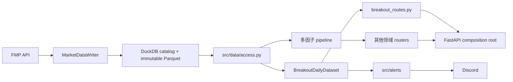
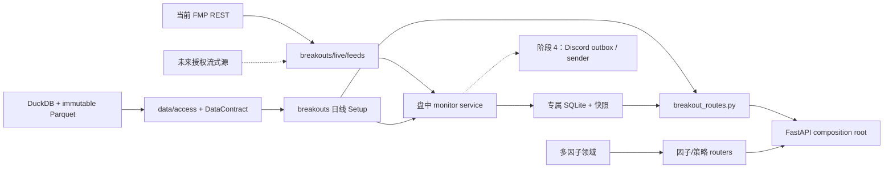

# 盘中动量触发监控方案

状态：已确认；阶段 0-2 已实现，等待生产机 5 个交易日影子观察
版本：Implementation v1.1
日期：2026-08-08

## 1. 目标

在保留现有强势筛选、日线 Setup 评分和 Web 诊断能力的前提下，新增一个独立的盘中监控
worker：

- 盘前生成不超过 600 只日线候选；
- 每 5 分钟更新宽池活跃度并维护默认不超过 40 只重点观察池；
- 对重点观察池按完成的 1 分钟 bar 检查突破；
- 影子闸门通过后，满足固定触发条件时向现有内部 Discord 频道发送一次提醒；
- 运行在新加坡 2 核 4 GB Linux 服务器上；
- 不依赖 FastAPI，不修改多因子分数、回测结果或模拟盘持仓；
- 第一阶段只提醒，不自动下单。

本方案解决的是“何时发现并提醒”，不在本阶段重新设计日线 Setup，也不把大量参数暴露到
网页上。

## 2. 已确认的产品决策

| 项目 | 决策 |
|---|---|
| Discord 用户 | 仅内部用户，使用一个现有频道 |
| 对外提醒类型 | 每只股票每个有效突破只发送一条正式提醒 |
| 正式确认周期 | 完成的 1 分钟 bar |
| 宽池更新 | 每 5 分钟 |
| 重点池上限 | 默认 40，只允许配置到 60 |
| 宽池上限 | 默认 600 |
| ETF | 默认关闭，沿用现有配置 |
| 自动交易 | 不做 |
| 现有日线规则 | 保留，不在本阶段调整 |
| 服务器 | 2 vCPU、4 GB RAM，新加坡时区 |

程序内部仍需保留 `WATCHING -> ARMED -> TRIGGERED -> COOLDOWN` 状态，用于去重、恢复和
审计；这些内部状态不要求拆成多个 Discord 频道或面向不同用户展示。

## 3. 当前代码隔离审计

### 3.1 结论

阶段 0 已完成 Web 组合层隔离；FastAPI 只负责注册专用 router。

| 边界 | 当前状态 | 结论 |
|---|---|---|
| URL | `/breakouts`、`/breakouts/{ticker}`、`/api/breakouts/*` | 已隔离 |
| 页面资源 | `breakout_list.html`、`breakout_detail.html`、`breakout_detail.js` | 已隔离 |
| 日线/分钟核心 | `src/breakouts/` | 已隔离 |
| Discord worker | `src/alerts/` + `scripts/run_momentum_alerts.py` | 已隔离于 Web |
| 运行进程 | Web 与告警是不同 systemd service | 已隔离 |
| Web router | `src/webapp/breakout_routes.py` 独占全部突破 URL | 已隔离 |
| 扫描编排 | `src/breakouts/application.py`，刷新脚本不再导入 Web | 已隔离 |
| 盘中 live 域 | `src/breakouts/live/`，无 Web/因子/回测/模拟盘导入 | 已隔离 |
| FastAPI 进程 | 突破页面与量化页面使用同一个 FastAPI 实例 | 共享组合层 |
| 日线行情 | 突破与多因子都通过 `src/data/access.py` 绑定正式版本 | 统一只读边界 |
| FMP 适配器 | `src/data/fmp.py` 中立复用 | 有意共享 |
| 配置文件 | 共用 `configs/default.yaml`，分属不同配置段 | 可接受 |

因此：

1. 突破规则不会修改因子权重，也不会进入多因子 pipeline。
2. 告警 worker 可以在不启动网页和多因子计算的情况下独立运行。
3. `routes_v2.py` 已不再拥有任何 `/breakouts` 或 `/api/breakouts` 路由。
4. 日线由唯一 `MarketDataWriter` 发布，突破模块没有逐票文件或网络回退。

### 3.2 当前依赖方向



领域核心没有互相调用；统一 FastAPI 只复用导航和 composition root。

## 4. 目标隔离架构

### 4.1 依赖原则

实施后必须满足：

1. `src/breakouts/` 不得导入 `src/factors`、`src/backtest`、`src/papertrading` 或
   `src/webapp`。
2. 实时 worker 不得导入 FastAPI router、Jinja 模板或 Web 私有函数。
3. Web router 只能调用突破 application service，不直接实现扫描循环或行情订阅。
4. 多因子 pipeline 不得读取实时提醒 SQLite，也不得根据 Discord 状态改变结果。
5. FMP 适配器只负责数据协议，不承载 Setup 或突破业务规则。
6. 日线刷新任务是正式版本的唯一主动写入者；盘中 worker 只读同一个 `DataContract`。
7. 盘中 bar、运行状态和快照使用突破专属目录，不写入多因子产物目录。

### 4.2 目标依赖图



FastAPI 仍可作为统一页面外壳，这属于展示层复用，不代表交易逻辑耦合。未来如果需要独立部署，
专用 router 和只读快照接口可以直接迁移，无需移动核心算法。

### 4.3 建议目录

```text
src/
  breakouts/
    scanner.py                  # 保留：日线强势筛选和 Setup
    daily_data.py               # 版本绑定日线数据包
    intraday.py                 # 保留：历史分钟诊断；后续去除实时循环职责
    application.py              # 从 Web 下沉：股票池解析和扫描用例
    live/
      models.py                 # MinuteBar、候选、信号、运行状态
      settings.py               # 盘中监控专属配置
      rolling.py                # 增量 VWAP、MA、相对成交量
      selector.py               # 600 -> 40 的活跃池选择
      detector.py               # 固定版本的盘中触发规则
      service.py                # 会话生命周期和状态机
      state.py                  # 专属 SQLite、heartbeat、幂等状态
      feeds.py                  # 批量 quote 雷达 + 精确分钟确认
  alerts/
    discord.py                  # 继续复用安全投递

src/webapp/
  breakout_routes.py            # 从 routes_v2.py 提取

scripts/
  run_intraday_momentum_monitor.py

deploy/systemd/
  quant-intraday-momentum-monitor.service
  quant-intraday-momentum-monitor.timer

outputs/intraday_momentum_monitor/
  state.sqlite3
  sessions/
  snapshots/
```

以上目录已落地；依赖方向不得退回到 `routes_v2.py` 或多因子模块。

## 5. 数据与扫描流程

### 5.1 盘前候选

继续使用现有日线强势筛选和 Setup 评分：

- 20 日涨幅；
- ADR20；
- 当日/平均成交额；
- 日线 Setup 检查和评分；
- Pivot、均线和整理结构；
- ETF 默认排除；
- `always_tickers` 继续强制检查。

盘前结果的语义改为“今日待触发池”，而不是“已经突破”。候选快照必须包含：

```text
session_date
algorithm_version
parameter_version
ticker
setup_score
daily_pivot
previous_high
adr20
avg_dollar_volume20
source_data_date
data_universe
dataset_version_id
bars_sha256
```

实时 worker 启动时读取这份冻结快照，不在每分钟重新计算全部日线指标。
完整 `DataContract` 保存在候选 payload 中；重启恢复时校验 version、run、target session 和
checksum。latest pointer 后续前进不会改变当日候选输入。

### 5.2 5 分钟宽池更新

每 5 分钟对最多 600 只候选执行批量 quote 更新，只计算便宜的排序字段：

- 当前价格与日涨跌幅；
- 当前累计成交额；
- 距离日线 Pivot；
- 距离前一日高点；
- 当日活跃度；
- 是否属于 `always_tickers`；
- 盘前冻结的 Setup 分数。

选出最多 40 只进入重点池。排序算法应是纯函数，并写入版本号，不能由 Web 表单临时改变。

在数据条件允许时，引入同一时刻相对成交量：

```text
rvol(t) = 今日截至 t 的累计成交量
          / 过去 N 个交易日截至同一时刻的平均累计成交量
```

历史时段成交量轮廓应预计算为小型统计表，不能每 5 分钟重新加载所有历史分钟线。

### 5.3 1 分钟触发

只对重点池按完成的 1 分钟 bar 更新：

- OR1 / OR5 / OR30 / OR60 指标；
- VWAP；
- 分钟 MA10 / MA20 / MA50；
- 当前与同时间基准的相对成交量；
- 日线 Pivot、前一日高点和盘前高点；
- 数据时间、价差和异常状态。

正式信号只在完成的 bar 上评估，避免未收盘高点短暂穿越后消失。建议在交易所分钟结束后的
2 至 8 秒内完成本轮计算和发送。

第一阶段不把规则做成页面可调参数。现有 detector 正式保留既有 OR60/OR30 语义；配置中的
OR5/OR15 是后续研究参数，目前 `RollingIntradayBars` 实际维护 1/5/30/60，不能把 OR15 描述为
已上线触发条件。任何变更必须使用独立 `algorithm_version`，先影子记录再评审。

### 5.4 单条 Discord 提醒

内部状态可以多阶段，但对外只发送一次正式提醒。建议消息包含：

```text
Ticker / 公司名
触发时间（America/New_York）
当前价 / 突破位 / 超出幅度
OR5 或 OR15
相对成交量
VWAP
日线 Setup 分数
ADR20
详情页链接
算法版本
```

同一交易日、同一股票、同一算法版本默认只发送一次。进程重启后必须继续保持幂等。

## 6. 数据源方案

### 6.1 首选：实时流

能力探针已于 2026-07-28 完成：

- FMP 旧股票流式主机可以完成 TLS 和 WebSocket 握手；
- 当前项目 API key 在登录阶段明确返回 `unauthorized`，没有股票 WebSocket entitlement；
- FMP 官方新地址当前重定向到普通 HTTPS 页面，不能作为标准 WebSocket 地址继续握手；
- 同一 key 可读取 `batch-quote` 和精确 1 分钟 OHLCV；
- AEVA 两日分钟线实测 387 根、约 18 KiB、单次约 1.44 秒。

因此当前实现不把 WebSocket 伪装成可用能力。以后升级 FMP entitlement 或更换数据商时，仍需
重新确认：

1. 当前 FMP 套餐是否有 WebSocket 权限；
2. 单连接和单账号可订阅的股票数；
3. 消息是成交、quote 还是完成的分钟 bar；
4. 成交量字段是单笔、分钟还是当日累计；
5. 是否覆盖 NASDAQ、NYSE、AMEX 小盘股；
6. 是否包含盘前数据以及时区语义；
7. 断线重连、补发和乱序规则；
8. 实际延迟和计费方式。

探针脚本是 `scripts/probe_fmp_websocket.py`，只输出脱敏状态，不记录 key 或原始 payload。

### 6.2 REST 降级

REST 可用于：

- 每 5 分钟批量更新宽池 quote；
- worker 启动时补齐最近历史；
- 未来接入流式源后的断线缺口校验；
- 影子阶段验证数据一致性。

当前已实现的混合 REST 路径：

1. 最多 600 只候选每 5 分钟使用批量 quote 排序；
2. 重点池每分钟只使用一个批量 quote 雷达请求；
3. 新入池股票一次预载最近 7 个自然日的精确分钟线；
4. 留在重点池的股票每 5 分钟只拉当天分钟线并增量去重；
5. 分钟之间出现疑似突破时，只为对应股票补拉精确分钟线；
6. 正式判定只读取精确、已完成且不超过 90 秒的 bar，quote 不能代替 OHLCV。

REST 不应采用“40 只股票每分钟逐只下载三天分钟线”的方式。按 40 只、390 分钟计算，这会产生
约 15,600 次单股分钟线请求/交易日，并重复解析和写入大量相同数据。

该方案常态约为 40 次精确请求/5 分钟，而不是 40 次/分钟。systemd 使用 `--auto`：生产机数据
覆盖与五日观察闸门通过前只运行 shadow，通过后才允许正式 Discord。

## 7. 2 核约 2 GB 实机容量设计

### 7.1 预期负载

| 项目 | 默认规模 | 负载判断 |
|---|---:|---|
| 日线候选 | 600 | 盘前一次，低 |
| 宽池批量 quote | 600 / 5 分钟 | 网络 I/O 为主，低 |
| 重点池 | 40，硬上限 60 | 低 |
| 分钟 bar | 40 × 390 = 15,600/日 | 很低 |
| 增量 MA/VWAP | 每 bar 常数时间 | 很低 |
| SQLite 写入 | heartbeat + 状态变化 | 很低 |
| Discord | 仅出现信号时 | 可忽略 |

2026-08-09 实机 `free -m` 显示约 2 GB、无 swap。当前设计仍可运行，但必须保留 systemd 内存
上限并用五日观测确认真实网络负载，不能按 4 GB 预算估算。

### 7.2 资源预算

| 组件 | 目标内存 |
|---|---:|
| FastAPI Web | 300-700 MB |
| 盘中 monitor worker | 150-500 MB，硬上限 768 MB |
| 操作系统、文件缓存、SQLite | 600-1,000 MB |
| 安全余量 | 由 `MemoryMax` 和错峰任务保护 |

建议：

- monitor 设置 `MemoryMax=768M`；
- monitor 设置适度 `CPUQuota` 或 `Nice`，给 Web 保留响应能力；
- 配置 1-2 GB swap 处理偶发峰值，但正常运行不能持续换页；
- 日线刷新和 group analytics 继续安排在美股收盘后，避免与盘中 monitor 重叠；
- 不使用多进程 worker；行情接收、计算和投递以单进程异步 I/O 为主；
- 并发 REST 请求默认不超过 4。

### 7.3 性能验收线

上线前在服务器完成合成负载测试：

- 600 只候选；
- 60 只重点池；
- 390 分钟完整交易日；
- 至少连续回放 5 个交易日；
- worker 峰值 RSS 小于 600 MB；
- 平均 CPU 小于单机总容量的 25%；
- 每分钟计算 p95 小于 1 秒；
- 完成 bar 到信号落库 p95 小于 3 秒；
- 无随时间持续增长的内存占用。

开发机 2026-07-28 合成回放结果：

```text
5 个交易日 / 600 候选 / 60 重点股
1,950 个分钟周期 / 117,000 次检测 / 117,000 行 SQLite 状态写入
cycle p95 = 102.725 ms
peak RSS = 167.1 MB
总回放时间 = 46.132 s
```

开发机已经通过计算与内存线；网络延迟、日线覆盖、连续运行和 CPU 仍必须在新加坡生产机复测。
SG 单日 600 候选/40 活跃合成基准为 cycle P95 182 ms、峰值 RSS 126.9 MB。

2026-08-08 版本数据路径补充实测：正式 SP500 503 只当前成分，400 日窗口 154,474 行；
日线载入 0.59 秒、Setup 扫描 1.45 秒、总计 2.04 秒、峰值 RSS 约 230 MB。读取条件已下推
DuckDB。SG 的 `US_LIQUID_5M` 规模更大，仍必须单独验收。

## 8. 会话生命周期

```text
09:20 ET  启动服务，读取盘前候选和历史基准
09:25 ET  校验数据源、候选快照和交易日
09:30 ET  开始构造正常交易时段 bar
09:35 ET  OR5 形成，更新首个重点池
09:35-11:30 ET  每分钟检查，正常门槛
11:30-15:30 ET  每分钟检查，保持相同调度
15:30-16:00 ET  每分钟检查尾盘触发
16:05 ET  完成快照、断开数据源并正常退出
```

不要通过 systemd 每分钟重新启动 Python。使用一个 `Type=simple` 常驻 service，由每日 timer
在 09:20 ET 启动，服务在 16:05 ET 自行退出。节假日和提前收盘由交易所日历及市场状态处理。

## 9. 状态、幂等与故障处理

### 9.1 SQLite 主键

建议正式提醒的幂等键：

```text
(session_date, ticker, algorithm_version, trigger_family)
```

发送流程继续采用 outbox 语义：

1. 事务内记录待发送；
2. 调用 Discord；
3. 收到确定成功响应后标记 delivered；
4. 不确定响应不得盲目重发；
5. 进程重启后从 SQLite 恢复。

### 9.2 数据故障必须关闭提醒

以下情况不得生成正式信号：

- 日线候选覆盖未达到 80%，或未精确截止上一 XNYS 交易日；
- 最新 bar 超过 90 秒；
- 行情时间倒退或跨错交易日；
- 数据源出现未补齐的分钟缺口；
- 当前股票缺少形成触发条件所需的历史；
- 市场已关闭或处于非预期会话；
- 当前算法版本或候选快照缺失。

可以继续写运行告警，但不能使用旧价格发送交易信号。

### 9.3 重连

断线后：

1. REST 失败保持旧状态但关闭本轮判定；
2. 下一分钟按 feed 重试策略恢复；
3. 使用当天精确分钟线补齐并去重；
4. 校验最后完成 bar 的时间戳；
5. 数据新鲜后才恢复信号评估。

## 10. Web 集成

### 10.1 第一阶段必须完成的隔离

把以下内容从 `src/webapp/routes_v2.py` 提取到 `src/webapp/breakout_routes.py`：

- 股票池解析；
- 扫描参数解析与缓存；
- `/breakouts`；
- `/api/breakouts/scan`；
- `/api/breakouts/check/{ticker}`；
- `/breakouts/{ticker}`；
- `/api/breakouts/{ticker}/intraday`；
- 突破图表构建辅助函数。

`src/webapp/app.py` 只在 composition root 注册这个 router。提取阶段必须是纯移动和测试补强，
不改变页面 URL、筛选默认值、模板、导航和响应结构。

### 10.2 Web 只读实时状态

后续页面需要展示实时状态时，Web 读取 worker 生成的原子快照或只读 SQLite 查询，不在 HTTP
请求中启动行情订阅，也不触发全市场实时扫描。

结果是：

- Web 停止不影响 Discord 监控；
- monitor 重启不影响因子页面；
- `/breakouts` 暂时不可用不会改变多因子产物；
- 网页访问量不会放大 FMP 实时请求。

## 11. 配置建议

已新增独立配置段，不把新 worker 参数塞进旧 `momentum_alerts.intraday`：

```yaml
intraday_momentum_monitor:
  enabled: true
  asset_types:
    include_etfs: false

  universe:
    name: US_ACTIVE
    max_symbols: 600
    refresh_minutes: 5
    active_max_symbols: 40
    active_hard_limit: 60

  bars:
    interval_minutes: 1
    stale_after_seconds: 90
    preload_bars: 60

  daily_data:
    min_exact_coverage: 0.80

  opening_range:
    windows: [5, 15]

  runtime:
    max_concurrent_requests: 4
    heartbeat_seconds: 30
    timezone: America/New_York

  notifications:
    cooldown_minutes: 20
    delivery_enabled: false
    max_delivery_attempts: 3
    max_messages_per_cycle: 5
    send_empty: false

  observation:
    required_sessions: 5
    min_cycle_coverage: 0.85
    max_error_cycle_ratio: 0.05
    max_cycle_p95_seconds: 30.0
```

算法阈值与运行参数分开管理。运行频率、池子大小可以配置；真正改变信号语义的阈值必须形成新的
`algorithm_version`，不能悄悄覆盖历史定义。

## 12. 可观测性

每 30 秒更新 heartbeat，至少记录：

- 进程启动时间和算法版本；
- `data_universe / dataset_version_id / bars_sha256`；
- 当前交易日和市场状态；
- 数据源连接状态；
- 最新消息和最新完成 bar 时间；
- 宽池、重点池和订阅数；
- 每分钟循环耗时；
- 数据缺口、乱序、重连次数；
- 已产生和已发送信号数；
- Discord 最近一次投递状态；
- 当前 RSS 和 CPU；
- 最后错误的安全摘要，不记录 Webhook。

需要提供一个只读命令：

```bash
python scripts/run_intraday_momentum_monitor.py --status
```

systemd 使用 `--auto` 检查五日晋级资格；也可以显式强制 shadow：

```bash
python scripts/run_intraday_momentum_monitor.py --auto
python scripts/run_intraday_momentum_monitor.py --shadow
```

`--auto` 不会修改生产环境。`INTRADAY_MOMENTUM_DISCORD_ENABLED=false` 时它始终保持 shadow；
连续五日 PASS 后仍须人工复核并将该开关设为 `true`，后续启动才允许 live 投递。

## 13. 测试策略

### 13.1 边界测试

新增自动化隔离检查：

- `src/breakouts` 不导入因子、回测、模拟盘或 Web；
- 新 monitor 不导入 `src.webapp`；
- 因子模块不导入 breakouts/alerts；
- `routes_v2.py` 不再包含 `/breakouts` 路由；
- Web router 不被 worker 导入。

### 13.2 业务测试

- 当前 OR1/5/30/60 边界，以及未来启用 OR15 前的新增测试；
- 1 分钟 bar 完成前不触发；
- MA、VWAP 和相对成交量增量计算；
- 缺失 bar、乱序 bar、重复 bar；
- 重点池加入和移除；
- `always_tickers` 保留；
- ETF 默认关闭；
- 同日同信号只发送一次；
- 重启后不重复发送；
- 休市、提前收盘和夏令时；
- Discord 超时、限流和不确定响应。

### 13.3 回归测试

- `/breakouts` 原有页面和 API 契约不变；
- 动量交点、因子库、策略、回测、模拟盘和 Watchlist 路由不变；
- 多因子产物哈希不因 monitor 运行改变；
- 共享日线 Parquet 继续保留 `adj_close`；
- 现有盘前两频道投递不受影响。

## 14. 分阶段实施计划

用户已确认本文档；当前执行状态如下。

### 阶段 0：基线与隔离

状态：**完成**。

- 记录当前测试基线和关键 API 响应；
- 从 `routes_v2.py` 提取 `breakout_routes.py`；
- 下沉 Web 私有的扫描编排为 `breakouts/application.py`；
- 增加依赖边界测试；
- 不改变任何策略行为。

完成条件：所有现有测试通过，页面和 API 响应不变。

### 阶段 1：数据源能力探针

状态：**完成**。当前 key 无 WebSocket entitlement，采用混合 REST。

- 验证 FMP WebSocket 套餐、字段、覆盖、限制和延迟；
- 记录脱敏的握手、鉴权和 REST 响应统计；
- 定义统一 feed 接口；
- 实现精确分钟 REST 补齐、去重和乱序恢复；
- 不发送 Discord。

完成条件：明确当前 key 的流式权限边界，确认精确分钟 REST 的时间和成交量语义，并让 feed
接口可替换。AEVA 已完成在线抽样；AEVA、OKTA、PENG、VAST 等多标的连续覆盖属于阶段 3
生产影子观察项。

### 阶段 2：增量计算与状态机

状态：**完成**。本地 5 日 600/60 回放通过。

- 实现 600 -> 40 选择器；
- 实现增量 bar、VWAP、MA、OR 和相对成交量；
- 实现版本化 detector；
- 实现专属 SQLite、heartbeat 和幂等；
- 候选 SQLite 与 Web cache 绑定 `DataContract`；
- Web、盘前、旧提醒和分钟监控迁移到同一个版本化日线入口；
- 使用历史数据和合成流回放。

完成条件：5 日回放达到性能和正确性验收线。

### 阶段 3：服务器影子运行

状态：**代码完成，待新加坡服务器累计真实会话**。仓库已提供 service/timer 与五日晋级闸门。

- 部署独立 systemd service/timer；
- Discord outbox 只写 `SHADOW`；
- 连续观察至少 5 个完整交易日；
- 记录漏 bar、延迟、重连、候选数量、CPU、RSS 和预期信号；
- 与 Web 手工检查结果抽样对照。

完成条件：无重复、无陈旧数据触发、资源稳定、数据覆盖合格。

### 阶段 4：内部 Discord 上线

状态：**投递代码与独立 outbox 已完成，正式发送受五个完整交易日闸门约束**。

- 开启单频道正式提醒；
- 旧小时 worker 先转为 dry-run，避免重复发送；
- 观察至少 5 个交易日；
- 确认新 worker 稳定后停用旧小时 timer；
- 保留一键回滚说明。

完成条件：提醒幂等，延迟达标，旧服务可以安全停用。

### 阶段 5：评估，不自动扩张

- 统计触发后的 MFE、MAE、假突破率和时间分布；
- 比较 OR5/OR15 和不同市场状态；
- 至少积累 2-4 周影子/提醒数据后再讨论规则调整；
- 自动下单必须另立方案、回测和风控评审。

## 15. 回滚

新 worker 的部署不修改多因子数据结构。出现问题时：

1. 停止 `quant-intraday-momentum-monitor.service`；
2. 禁用其 timer；
3. 重新启用旧小时 worker；
4. 保留新 SQLite 和会话快照用于调查；
5. 不删除正式日线版本，不回滚多因子产物。

## 16. 当前发布闸门

1. 先在服务器运行收盘后刷新，确认候选源日期等于上一 XNYS session；
2. 安装并启用 `--auto` service/timer；环境开关是总 kill switch；
3. 连续观察至少 5 个完整交易日；
4. 核对缺 bar、延迟、API 失败、CPU、RSS 和影子信号；
5. 只有最近五个预期 XNYS session 全部 `PASS`，下一交易日进程才进入 live；否则继续 shadow。

## 17. 参考

- [项目运行架构与耦合审计](project_architecture.md)
- [动量突破系统完整说明](momentum_breakout_summary.md)
- [旧盘中小时告警说明](momentum_alerts.md)
- [新加坡服务器部署模板](singapore_server_deployment.md)
- [QuantConnect Opening Range Breakout Research](https://www.quantconnect.com/research/18444/opening-range-breakout-for-stocks-in-play/)
- [TradingView Alert Frequencies](https://www.tradingview.com/support/solutions/43000474415-differences-between-alert-frequencies/)
- [FMP WebSocket Dataset](https://site.financialmodelingprep.com/datasets/websocket)
- [Alpaca Real-time Stock Data](https://docs.alpaca.markets/us/docs/real-time-stock-pricing-data)
