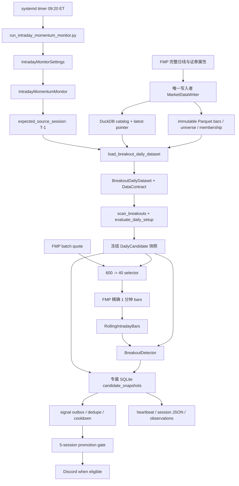

# 动量突破完整数据与代码线路

更新日期：2026-08-09

## 1. 先给结论

这次数据架构迁移没有改变动量突破的数学规则。20 日涨幅、ADR、成交额、Setup 评分、Pivot、
`FORMING / SETUP / READY / BREAKOUT` 和盘中触发条件仍由原来的代码计算。

改变的是输入和运行状态的所有权：

1. Parquet 保存不可变的正式日线和该版本的股票池；
2. DuckDB 保存版本目录、最新正式指针、目标交易日和 checksum；
3. SQLite 保存某次盘中运行的候选、状态、信号、outbox、五日观察和 heartbeat；
4. FMP quote/1 分钟 REST 只提供当日雷达与精确分钟确认，不再补日线。

所以现在可以回答“某个信号使用了哪一版日线”，也不会在一次扫描中逐只股票读到不同版本。

## 2. 一张完整线路图



## 3. 三类持久化数据怎样协同

### 3.1 Parquet：事实层

正式版本位于：

```text
data/lake/curated/equity_daily/universe=<UNIVERSE>/version=<VERSION_ID>/
  bars.parquet
  universe.parquet
  membership.parquet  # 动态 PIT 股票池才有
  manifest.json
```

`bars.parquet` 是长表，至少包含 `date / ticker / OHLCV / adj_close`。文件发布后不可原地修改；
新数据产生新目录和新 `version_id`。

### 3.2 DuckDB：控制层

DuckDB catalog 不承担逐分钟状态机，而是回答：

- 哪些版本已经通过质量门禁；
- 某个 universe 的最新正式版本是什么；
- 版本对应哪个 target session、run、Parquet 路径和 checksum；
- rejected run 为什么没有推进正式指针。

突破消费者不直接反复查询“最新”。`src/data/access.py` 先解析一次版本，随后所有读取都继续传
同一个 `DatasetVersion`。

### 3.3 SQLite：运行状态层

盘中监控使用：

```text
outputs/intraday_momentum_monitor/state.sqlite3
```

核心表是：

- `candidate_snapshots`：当日冻结候选及其完整 `DataContract`；
- `symbol_state`：`WATCHING / ARMED / TRIGGERED / COOLDOWN`；
- `signals`：按交易日、ticker、算法版本和 trigger family 幂等；
- `signal_outbox`：不可变 Discord payload、发送状态、次数、message ID 和冷却抑制；
- `monitor_cycles`：每分钟覆盖、错误、延迟和冻结数据版本；
- `session_observations`：收盘后汇总的 `PASS / FAIL` 与五日晋级证据；
- `heartbeat`：运行阶段、版本、耗时、活跃池、错误和 feed 计数。

SQLite 不保存正式日线副本。它只引用日线版本，并保存从该版本推导出的候选和运行结果。

## 4. `DataContract` 到底固定了什么

`src/data/access.py::DataContract` 至少记录：

```text
requested_universe
data_universe
dataset_version_id
dataset_run_id
target_session
bars_sha256
membership_sha256
coverage
```

候选快照同时把 `data_universe / dataset_version_id / bars_sha256` 提升为 SQLite 列，便于直接
排查；完整契约仍保存在 `payload_json`。

进程重启时，`validate_daily_data_contract()` 会确认版本仍存在，而且 run、目标交易日和 checksum
与快照一致。即使此时 latest pointer 已经前进，当前交易日仍恢复旧快照绑定的原版本，不会漂移
到新版本。契约只在创建或重启恢复时验证，不会每 5 秒重复打开 DuckDB。

## 5. 日线候选是怎样生成的

入口是 `src/breakouts/live/candidates.py::build_daily_candidate_snapshot()`：

1. 计算当前盘中 session 对应的上一完整 XNYS session `T-1`；
2. 从 DuckDB 解析 `US_ACTIVE -> US_LIQUID_5M` 的一个正式版本；
3. 从该版本的 `universe.parquet` 读取证券类型和当前流动性；
4. ETF 默认排除，保留当前成交额至少 500 万美元的股票和合规 `always_tickers`；
5. DuckDB 将 ticker 和日期条件下推到 Parquet，只返回这些股票最近 400 个日历日；
6. `daily_frames_from_bars()` 在内存中一次性变成 ticker -> DataFrame，不逐票读文件；
7. 至少 80% 的股票必须精确覆盖 `T-1`，否则 fail closed；
8. 用宽筛 `Return20 >= 10% / ADR20 >= 4.5% / AvgDollarVol20 >= 10m` 扫描；
9. `always_tickers` 只绕过宽筛，不绕过后面的严格条件；
10. 最多冻结 600 个 `DailyCandidate`，连同 `DataContract` 写入 SQLite。

正式严格条件仍是 `20% / 6% / 当日 10m / 20 日均 10m + Setup`，在盘中 quote 到来后用当日
累计值重新判断。

## 6. 每个盘中循环发生什么

入口是 `src/breakouts/live/service.py::cycle()`：

1. 每分钟以内缓存一次 NASDAQ 市场状态；休市时不构建候选也不判信号；
2. 首个开市循环创建或恢复冻结候选；
3. 每 5 分钟批量获取最多 600 个候选的 quote；
4. `selector.py::select_active_pool()` 按强制观察、Setup、是否触及 Pivot、距离 Pivot、状态、
   上轮保留、评分、涨幅和成交额选出默认 40 只；
5. 新入重点池的股票预载最近分钟线，保留股票只增量刷新当天分钟线；
6. `RollingIntradayBars.merge()` 去重并聚合精确分钟 bar；形成中的最后一分钟不参加判定；
7. `metrics()` 计算 VWAP、分钟 MA10/20/50、同时间累计成交量 RVOL 和 Opening Range；
8. `should_confirm()` 用 quote 做低成本 ARMED 预判；
9. 只有 ARMED 股票才补拉一次精确分钟线；
10. `evaluate()` 同时检查严格日线/当日条件、市场开市、quote 新鲜度和完成 bar；
11. 新信号用 SQLite 主键去重，并写入独立 outbox；shadow 行永不补发；
12. live outbox 经过 ticker 冷却和 at-most-once 状态机后发送 Discord；不确定结果冻结为 `UNKNOWN`；
13. 收盘五分钟后汇总覆盖率、错误率、P95 延迟和数据契约，连续五日 `PASS` 后 `--auto` 才晋级。

当前 `algorithm_version` 仍是 `legacy-breakout-shadow-v1`。数据契约迁移将
`parameter_version` 提升为 `2026-08-08.1`，避免复用旧格式候选快照；这不代表策略阈值改变。

## 7. Web、盘前和旧提醒怎样复用

四个入口共享 Setup 核心，但各自有编排层：

| 入口 | 编排文件 | 版本行为 |
|---|---|---|
| Web | `src/breakouts/application.py` | 缓存键含日线和市场版本 ID；一次批量加载后扫描 |
| 盘中分钟监控 | `src/breakouts/live/` | 当日冻结 T-1 契约，重启恢复同一版本 |
| 盘前日报 | `src/premarket_digest/momentum.py` | 精确读取 T-1 正式版本，不用 raw universe 作为生产输入 |
| 旧小时提醒 | `src/alerts/engine.py` | 正式日线包 + 当日 FMP quote；不再临时补日线/证券 profile |

`src/premarket_digest/momentum.py::_load_cached_universe()` 暂时保留为显式注入兼容层和完整性测试，
默认生产构造已经走正式版本数据包。

## 8. 哪些数据会保留

- 正式日线：不可变 Parquet 长期保留；
- DuckDB 版本记录：保留正式和 rejected 审计记录；
- 当日候选：SQLite 保留，用于重启恢复；
- 分钟 bars：worker 内存中增量保留，历史诊断路径另有可重建分钟缓存；
- 信号、outbox、五日观察与 heartbeat：SQLite + 原子 JSON 快照保留；
- quote：只作为当日廉价雷达，不写成正式日线。

系统不是持续轮询日线文件。日线在候选生成时读取一次；之后持续变化的是 quote、分钟 bar、
滚动指标和 SQLite 状态。

## 9. 性能与本机验证

`MarketDataReader.load_bars()` 已把日期和 ticker 条件下推给 DuckDB，不再先读完整 Parquet 后用
Pandas 过滤。2026-08-08 使用本机正式 SP500 版本实测：

```text
503 只当前成分
154,474 行 400 日窗口
日线载入 0.59 秒
完整 Setup 扫描 1.45 秒
总计 2.04 秒
进程峰值 RSS 约 230 MB
```

SG 实机实际可见约 2 GB 内存。600 候选、40 活跃标的、390 个分钟循环的无网络基准 P95 为
182 ms、峰值 RSS 126.9 MB；CPU/内存门槛通过。真实 FMP 延迟仍由五日 shadow 的逐分钟记录验收，
并保持 monitor `MemoryMax=768M`。

## 10. 当前部署前提

本机没有完整 `US_LIQUID_5M`，真实验收在新加坡执行。SG 已发布该 universe；每日仍必须先成功
运行：

```bash
python scripts/refresh_us_active.py
python scripts/run_data_pipeline.py status --json
```

确认 `US_LIQUID_5M.target_session == 上一完整 XNYS session` 后，再启动 shadow monitor。数据未
发布、版本陈旧、覆盖不足或契约不一致时，系统会关闭信号，而不是回退到旧逐票文件或联网补日线。

## 11. 建议阅读顺序

按一条运行线路阅读，不要按目录散读：

1. `deploy/systemd/quant-intraday-momentum-monitor.timer`
2. `scripts/run_intraday_momentum_monitor.py`
3. `src/breakouts/live/settings.py`
4. `src/breakouts/live/service.py::_ensure_candidates()`
5. `src/breakouts/live/session.py::expected_source_session()`
6. `src/breakouts/live/candidates.py::build_daily_candidate_snapshot()`
7. `src/breakouts/daily_data.py::load_breakout_daily_dataset()`
8. `src/data/access.py::load_published_daily_data()`
9. `src/data/foundation.py::MarketDataReader.load_bars()`
10. `src/breakouts/scanner.py::scan_breakouts()` 和 `evaluate_daily_setup()`
11. 回到 `src/breakouts/live/service.py::cycle()`
12. `src/breakouts/live/selector.py`
13. `src/breakouts/live/feeds/base.py` 和 `fmp_rest.py`
14. `src/breakouts/live/rolling.py`
15. `src/breakouts/live/detector.py`
16. `src/breakouts/live/delivery.py`
17. `src/breakouts/live/state.py`
18. `tests/test_intraday_monitor.py`
19. `tests/test_data_foundation.py`

读完第 10 步，就理解“今日观察谁”；读完第 16 步，就理解“系统如何持续监控、计算、去重并在
重启后恢复”。
