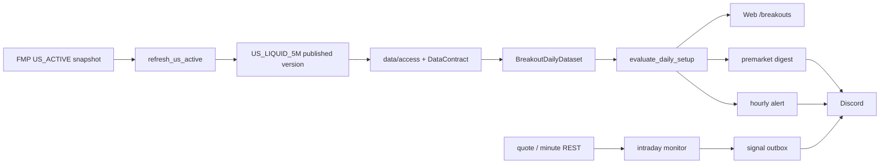

# 动量突破系统总结

更新日期：2026-08-08

## 1. 定位

动量突破是一套 Qullamaggie 风格的强势股筛选、Setup 诊断和提醒系统。它会：

1. 用 20 日涨幅、ADR 和成交额找出强势且可交易的股票；
2. 检查前期涨幅、整理时间、均线、波动收缩、Pivot 等结构；
3. 输出 `FORMING / SETUP / READY / BREAKOUT` 和解释型评分；
4. 支持 Web 研究、盘前摘要、小时提醒和带五日晋级门槛的独立分钟监控。

它不是自动交易策略，不会修改多因子分数、策略权重或模拟盘持仓。

## 2. 当前数据链



`US_ACTIVE` 是用户可理解的入口名，正式数据池是版本化 `US_LIQUID_5M`。唯一
`MarketDataWriter` 把日线、证券属性和 membership 一起发布；突破消费者统一通过
`src/data/access.py` 获得一个带 `DataContract` 的 `BreakoutDailyDataset`，缺失时不回退 FMP。
DuckDB 负责版本目录，Parquet 保存事实，专属 SQLite 保存运行状态。

## 3. 四种运行方式

| 入口 | 数据时点 | 目的 | Discord |
|---|---|---|---|
| Web `/breakouts` | 最新正式日线版本 | 交互筛选和单股诊断 | 否 |
| 盘前日报 | 精确上一完整 XNYS session `T-1` | 稳定日摘要 | 动量频道，生产 timer 启用 |
| 小时 alert worker | 正式日线 + 当日 quote/可选分钟线 | 盘中状态升级 | 生产 timer 启用，分钟 live 稳定前保留 |
| 分钟 monitor | 冻结 T-1 候选 + quote/完成分钟 bar | 分钟触发和审计 | `--auto`，先 shadow 五个合格 session 再 live |

这些入口复用同一 Setup 计算，但日期门槛、状态库和目的不同，结果不应机械比较。

## 4. 股票池

收盘后 `scripts/refresh_us_active.py`：

1. 从 FMP 刷新当前证券属性；
2. 默认只保留 `asset_type=STOCK`；
3. 保留当前 dollar volume 至少 500 万美元的股票；
4. 加入 QQQ、SPY、IWM 等支持标的；
5. 冻结当日动态 membership；
6. 增量摄取、质量校验并原子发布 `US_LIQUID_5M` 的 bars/universe/membership；
7. 清理并预计算 Web 扫描缓存。

Web 仍可把“US_ACTIVE”作为用户可理解的入口名，但其日线实际绑定正式
`US_LIQUID_5M` version。

## 5. 日线硬筛

默认四项基础门槛位于 `configs/default.yaml -> momentum_alerts`：

- 20 日涨幅；
- 20 日 ADR；
- 当日成交额；
- 20 日平均成交额。

核心计算至少需要 65 个有效 session，输入包括：

```text
open, high, low, close, volume
```

Setup 进一步计算 MA20/MA50、整理区间、波动收缩、成交量收缩、Pivot 距离、突破量能和市场
状态。部分研究阈值仍在 `src/breakouts/scanner.py` 中，修改时应提升算法版本并重做事件回测。

## 6. Web 页面

| 路径 | 作用 |
|---|---|
| `/breakouts` | 股票池扫描、过滤和状态列表 |
| `/breakouts/{ticker}` | K 线、Pivot、Setup 条件和市场状态 |
| `/api/breakouts/scan` | 扫描 JSON |
| `/api/breakouts/check/{ticker}` | 单票硬筛 |
| `/api/breakouts/{ticker}/intraday` | 分钟聚合和开盘区间 |

广域扫描结果在 `data/cache/momentum_scans/` 缓存 6 小时，可安全重建。缓存键同时包含扫描日线
版本和 QQQ/IWM 市场版本；latest pointer 前进后不会误用旧结果。Watchlist 不共用该缓存。

## 7. 盘前数据闸门

令 `T` 为即将开盘 session，`T-1` 为上一完整 XNYS session。正式摘要要求：

1. 一个正式 `US_LIQUID_5M` version 的 `target_session` 覆盖 `T-1`；
2. universe、bars 和 membership 都属于该版本；
3. `DataContract` 固定 version、run、target session 和 checksum；
4. 每只评估股票最后一根 bar 恰好是 `T-1`；
5. 无重复 session，全部关键指标有限；
6. 精确日期覆盖率和可评估历史覆盖率都至少 80%。

发送窗口内不临时拉日线或刷新股票池。周末、节假日、09:30 ET 之后的 Persistent 补跑会跳过。

## 8. 分钟监控与五日晋级

`scripts/run_intraday_momentum_monitor.py` 独立于 FastAPI、多因子、回测和模拟盘。当前没有股票
WebSocket entitlement，因此使用批量 quote、重点池分钟同步和疑似突破单票确认。只有完成且不
陈旧的分钟 bar 能触发 signal。

它不下单。每个信号先写独立 SQLite outbox，通过唯一键去重和 ticker 冷却；`--auto` 在连续五个
XNYS session 的覆盖、错误率、延迟和数据契约门槛全部通过前固定 shadow，通过后才允许使用独立
Discord 凭据正式投递。接收结果不确定时状态冻结为 `UNKNOWN`，不会自动重发。

## 9. 输出与清理边界

| 路径 | 内容 | 清理规则 |
|---|---|---|
| `data/lake/...US_LIQUID_5M...` | 正式 bars/universe/membership | 不得删除 published version |
| `data/catalog/` | DuckDB 版本目录和正式指针 | 只能由数据任务维护 |
| `data/raw/intraday/1min/` | 分钟缓存 | 可重建，但会增加 API 请求 |
| `data/cache/momentum_scans/` | Web 扫描缓存 | 可直接清空 |
| `outputs/momentum_alerts/` | 小时提醒状态/运行产物 | 状态库不能为重发随意删 |
| `outputs/premarket_digest/` | 盘前 outbox 和 dry run | dry run 可归档，状态库保留 |
| `outputs/intraday_momentum_monitor/` | 信号、outbox、观测和快照 | 状态库保留，旧快照可归档 |

## 10. 当前限制

- 尚无完整突破事件级历史回测，评分不能直接证明收益有效。
- QQQ 市场状态目前主要是诊断，不是所有入口的统一硬门槛。
- 相对强弱百分位是在硬筛候选中计算，不是全市场百分位。
- 部分 Setup 参数仍硬编码。
- 盘中临时 bar 会变化；只有 T-1 结果可冻结复现。
- 没有仓位、订单和自动止损；`stop_width` 只是诊断。
- 分钟 worker 已具备自动晋级机制，但正式推送仍须完成连续五个真实交易日验收。

下一项研究重点应是事件级回测：冻结每日首次状态升级，使用下一交易日可成交价格，统计
1/5/20 日收益、最大不利波动、假突破率、成本和不同市场状态下的稳定性。

## 11. 阅读地图

1. `src/breakouts/scanner.py`
2. `src/breakouts/daily_data.py`
3. `src/data/access.py`
4. `src/breakouts/application.py`
5. `scripts/refresh_us_active.py`
6. `src/premarket_digest/momentum.py`
7. `src/alerts/engine.py`
8. `src/breakouts/live/`
9. [`momentum_breakout_data_flow.md`](momentum_breakout_data_flow.md)
10. [`premarket_discord.md`](premarket_discord.md)
11. [`intraday_momentum_monitor_design.md`](intraday_momentum_monitor_design.md)
