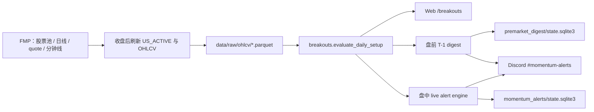

# 动量突破系统总结

> 状态基准：2026-07-22。本文描述当前仓库已经实现的行为，不把规划中的功能写成已上线功能。
> 本文是动量突破领域的统一入口；root 服务器逐条命令仍以
> [`root_discord_operations_guide.md`](root_discord_operations_guide.md) 为准。

## 1. 一句话定位

当前“动量突破”是一套 **Qullamaggie 风格的强势股筛选、Setup 诊断和 Discord 提醒系统**：

1. 先用 20 日涨幅、ADR 和成交额找出强势且可交易的股票；
2. 再检查前期涨幅、整理时间、均线、波动收缩、Pivot 等结构；
3. 输出 `FORMING / SETUP / READY / BREAKOUT` 状态和 0～100 分解释型评分；
4. 可在 Web 页面研究，也可使用完整 T-1 日线生成每日盘前摘要；
5. 旧的小时 worker 还能结合实时 quote 和可选分钟线识别盘中升级。

它目前是 **研究和提醒系统**，不会自动下单，不会修改多因子分数、策略权重或模拟盘持仓。

## 2. 三种运行方式必须分清

同一个日线 Setup 核心被三个入口复用，但三者的数据时点、状态库和使用目的不同。

| 入口 | 数据时点 | 主要用途 | 是否发送 Discord |
|---|---|---|---|
| Web `/breakouts` | 本地日线缓存；部分请求可补单只行情 | 交互筛选、单股诊断、分钟图 | 否 |
| 盘前日报 | 上一完整 XNYS 交易日 `T-1` | 每个开盘日 09:20 ET 发一条稳定摘要 | 是，当前推荐生产方式 |
| 旧盘中小时 worker | 缓存日线 + 当日实时 quote + 可选分钟线 | 盘中候选升级和开盘区间突破 | 可选；若只要每天一条应保持关闭 |



### 2.1 Web 研究入口

- `/breakouts`：股票池扫描、阈值调整和状态过滤；
- `/breakouts/{ticker}`：日线 K 线、Pivot、九项 Setup 检查和 QQQ 市场状态；
- `/api/breakouts/scan`：返回扫描 JSON；
- `/api/breakouts/check/{ticker}`：检查某只股票是否通过四项硬筛；
- `/api/breakouts/{ticker}/intraday`：读取/刷新分钟线并返回开盘区间和均线。

预置股票池扫描结果按“参数组合”缓存 6 小时；Watchlist 不使用这层扫描缓存。Web 是研究入口，
不具备盘前发送所要求的严格 T-1 完整性门槛。普通广域扫描先选择至少 80% 已加载股票共同覆盖的
最新日期；单只股票相对该日期落后不超过 7 个自然日时仍可能保留，因此 Web 与严格 T-1 盘前结果
可能不同。

### 2.2 每日盘前摘要

盘前摘要由 `scripts/run_premarket_digest.py` 生成。令：

- `T`：即将开盘的 XNYS session；
- `T-1`：上一完整 XNYS session；
- 自动发送窗口：`09:20–09:29 America/New_York`。

它只读刷新任务已经准备好的 `T-1` 股票池和日线，不在发送窗口内临时请求 FMP。周一、节假日
之后的上一交易日由 XNYS 日历计算，不使用普通工作日近似。

### 2.3 旧盘中小时提醒

`scripts/run_momentum_alerts.py` 采用两阶段扫描：

1. 用完整日线和较宽松门槛缩小股票池；
2. 拉取实时 quote，构造当日临时 OHLCV bar，再执行严格硬筛和 Setup 计算；
3. 可选地只为排名靠前的候选拉取一分钟线，识别 `OPENING_RANGE_BREAK`。

`--scheduled-hourly` 只允许在 NASDAQ 实际开市且美东 `10:00–15:59` 运行。仓库 timer 模板每小时
`:35` 唤醒一次；休市、窗口外和提前收盘后会正常跳过。

如果目标是“每天开盘前只发一条”，应确认：

```bash
systemctl disable --now quant-momentum-alerts.timer
```

## 3. 股票池和数据要求

### 3.1 默认股票池

- 盘前和盘中 worker 默认使用 `US_ACTIVE`；
- 默认只保留 `asset_type == STOCK`，ETF 不进入 Discord 告警；
- Web 的 `US_ACTIVE` 页面仍可研究股票和 ETF；
- Web 也支持项目内其他预置股票池和 `watchlist:<id>`。

盘中 worker 会把以下股票加入“必须检查”集合：

- `configs/default.yaml -> momentum_alerts.always_tickers`；
- `MOMENTUM_ALERT_EXTRA_TICKERS`；
- CLI `--extra-ticker`；
- 所有 Watchlist 成员；
- 模拟盘中数量大于零的持仓。

“必须检查”只允许绕过宽筛阶段的股票池/流动性入口，不会绕过后面的严格四项硬筛。因此它不等于
“无条件发送”。ETF 在 `include_etfs=false` 时仍会被排除。

### 3.2 日线要求

核心计算至少需要 65 个有效日线 session，字段必须包含：

```text
open, high, low, close, volume
```

日线缓存位于：

```text
data/raw/ohlcv/<TICKER>.parquet
```

这个目录同时被多因子系统使用。写回缓存时必须保留已有 `adj_close`，不能把共享 Parquet 降级成
只有五列，否则多因子 pipeline 会出现 `KeyError: 'adj_close'`。

突破公式当前读取 `close`，不是直接读取 `adj_close`。突破模块自行刷新时请求 FMP 的
`dividend_adjusted=True`，但共享缓存也可能由其他数据流程生成；若要做长期事件回测，应先冻结并
审计价格复权口径，不能只根据列名推断。

### 3.3 盘前发送的数据闸门

盘前摘要比 Web 和盘中 worker 更严格：

1. universe manifest 的 `source_session` 必须等于 `T-1`；
2. Parquet SHA-256、行数、刷新时间必须与 manifest 一致；
3. 每只股票最后一根 bar 必须恰好是 `T-1`；
4. 同一股票不能出现重复 session；
5. `exact_asof_count / universe_count >= 80%`；
6. `evaluable_history_count / universe_count >= 80%`。

任一覆盖门槛失败都会阻止正式发送，避免把数据不完整误报成“今天没有候选”。

## 4. 第一层：四项强势硬筛

对股票 `i` 和当前完整/临时日线 `t`：

```text
Return20 = (Close_t / Close_{t-20} - 1) * 100
ADR20 = mean((High_d / Low_d - 1) * 100), d=t-19..t
DollarVol_t = Close_t * Volume_t
AvgDollarVol20 = mean(Close_d * Volume_d), d=t-19..t
```

注意：这里的 ADR 是平均日内振幅 `High/Low-1`，不是 ATR。代码同时计算 ATR20 用于展示，但
硬筛使用 ADR20。

### 4.1 默认门槛

| 指标 | 盘中宽筛 | Web/盘前/盘中严格筛选 |
|---|---:|---:|
| 20 日涨幅 | ≥ 10% | ≥ 20% |
| ADR20 | ≥ 4.5% | ≥ 6% |
| 当前/当日成交额 | ≥ $5M 股票池门槛 | ≥ $10M |
| 20 日平均成交额 | ≥ $10M | ≥ $10M |

只有严格四项全部通过的股票才会成为最终候选。盘中场景的“当日成交额”来自当前 quote，因此开盘
初期尚未积累足够成交量时可能暂时不能通过；20 日平均成交额只使用已完成的日线，避免被未完成的
当日 bar 污染。

## 5. 第二层：Setup 指标与 100 分评分

四项硬筛通过以后计算九项结构检查，外加“已站上 Pivot”奖励。

| 条件 | 当前代码定义 | 分值 | 是否属于 `core_ready` |
|---|---|---:|---|
| 前期大涨 | 过去约 80 根、排除当前 bar 的最大 running-low→high 涨幅 ≥30% | 15 | 是 |
| 整理时间 | 最近 60 根先前 bar 的最高点距当前至少 9 个交易日 | 10 | 是 |
| 距离 MA50 | `-5% <= Close/MA50-1 <= +35%` | 10 | 是 |
| 均线结构 | `Close >= 0.98*MA20`、`MA10 >= 0.98*MA20`、MA20 相对五日前上升 | 15 | 是 |
| 波动收缩 | 最近 3 日平均 ADR / ADR20 ≤0.55 | 15 | 是 |
| 低点抬高 | 最近 5 日 Low 的线性斜率 >0 | 10 | 否 |
| 整理缩量 | 前 4 日均量 / 此前 16 日均量 ≤0.85 | 5 | 否 |
| 接近 Pivot | `Close/Pivot-1 >= -3%` | 10 | 否，但决定 READY |
| 止损宽度 | `Close/Low_t-1 <= ADR20` | 5 | 否 |
| 已站上 Pivot | `Close >= Pivot` | 5 | 否，但决定 BREAKOUT |

```text
Pivot = max(High_{t-20}, ..., High_{t-1})

core_ready = 前期大涨
             AND 整理时间
             AND 距离 MA50
             AND 均线结构
             AND 波动收缩
```

最高分为 100。评分用于排序和解释，不是概率，也没有经过“80 分等于 80%成功率”之类的校准。

一个实现细节：股票的 `ma_trend` 当前只要求 **MA20 五日斜率为正**，并未要求
`ma10_slope_5d > 0`；MA10 只需不明显低于 MA20。维护页面文案时应以这一实际条件为准。

## 6. 状态机

```text
BREAKOUT = core_ready AND Close >= Pivot
READY    = core_ready AND Close/Pivot-1 >= -3%
SETUP    = core_ready，但尚未进入 READY/BREAKOUT
FORMING  = 四项硬筛通过，但 core_ready 尚未全部满足
```

稳定排序为：

```text
BREAKOUT -> READY -> SETUP -> FORMING
          -> Score 降序
          -> Return20 降序
          -> ticker 升序（盘前稳定 tie-break）
```

Web 与盘前日报保留四种完整状态。旧盘中 worker 会把 `SETUP` 和 `FORMING` 都映射为
`CANDIDATE`，其告警等级为：

```text
CANDIDATE < READY < BREAKOUT < OPENING_RANGE_BREAK
```

`relative_strength_pct` 是“已经通过四项硬筛的候选之间”的 Return20 百分位，不是对
US_ACTIVE 全市场计算的相对强弱排名。

## 7. QQQ 市场过滤

默认市场状态使用 QQQ：

```text
PASS = MA10 > MA20
       AND MA10 高于五日前
       AND MA20 高于五日前
```

其重要语义是：

- 它当前只作为信息展示；
- `FAIL` 不会自动删除候选，也不会阻止 Discord 发送；
- T-1 缓存不一致时盘前显示 `UNKNOWN`，不会伪造 PASS/FAIL；
- Web 列表允许在 QQQ 和 IWM 之间选择，盘前摘要和单股详情默认固定使用 QQQ。

如果以后要让市场状态真正控制交易，应新增显式、可回测的 market gate，不能只修改页面颜色。

## 8. 盘中分钟线扩展

只有显式启用 `--intraday` 或配置 `momentum_alerts.intraday.enabled=true` 时，盘中 worker 才会
为排名靠前的候选拉取一分钟线。

默认配置：

```text
聚合周期：5 分钟
最多股票：25
回看天数：3
一分钟缓存新鲜期：约 2 分钟
常规交易时段：09:30–16:00
```

程序计算 1、5、30、60 分钟开盘区间。告警升级使用已形成的 60 分钟区间；若不可用则使用
30 分钟区间。满足以下条件时升级为 `OPENING_RANGE_BREAK`：

```text
区间形成后曾触及/突破区间高点
AND 当前价格仍在区间高点之上
AND 最新聚合 bar 满足 MA10 > MA20 > MA50
```

分钟均线会用缓存中的先前常规交易时段 bar 作为预热样本，不是每天 09:30 重新从零计算。

## 9. Discord 的两条动量链路

### 9.1 盘前日报（推荐）

环境变量：

```text
DISCORD_MOMENTUM_WEBHOOK_URL
DISCORD_MOMENTUM_ROLE_ID
MOMENTUM_DASHBOARD_BASE_URL
```

- 每个目标开盘日最多发送一次；
- 即使零候选，也发送明确的空摘要；
- 展示前 10 个候选；
- 展示集合中存在 `READY/BREAKOUT` 时才允许提醒配置的角色；
- 每个候选可以链接回 `/breakouts/{ticker}`；
- 与 `#sector-rotation` 使用不同 Webhook 和独立 outbox 行。

### 9.2 旧盘中小时告警（可选）

环境变量：

```text
DISCORD_WEBHOOK_URL
DISCORD_ALERT_ROLE_ID
MOMENTUM_DASHBOARD_BASE_URL
```

- 默认无候选时不发送，除非使用 `--send-empty`；
- 角色提醒只针对当日尚未投递的高优先级升级；
- 普通候选成功投递后形成当日 baseline；
- 每次运行的完整 JSON 快照都会保留。

两组 Webhook 名称和两个状态库不能混用。

## 10. 去重与失败语义

| 链路 | 状态文件 | 去重键/原则 |
|---|---|---|
| 盘前日报 | `outputs/premarket_digest/state.sqlite3` | 目标开盘日 + 频道；成功后不可变 |
| 盘中小时告警 | `outputs/momentum_alerts/state.sqlite3` | session + ticker 的最高已见/已投递等级 |

盘前发送中：

- `SENT`：Discord 返回明确 `message_id`；
- `SKIPPED_ALREADY_SENT`：已经发送，不是错误；
- `UNKNOWN`：请求可能成功但本机没有可靠确认，必须先人工检查频道；
- 只有确认频道没有消息后，才能对单个 session、单个 channel 使用 `--retry-unknown`。

Discord 请求采用偏向“至多一次”的策略：连接尚未建立或 429 限流可安全重试；读超时、未知网络
错误、5xx 或 2xx 但没有 message ID 时不会盲目自动重发，以降低重复消息风险。

## 11. 当前 root 服务器的常用命令

当前服务器固定使用：

```text
项目目录：/home/projects/quant
worker Python：/home/projects/quant/.venv-worker/bin/python
FMP env：/etc/quant/momentum-alerts.env
盘前 Discord env：/etc/quant/premarket-digest.env
```

不要使用 `conda activate`，也不要根据终端前缀猜测 systemd 使用哪个 Python；正式 unit 使用
`.venv-worker/bin/python` 的绝对路径。

### 11.1 盘前安全预览，不发送

`SESSION` 表示即将开盘的美股交易日，不是行情数据日期。

```bash
cd /home/projects/quant
.venv-worker/bin/python scripts/run_premarket_digest.py \
  --env-file /etc/quant/premarket-digest.env \
  --session SESSION
```

不带 `--send` 就不会联系 Discord。预览写入：

```text
outputs/premarket_digest/dry_runs/
```

### 11.2 手动只发送动量频道

先对相同 `SESSION` 完成 dry-run，再执行：

```bash
cd /home/projects/quant
.venv-worker/bin/python scripts/run_premarket_digest.py \
  --env-file /etc/quant/premarket-digest.env \
  --send --allow-outside-window \
  --session SESSION --allow-historical-send \
  --channel momentum
```

所有显式指定 `--session` 的真实发送都必须同时带 `--allow-historical-send`。这是防止误发旧日报
的人工确认，不代表这个日期一定已经过去。

### 11.3 查看自动任务

```bash
systemctl list-timers --all \
  quant-us-daily-refresh.timer \
  quant-group-analytics-eod.timer \
  quant-premarket-digest.timer \
  quant-momentum-alerts.timer
```

只想每天盘前一条时，前三个按需要启用，`quant-momentum-alerts.timer` 应为
`disabled/inactive`。

查看最近盘前发送日志：

```bash
journalctl -u quant-premarket-digest.service -n 200 --no-pager
```

查看数据刷新日志时不能只看 `Result=success`，还要确认业务日志中 `failures=0`，因为部分股票
失败时刷新脚本仍可能正常结束。

### 11.4 为什么不要随时启动 scheduled service

```bash
systemctl start quant-premarket-digest.service
```

正式 service 固定带 `--send --scheduled`，在 09:20–09:29 ET 以外通常得到
`SKIPPED_OUTSIDE_WINDOW`。需要随时手动发送时应使用 11.2 的 Python 命令。

### 11.5 旧盘中 worker 的手动检查

Dry-run，不发送：

```bash
cd /home/projects/quant
.venv-worker/bin/python scripts/run_momentum_alerts.py \
  --env-file /etc/quant/momentum-alerts.env
```

手动发送，不启用分钟线：

```bash
.venv-worker/bin/python scripts/run_momentum_alerts.py \
  --env-file /etc/quant/momentum-alerts.env \
  --send
```

这些命令不会启用 timer。`--send` 会真实联系旧的 `DISCORD_WEBHOOK_URL`，执行前应确认它是否
仍绑定到期望的频道。

## 12. 配置速查

主配置位于 `configs/default.yaml -> momentum_alerts`：

```yaml
momentum_alerts:
  universe: US_ACTIVE
  exchange: NASDAQ
  always_tickers: []
  asset_types:
    include_etfs: false
  broad_scan:
    min_return_20d: 10.0
    min_adr_20d: 4.5
    min_current_dollar_volume_m: 5.0
    min_avg_dollar_volume_m: 10.0
    max_symbols: 600
  strict_scan:
    min_return_20d: 20.0
    min_adr_20d: 6.0
    min_dollar_volume_m: 10.0
    min_avg_dollar_volume_m: 10.0
  intraday:
    enabled: false
    interval: 5
    max_symbols: 25
    lookback_days: 3
  notifications:
    max_rows: 10
    mention_levels: [READY, BREAKOUT, OPENING_RANGE_BREAK]
    send_empty_digest: false
```

以下 Setup 规则当前仍硬编码在 `src/breakouts/scanner.py`，不在 YAML 中：

- 前期涨幅 30%；
- 80/60/20 日观察窗口；
- MA50 下界 -5%；
- MA20 支撑容差 2%；
- tightness 0.55；
- volume dry-up 0.85；
- 评分权重。

若以后允许在页面或配置中修改这些参数，必须把“参数版本”一起写入扫描快照和回测结果，否则历史
候选无法复现。

## 13. 输出与缓存目录

| 路径 | 内容 | 是否可随意删除 |
|---|---|---|
| `data/raw/ohlcv/` | 日线共享缓存 | 否；多因子和突破共同使用 |
| `data/raw/intraday/1min/` | 一分钟线缓存 | 可重建，但会增加 API 请求 |
| `data/cache/momentum_scans/` | Web 广域扫描 6 小时缓存 | 可重建 |
| `data/raw/universe/us_active.parquet` | US_ACTIVE 股票池 | 应由刷新任务维护 |
| `data/raw/universe/us_active.premarket.json` | 盘前完整性 manifest | 不应人工伪造 |
| `outputs/momentum_alerts/runs/` | 旧盘中每轮 JSON 快照 | 可归档，不应与状态库混淆 |
| `outputs/momentum_alerts/state.sqlite3` | 旧盘中等级去重 | 不要为重发直接删除 |
| `outputs/premarket_digest/dry_runs/` | 盘前预览 JSON/Markdown | 可归档 |
| `outputs/premarket_digest/state.sqlite3` | 盘前 outbox 和发送状态 | 不要为重发直接删除 |

## 14. 与多因子动量和 MSCI Momentum 的区别

| 系统 | 回答的问题 | 核心时间尺度 | 输出 |
|---|---|---|---|
| 动量突破 | 哪些高波动强势股正在形成/突破可解释的价格结构？ | 20～80 日 + 盘中 | Setup 状态和提醒 |
| 当前多因子 MOM | 哪些股票在截面上的 1M/3M/6-1/12-1 动量更高？ | 1～12 个月 | 因子 Z-score、组合和回测 |
| MSCI Momentum | 哪些股票的 6-1/12-1 风险调整动量更强？ | 6～12 个月、3 年波动率 | 市值倾斜指数权重 |

三者可以协作，但不能互相替代。当前正确边界是：

- 多因子决定长期相对吸引力；
- 动量突破提供候选池或入场时机；
- 板块行业强弱提供市场结构背景；
- 任何组合方式都应作为新的、显式可回测策略实现，不能让 Web Tab 或 Discord worker 暗中改变
  主框架持仓。

## 15. 当前限制和维护重点

1. **尚无突破策略专用历史回测。** 当前评分能解释条件是否满足，但不能证明收益有效；尚未系统统计
   READY/BREAKOUT 后的 1/5/20 日收益、假突破率、止损和交易成本。
2. **QQQ 状态只是展示。** 它没有成为候选硬门槛。
3. **相对强弱百分位只在硬筛候选内部计算。** 名称容易让人误以为是全市场排名。
4. **部分规则硬编码。** 改代码会改变历史语义，但当前快照没有独立算法版本字段。
5. **盘中临时 bar 会随 quote 更新。** 盘中结果天然可能变化；盘前 T-1 结果才是可冻结版本。
6. **没有仓位和订单执行。** `stop_width` 只是诊断指标，不是自动止损单。
7. **Web 路由仍较集中。** `routes_v2.py` 同时承载多个领域，后续应把突破路由下沉到独立 router。
8. **共享行情缓存必须保持兼容。** 修改突破刷新逻辑时要继续保留 `adj_close` 并运行多因子回归测试。
9. **Web 与盘前的日期门槛不同。** Web 允许少量不超过 7 个自然日的滞后 bar；正式盘前必须逐只
   精确截止 T-1。
10. **核心边界测试仍可加强。** 当前测试覆盖 ADR 公式、缓存、分钟聚合、告警去重和盘前数据闸门，
    但还缺少一张覆盖全部评分组合、状态边界和满分路径的参数化真值表。

优先级最高的下一步不是继续增加提醒条件，而是建立事件级回测：冻结每日候选、记录首次状态升级，
使用下一交易日可成交价格评估收益、最大不利波动、成交成本和不同市场状态下的稳定性。

## 16. 代码地图与详细文档

| 文件 | 职责 |
|---|---|
| `src/breakouts/scanner.py` | 日线指标、硬筛、Setup、评分、状态、QQQ/IWM 市场过滤 |
| `src/breakouts/intraday.py` | 一分钟缓存、聚合 bar、均线和开盘区间 |
| `src/breakouts/scan_cache.py` | Web 广域扫描缓存 |
| `src/alerts/engine.py` | 盘中宽筛、实时 quote、严格复核和分钟线升级 |
| `src/alerts/state.py` | 盘中等级去重和运行审计 |
| `src/alerts/discord.py` | Discord payload、角色提醒、长度校验和安全投递 |
| `src/premarket_digest/momentum.py` | 完整 T-1 数据闸门和盘前动量来源 |
| `src/premarket_digest/service.py` | 双频道 outbox、幂等发送和失败状态 |
| `src/webapp/routes_v2.py` | `/breakouts` 页面和 API |
| `scripts/refresh_us_active.py` | 收盘后 US_ACTIVE 与日线刷新 |
| `scripts/run_momentum_alerts.py` | 旧盘中小时 worker CLI |
| `scripts/run_premarket_digest.py` | 当前盘前双频道 CLI |

继续深入时按以下顺序阅读：

1. [`premarket_discord.md`](premarket_discord.md)：盘前两频道的完整数据闸门和发送设计；
2. [`root_discord_operations_guide.md`](root_discord_operations_guide.md)：当前 root 服务器逐条运维命令；
3. [`momentum_alerts.md`](momentum_alerts.md)：旧盘中小时 worker 的简要使用说明；
4. [`project_architecture.md`](project_architecture.md)：突破、多因子、板块分析之间的依赖隔离；
5. [`singapore_server_deployment.md`](singapore_server_deployment.md)：通用 `/opt/quant + quant` 部署模板。

最后一份是通用模板，不是当前服务器的实际路径。当前服务器不要把模板 unit 直接覆盖到
`/etc/systemd/system/`；应以已经调整好的 `/home/projects/quant + root + .venv-worker` unit 和
root 运维手册为准。
