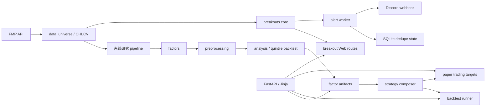

# 项目运行架构与耦合审计

## 1. 当前不是一个进程，而是五种运行方式

| 入口 | 职责 | 主要输出 |
|---|---|---|
| `scripts/run_mvp.py` | 离线下载、因子计算、预处理、IC、分组回测 | `outputs/universes/` |
| `src.webapp.app:app` | FastAPI 页面和 API；读取研究产物，并提交回测/模拟盘操作 | HTML/API |
| `src.backtest.runner` | 执行“策略 × 股票池”的回测任务 | `outputs/backtests/` |
| `scripts/run_momentum_alerts.py` | 独立实时强势扫描、去重、Discord 投递 | `outputs/momentum_alerts/` |
| `scripts/refresh_us_active.py` | 更新美股活跃池和日线缓存 | `data/raw/` |

告警 worker 不需要 FastAPI。新加坡服务器只运行后两个定时任务即可，网页可以继续
留在本机，或者以后单独部署。

## 2. 主依赖方向

依赖原则是：页面和脚本可以调用业务模块；业务模块不应反向导入 FastAPI 页面。
本次已把 `backtest/composer.py -> webapp/results_store.py` 的反向依赖改为中立的
`factors/artifacts.py`。

## 3. 多因子与强势突破如何合作

目前两者是并列能力，不是同一个交易模型：

| 维度 | 多因子研究/策略 | 强势突破/告警 |
|---|---|---|
| 股票池 | 主要是 `SP500`、`MAG7`、Watchlist | `US_ACTIVE` 美股挂牌标的（含 ADR），告警默认仅 `STOCK` |
| 时间尺度 | 日频、历史截面、月/周调仓 | 日线 Setup + 小时实时 quote + 可选分钟线 |
| 输出 | 因子矩阵、IC、回测、目标权重 | 候选、READY/BREAKOUT、Discord 摘要 |
| 是否影响另一方评分 | 否 | 否 |

合作点只有四类：

1. 共用 `configs/default.yaml` 和 FMP 适配器。
2. 共用 `data/raw/ohlcv/*.parquet` 日线缓存；多因子还会生成自己的宽表。
3. 告警可从 Watchlist 和模拟盘正持仓读取“必须检查”的股票。
4. FastAPI 把两套能力放在同一个导航和页面外壳里。

因此，新增强势突破 Tab 本身没有让突破规则污染多因子策略，也没有改变已有的因子
权重或回测结果。

## 4. 耦合结论

**突破与多因子之间：低到中等耦合，目前不过度。** 它们共享基础设施，但核心算法、
结果目录和运行进程是分开的。告警服务器即使不启动 Web 和多因子 pipeline 也能工作。

**整个平台内部：存在中等技术债，继续扩展前应该治理。** 主要问题按优先级如下：

1. `src/webapp/routes_v2.py` 超过 1700 行，同时管理策略、回测、模拟盘、突破和
   Watchlist，已经是维护热点。应按领域拆成独立 router。
2. `scripts/refresh_us_active.py` 的可选页面预计算仍调用 Web 私有函数
   `_get_breakout_scan`。服务器通过 `--skip-precompute` 已避开，但长期应下沉为
   `breakouts` application service。
3. 中立的因子产物层仍从 `CONFIG.webapp.output_dir` 读取根目录，配置命名带有 Web
   历史包袱；后续可迁移为顶层 `storage.output_dir`。
4. Web 回测使用进程内线程池，适合单机研究，不适合多实例部署；规模扩大后应换成
   独立 job worker。
5. 多个进程会读写本地 Parquet/JSON。单服务器低频运行可接受；多实例时需要文件锁、
   对象存储或数据库事务。

## 5. 后续组合的正确方式

如果以后要让突破信号参与量化组合，不要直接修改现有因子分数。建议新增显式、可回测的
策略层，例如：

- `universe_filter`：只允许通过强势四项硬筛的股票进入候选池。
- `entry_timing`：多因子决定“买什么”，突破信号决定“何时入场”。
- `breakout_factor`：将 Setup 分数做成一个有日期、有截面、有 IC 检验的独立因子。

三种方式都应冻结参数版本，并分别与纯多因子基线做样本外回测。这样组合是可解释的，
不会让网页上的一个 Tab 变成隐藏的交易逻辑耦合。
