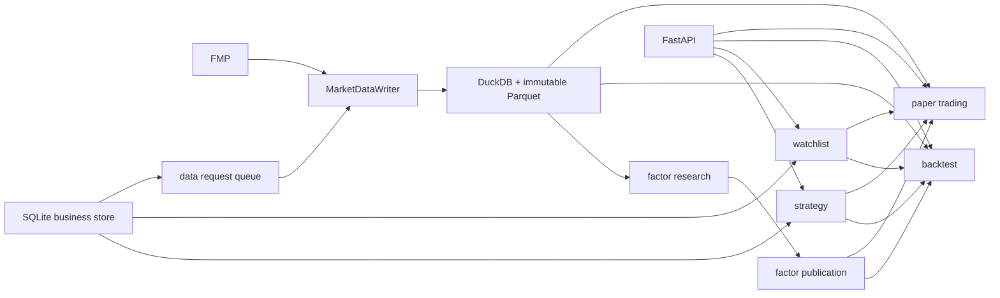

# 项目运行架构

更新日期：2026-08-08

## 1. 系统由多个进程协作

| 入口 | 职责 | 主输出 |
|---|---|---|
| `scripts/run_data_pipeline.py` | SP500 PIT、SP500/MAG7 日线摄取和正式版本发布 | `data/catalog/`、`data/lake/` |
| `scripts/refresh_us_active.py` | 生成并发布版本化 `US_LIQUID_5M` | DuckDB + `data/lake/` |
| `scripts/run_data_requests.py` | 处理 Watchlist 专属行情请求 | DuckDB + SQLite 请求状态 |
| `scripts/run_factor_research.py` | 对最新正式版本发布整批因子研究 | `outputs/universes/` |
| `src.webapp.app:app` | 页面、API、创建业务对象和提交回测 | HTML/API + SQLite |
| `src.backtest.runner` | 执行策略回测 | SQLite task + 大型 Parquet |
| `scripts/run_paper.py` | 运行 active 日线模拟盘 | SQLite 账户和账本 |
| `scripts/run_group_analytics.py` | sector/sub-industry EOD 强弱 | immutable group artifacts |
| `scripts/run_momentum_alerts.py` | 独立动量扫描和 Discord 投递 | 告警状态与摘要 |
| `scripts/run_intraday_momentum_monitor.py` | 独立分钟级 shadow 监控 | 独立 SQLite/快照 |
| `scripts/run_market_regime_research.py` | 大盘顶底研究 | 独立研究产物 |

Web 不是调度器。关闭浏览器不会停止 worker；启动网页也不会自动更新日线或因子。

## 2. 主多因子依赖方向



依赖规则：

1. 业务模块不能通过导入 Web 路由来读取数据。
2. 研究和交易模块不能直接请求 FMP 日线。
3. 一次运行只绑定一个明确 `DatasetVersion`。
4. 可变业务状态只经 `src/storage/app_db.py` 写 SQLite。
5. 大型分析表保留为 Parquet，不塞进 SQLite JSON 行。

## 3. 代码包怎么分层

```text
src/
  config.py               # YAML -> CONFIG
  data/                    # writer、reader、PIT、缺数队列、供应商适配
  factors/                 # raw factor 与研究发布 manifest
  preprocessing/          # 去极值、中性化、z-score
  analysis/               # IC、统计置信和诊断
  execution/              # 回测/模拟盘共用的费用、滑点和成交约束
  strategies/             # 策略定义和 SQLite store
  watchlists/             # Watchlist 定义和 SQLite store
  backtest/               # 组合、执行、任务 store 和结果表
  papertrading/            # 目标权重、订单、成交、账本和账户 store
  storage/                 # 通用 SQLite 事务与 checksum
  webapp/                  # FastAPI 路由、模板、JS、CSS
```

建议阅读顺序是配置和入口在前，业务细节在后：

```text
configs/default.yaml
  -> scripts/run_data_pipeline.py
  -> src/data/foundation.py
  -> scripts/run_mvp.py
  -> src/factors + src/preprocessing + src/analysis
  -> src/strategies + src/backtest
  -> src/papertrading
  -> src/webapp/routes_v2.py
```

## 4. 因子、策略、回测不是一回事

```text
因子 = 每日每只股票的一个特征值
策略 = 多个因子及其权重的配方
回测 = 策略 + 股票池 + 日期 + 调仓规则 + 成交模型的一次运行
模拟盘 = 同一策略在逐日账户状态上生成订单并等待未来 open 成交
```

命名股票池的因子先由研究任务发布。策略组合只读取同一 publication 下的 clean factor 矩阵。
Watchlist 走专属行情版本并现场计算 runtime factor bundle，不能向 FMP 临时补一只股票。

## 5. 独立模块边界

动量突破、盘前 Discord、分钟监控和大盘顶底研究与主多因子共享部分配置或正式行情，但不是
隐藏在策略分数中的条件：

| 域 | 是否改变多因子分数 | 主要数据 |
|---|---:|---|
| group analytics | 否 | 正式 SP500 version + 分类发布物 |
| 日线动量扫描 | 否 | 正式 `US_LIQUID_5M` version |
| 分钟 shadow monitor | 否 | quote/分钟缓存和独立状态 |
| market regime research | 否 | 正式 SP500 version + Cboe/FRED 等独立源 |

以后若让突破信号参与策略，应将其做成显式 universe filter、entry timing 或可研究的新因子，并
单独做样本外检验，不能由页面 Tab 暗中改变交易逻辑。

## 6. 当前仍需治理的边界

- `routes_v2.py` 仍承载策略、Watchlist、回测和模拟盘多个领域，可以继续拆路由。
- Web 回测使用进程内线程池，适合单机；多实例时应迁为独立任务 worker。
- SQLite 适合当前单写节点；多机并发写时迁 PostgreSQL。
- 模拟盘每次 frame 写入已有 SQLite 事务和 checksum，但整次账户运行包含多次持久化；需要通过
  故障注入验证 fill-first 幂等恢复，并评估是否升级为单次数据库事务。
- 独立 Discord/盘中模块仍有各自状态库，这是业务隔离，不应误并入模拟盘账本。
