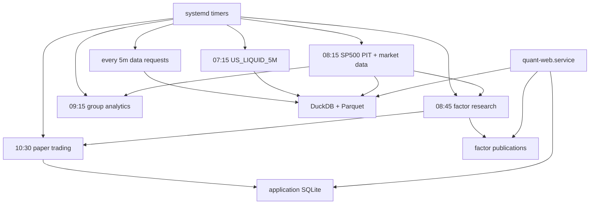

# SG 生产运维总览

更新日期：2026-08-08

## 1. 当前必须区分两套状态

| 范围 | 状态 |
|---|---|
| 本地 `/Users/huozhihong/Documents/Quant` | 已删除旧兼容代码；旧数据已校验后移出项目；group timer 改为 09:15；待完整测试 |
| SG `/home/projects/quant` | 上次 SSH 验收时服务可运行且完成影子观察；尚未部署本次本地清理 commit |

因此本文中的“目标状态”是下一次部署后应达到的状态，不能仅凭本地文件推断 SG 已经同步。

## 2. 目标生产拓扑



## 3. 预期服务

| Unit | 目标状态 | 关键职责 |
|---|---|---|
| `quant-web.service` | enabled + active | FastAPI 页面/API |
| `quant-us-daily-refresh.timer` | enabled | `US_LIQUID_5M` 正式版本 |
| `quant-market-data.timer` | enabled | SP500 PIT、SP500/MAG7 行情 |
| `quant-factor-research.timer` | enabled | 主因子整批研究发布 |
| `quant-group-analytics-eod.timer` | enabled | 读取正式 SP500 version 的板块研究 |
| `quant-paper-trading.timer` | enabled | active 模拟盘账户 |
| `quant-data-requests.timer` | enabled | Watchlist 缺数队列 |
| `quant-premarket-digest.timer` | disabled | 外发 Discord 暂停 |

服务器应以 `systemctl list-unit-files 'quant-*'`、`systemctl list-timers --all 'quant-*'` 和 journal
为事实来源。

## 4. 存储职责

| 存储 | SG 路径 | 备份重点 |
|---|---|---|
| DuckDB catalog | `/home/projects/quant/data/catalog/quant.duckdb` | 版本指针和质量审计 |
| Parquet lake | `/home/projects/quant/data/lake/` | 正式不可变行情和 PIT 冻结副本 |
| PIT publication | `/home/projects/quant/data/pit_universes/` | 当前 SP500 PIT 与 metadata |
| SQLite app DB | `/home/projects/quant/outputs/quant_app.sqlite3` | 策略、Watchlist、回测、模拟盘、请求队列 |
| Research outputs | `/home/projects/quant/outputs/universes/` | 当前 factor publication 与 generation |
| Backtest artifacts | `/home/projects/quant/outputs/backtests/` | 大型结果和日志 |

DuckDB 和 SQLite 都是嵌入式文件，不需要独立 daemon。Parquet 也是文件格式。数据只存在部署它们
的机器磁盘上，除非另行做备份或同步；本地和 SG 不是自动共享数据库。

## 5. 已完成的迁移里程碑

- 主行情使用 DuckDB catalog + 不可变 Parquet。
- 网页回测、策略排行、模拟盘统一通过 `MarketDataReader`。
- `next_open` 缺失时 fail closed，不回退 `close`。
- 策略、Watchlist、回测 task、模拟盘账户/账本和缺数队列进入 SQLite。
- SG 曾完成六个不同 target session 的行情全 OHLCV 精确影子核验和业务 SQLite 影子核验。
- 迁移期开关已经关闭；本地代码已进一步删除开关、影子脚本和旧读写实现。

历史影子观察是迁移审计证据，不再是每日生产健康检查。当前检查命令已经收敛为：

```bash
.venv-worker/bin/python scripts/run_data_pipeline.py status
.venv-worker/bin/python scripts/check_app_storage.py
```

## 6. 下一次 SG 发布验收

发布前：

1. 记录本地测试结果和 commit ID。
2. 停止会写数据的 service，避免备份中途变化。
3. 备份代码、`configs/default.yaml`、DuckDB catalog、SQLite 和 systemd units。

发布后：

1. 安装依赖并执行 `python -m compileall src scripts`。
2. 对全部新增或修改 unit 执行 `systemd-analyze verify`。
3. 确认 group timer 是 09:15，service `After=quant-market-data.service`。
4. 运行行情 status 和 SQLite integrity。
5. 启动 Web，带认证检查首页、因子、策略、Watchlist、回测和模拟盘页。
6. 手动运行一次缺数 worker，确认空队列时幂等退出。
7. 观察至少一个生产交易日，再归档 SG 旧目录。

旧目录处理必须采用“先核验、再外部归档、最后从项目移出”，不要删除当前 Parquet lake、SQLite
或仍被页面引用的回测结果。

## 7. 当前限制

- SG 尚未实际部署和验证本次 2026-08-08 本地清理。
- 第一个真实 Watchlist 缺数队列还没有完成端到端验收。
- 真实策略、回测和 active 模拟盘账户的重启恢复还没有完成验收。
- 模拟盘单个 record/frame 写入有事务，但整轮包含多次写入，需要故障注入确认幂等边界。
- Web 原始 18823 端口若直接公网 HTTP 暴露，Basic Auth 不能提供传输加密。
- 统一告警尚未覆盖所有 systemd 失败。

日常命令见 [`server_daily_runbook.md`](server_daily_runbook.md)，存储细节见
[`unified_data_storage.md`](unified_data_storage.md)。
