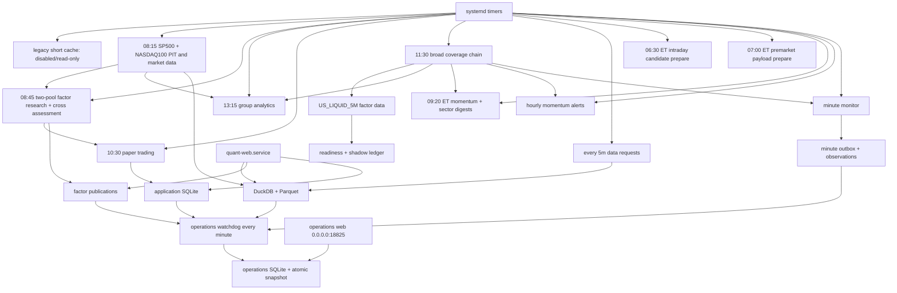

# SG 生产运维总览

更新日期：2026-08-29

## 1. 当前部署状态

| 范围 | 状态 |
|---|---|
| 本地 `/Users/huozhihong/Documents/Quant` | 全美宽基、严格回测、茶杯柄 shadow 与独立运维站代码已完成集成 |
| SG `/home/projects/quant` | 宽基代码和独立运维站已部署；主 Web、双核心研究池、既有调度、运维采集和茶杯柄 shadow 均已验收 |
| 全美宽基 v1 | 五交易日上线门槛已完成，网页默认开关已启用；正式置信研究仍由 PIT 行业历史门禁独立阻断 |

SG 发布使用隔离 worktree 生成的精确白名单包，不从有未提交改动的本地工作目录直接部署。生产
`.deploy-commit` 必须在下一次 SG 部署时更新到实际验收的共享提交，不能用文档中的历史提交号代替。
部署始终排除 `.git`、项目根目录的 `data/outputs/logs`、虚拟环境和密钥文件。rsync 排除项必须写成
`/data/`、`/outputs/` 等根锚定形式；非锚定 `data/` 会误排除代码目录 `src/data/`。

## 2. 目标生产拓扑



## 3. 预期服务

| Unit | 目标状态 | 关键职责 |
|---|---|---|
| `quant-web.service` | enabled + active | FastAPI 页面/API |
| `quant-operations-web.service` | enabled + active | `0.0.0.0:18825` 独立只读运维站，强制独立认证，不注册主业务路由 |
| `quant-operations-watchdog.timer` | enabled | 每分钟汇总 DuckDB、SQLite、JSON 和 systemd 证据，不发送 Discord 运维告警 |
| `quant-us-daily-refresh.timer` | disabled | 旧短历史版本只读归档，不再作为当前数据源 |
| `quant-market-data.timer` | enabled | SP500/NASDAQ100 PIT、SP500/NASDAQ100/MAG7 行情 |
| `quant-factor-research.timer` | enabled | 两个核心池研究、MAG7 参考结果和跨池发布 |
| `quant-group-analytics-eod.timer` | enabled | 13:15 读取同日 SP500 与全美 coverage benchmark 的板块研究 |
| `quant-paper-trading.timer` | enabled | active 模拟盘账户 |
| `quant-paper-discord-events.timer` | Webhook 配置后 enabled | 每两分钟对账新 fill，幂等发送模拟成交通知 |
| `quant-paper-discord-daily.timer` | Webhook 配置后 enabled | Tue-Sat 11:00 SGT 发送模拟盘账户日结 |
| `quant-data-requests.timer` | enabled | Watchlist 缺数队列 |
| `quant-intraday-candidate-prepare.timer` | enabled | 06:30 ET 预计算全美宽基盘中候选 |
| `quant-premarket-prepare.timer` | enabled | 07:00 ET 冻结双频道 payload，不连接 Discord |
| `quant-premarket-digest.timer` | enabled | 分别发送 momentum 与 sector rotation 盘前摘要 |
| `quant-momentum-alerts.timer` | enabled | 10:00–15:59 ET 小时摘要 |
| `quant-intraday-momentum-monitor.timer` | enabled | 分钟 shadow；五日验收后人工武装推送 |
| `quant-us-equity-coverage.timer` | **enabled + active** | Tue-Sat 11:30 SGT 串行发布 Security Master、全美 coverage、PIT 宽基和八因子数据 |
| `quant-broad-factor-data.service` | 由上游 `OnSuccess` 触发 | 宽基八因子月分片增量发布 |
| `quant-broad-research-readiness.service` | 由 factor `OnSuccess` 触发 | 检查正式宽基研究门槛；当前预期 `BLOCKED` |
| `quant-broad-shadow-observation.service` | 由 factor `OnSuccess` 触发 | 完整哈希、真实排名查询和五日台账 |

服务器应以 `systemctl list-unit-files 'quant-*'`、`systemctl list-timers --all 'quant-*'` 和 journal
为事实来源。旧 `quant-us-daily-refresh.timer` 必须保持 disabled；不能用固定 timer 总数代替逐项
核对 `configs/operations.yaml` 的 `enabled_expected`。

## 4. 存储职责

| 存储 | SG 路径 | 备份重点 |
|---|---|---|
| DuckDB catalog | `/home/projects/quant/data/catalog/quant.duckdb` | 版本指针和质量审计 |
| Parquet lake | `/home/projects/quant/data/lake/` | 正式不可变行情和 PIT 冻结副本 |
| Security Master | `/home/projects/quant/data/lake/security_master/` + DuckDB pointer | 稳定证券身份、ticker 区间和分类快照 |
| PIT publication | `/home/projects/quant/data/pit_universes/` | SP500/NASDAQ100 PIT 与 metadata |
| SQLite app DB | `/home/projects/quant/outputs/quant_app.sqlite3` | 策略、Watchlist、回测、模拟盘、请求队列 |
| Research outputs | `/home/projects/quant/outputs/universes/` | 当前 factor publication 与 generation |
| Backtest artifacts | `/home/projects/quant/outputs/backtests/` | 大型结果和日志 |
| Intraday momentum state | `/home/projects/quant/outputs/intraday_momentum_monitor/state.sqlite3` | 信号、outbox、逐分钟观测、五日晋级证据 |

茶杯柄检测复用 `quant-intraday-momentum-monitor.service`，不新增第二个行情抓取服务。它在同一 SQLite 中使用 `cup_handle_evaluations`、`cup_handle_cycles` 和 `cup_handle_session_observations`，并以 `daily-cup-5m-handle-shadow-v1` 独立累计五个完整交易日。部署后必须保持 `intraday_momentum_monitor.cup_handle.delivery_enabled: false`，直到新台账达到 `5/5` 且历史回放误报统计经人工验收。
| Operations ledger | `/home/projects/quant/outputs/operations/operations.sqlite3` | 任务运行、数据新鲜度、投递和异常台账；Web 读取独立原子快照 |

DuckDB 和 SQLite 都是嵌入式文件，不需要独立 daemon。Parquet 也是文件格式。数据只存在部署它们
的机器磁盘上，除非另行做备份或同步；本地和 SG 不是自动共享数据库。

## 5. 已完成的迁移里程碑

- 主行情使用 DuckDB catalog + 不可变 Parquet。
- 网页回测、策略排行、模拟盘统一通过 `MarketDataReader`。
- `next_open` 缺失时 fail closed，不回退 `close`。
- 策略、Watchlist、回测 task、模拟盘账户/账本和缺数队列进入 SQLite。
- SG 曾完成六个不同 target session 的行情全 OHLCV 精确影子核验和业务 SQLite 影子核验。
- 迁移期开关已经关闭；本地代码已进一步删除开关、影子脚本和旧读写实现。

历史影子观察是迁移审计证据，不再是每日生产健康检查。当前检查命令已经收敛为：

```bash
.venv/bin/python scripts/run_data_pipeline.py status
.venv/bin/python scripts/check_app_storage.py
```

### 5.1 双核心研究池生产状态

2026-08-11 已完成 NASDAQ100 来源差异的正式、可审计修正，并发布：

- PIT：目标日 `2026-08-10`，40 个快照，0 条不一致；
- 行情：`9c5abc4b58a5414e911153cdda6a429c`，165 票、248,893 行、目标日覆盖 100%；
- 研究：`763f89c3-3b62-4fd2-9d6b-968f3bf4b4b2`，8 因子完成；
- 跨池：`ROBUST=3`、`SEGMENT_SPECIFIC=1`、`INSUFFICIENT=4`。

临时排除 NASDAQ100 的两个 drop-in 已停用并归档。实际启动行情和研究 unit 均返回
`Result=success`、`ExecMainStatus=0`。因子数据页面和 snapshot/history API 已在 SG 返回 200。
审核规则与来源见
[`research_universe_redesign_implementation.md`](research_universe_redesign_implementation.md)。

### 5.2 2026-08-11 systemd 依赖链修复

部署验收时发现五个旧 root unit 仍把已经删除的 `runlog/` 写成必须存在的
`ReadWritePaths`，导致 Python 启动前即以 `226/NAMESPACE` 失败。仓库模板和实际 unit 已统一改为：

```ini
ReadWritePaths=/home/projects/quant/data /home/projects/quant/outputs /home/projects/quant/logs
ReadWritePaths=-/home/projects/quant/runlog
```

受影响 unit 为 group analytics、US daily refresh、intraday monitor、momentum alerts 和 premarket
digest。原 unit 已备份到本次回滚目录。修复后的实跑结果：

- US_LIQUID_5M 版本 `ff9c8527e3a54f3aaade58d8ef939f68`：2,953 票、361,216 行、
  目标日覆盖率 99.93%、失败下载 0，并预计算 97 个动量候选；
- group analytics 的 sector 与 sub-industry 两个 EOD 产物均为 `SUCCESS`；
- momentum alerts 在美股休市时返回 `skipped_market_closed`；
- premarket digest 已改为 `--channel all`，窗口外 smoke 明确识别 momentum 与
  sector-rotation 两个频道并返回 `SKIPPED_OUTSIDE_WINDOW`；
- intraday monitor 实际进入 running，五秒 smoke 后正常停止；
- 最终 `systemctl --failed` 中没有 Quant unit，9 个 Quant timer 均为 active/waiting。

2026-08-10 美股时段没有通知的直接原因就是上述 `226/NAMESPACE`：盘前、盘中分钟监控和
小时动量进程都未进入 Python。修复后，`2026-08-10` sector/sub-industry 正式产物已通过
盘前 dry-run，覆盖 `502/502`，两个频道的独立 Webhook 也均已配置。分钟监控不会绕过风险
门槛；截至 2026-08-12，`2026-08-11` 完整 session 已通过，五日观察为 `1/5 PASS`，
`delivery_armed=false`、有效模式为 `shadow`。达到 `5/5` 只取得上线资格，人工打开独立发送
开关后，`--auto` 才会在后续 session 进入 Discord live。小时动量告警不受该晋级闸门约束，
但只有交易时段存在合格信号时才发送。

### 5.3 全美宽基 v1 SG 首次上线记录

2026-08-12 已实现并部署到 SG：

- `US_EQUITY_COVERAGE` 月分片行情、PIT `US_LIQUID_5M`、八因子 long Parquet；
- Security Master 全局搜索，MDB/AEVA 不再依赖指数成分；
- 每日三阶段编排、350 MB/15 GB 启动资源门槛、900 MB cgroup 硬上限；
- 按不同 XNYS target session 计数的五日影子台账；
- 页面默认宽基开关，当前固定为 `false`。

生产验收记录：

- 一致性备份：`/home/projects/quant-backups/broad-migration-20260812T230832CST`，约 251 MB，含代码、
  `data/outputs`、`/etc/quant` 和 systemd；
- `systemd-analyze verify` 已通过；唯一提示是腾讯云 `tat_agent.service` 的旧 `/var/run`；
- SG 资源预检通过：可用内存约 976 MB、可用磁盘约 66.8 GB；业务 SQLite
  `PRAGMA integrity_check=ok`，DuckDB 可只读打开；
- 本地和 SG 均为 `488 passed`；宽基 4 个 service 和 1 个 timer 已安装，timer 保持 `disabled`；
- Security Master 第一次发布得到 10,200 个证券、5,397 个活跃普通股，耗时 4 分 46 秒，峰值
  526 MB；覆盖回填在第 4 个 100 票批次后主动暂停，未推进 coverage 正式 pointer；
- 真实回填发现 `OCCIP` 被 FMP 错标为普通股，以及第一次候选未检查自身 CUSIP/ISIN 多重映射。
  代码已增加 Nasdaq 紧凑优先股、warrant/unit 分类、严格同 issue 身份归并、歧义键隔离、候选
  自检与重复构建幂等测试。第一次主表 generation `116a74a6d7ca49a5abab6077592494ba` 仅作为
  问题证据保留，不得作为正式 coverage 回填父版本；
- Web 已重启。`/research`、`/research/factor-data`、meta API、MDB 和 AEVA 搜索均返回 200，响应
  约 0.07-0.44 秒。MDB/AEVA 当前明确显示 `coverage_status=MISSING`，宽基 meta 明确显示未发布，
  没有回退到 SP500；
- 美股盘中监控保持 active，小时动量在 22:36 SGT 成功发送 Discord。首次重任务因与盘中窗口
  重叠而暂停，后续只在安全窗口恢复。

### 5.4 独立运维站已投产

2026-08-13 已完成 `quant-operations-watchdog.timer` 和 `quant-operations-web.service` 部署。
运维站使用独立 `18825`、独立 Basic Auth 和只读原子 SQLite 快照，不注册到主业务 Web，也不发送
Discord 运维告警。SG 生产监听 `0.0.0.0:18825`，直接入口为
`http://43.156.89.232:18825/`；认证缺失时服务拒绝公网启动，无认证请求返回 `401`。直接 IP
目前使用 HTTP，长期仍应迁移到 HTTPS 反向代理。公网切换回滚备份位于
`/home/projects/quant-backups/operations-public-20260813T093923+0800`；外部直连已返回预期 401，
服务器内六个认证页面与 `/healthz` 均返回 200。连续自动采集已证明 11/11 个任务均能从 SG 的
DuckDB、SQLite、JSON 和 systemd 读取结构化证据。完整验收记录、访问方式和状态定义见
[`operations_observability.md`](operations_observability.md)。

当前 SG 上旧 07:15 `US_LIQUID_5M` 仍服务动量扫描；它与新的 derived PIT universe 是不同存储
职责，不能把旧 180D 版本当成宽基历史研究证据。首次正式链完成前仍必须保持：

- `data.broad_factor_data.web_default_enabled=false`；
- `quant-us-equity-coverage.timer=disabled`；
- 不恢复绑定旧 Security Master 的
  `run=20260812T152208Z_57bca7cb`，但保留其 checkpoint 和 Parquet 证据；
- 用修复后的主表重新开始 coverage 回填，再发布 PIT、八因子并进入 5 个不同交易日观察。

具体上线步骤见
[`us_broad_factor_research_implementation.md`](us_broad_factor_research_implementation.md)。

2026-08-13 11:35 SGT 的修复后重跑结果：盘中动量已退出，资源预检通过，timer 和 writer 均保持
关闭；新冻结源候选 `run=20260813T033828Z_c7c84071` 正确排除了 OCCIP 等特殊证券，但在
Security Master 的 100% 身份覆盖门槛失败。具体是 FMP 把 HSPT/SLBT 复用了同一组 ISIN/CUSIP，
又把 VACH/VRXA 复用了同一 ISIN；系统正确隔离了歧义 provider 键且没有静默合并，却导致已退市的
HSPT、VACH 没有剩余身份键，最终覆盖为 10,184/10,186。使用同一冻结源重建
`run=20260813T035020Z_2ddf08cb` 后，security ID、业务主表、别名和 identity-key 结果精确一致，
幂等校验通过，但同一质量门槛仍失败。

进一步核查 SEC 文件后确认，HSPT/SLBT 与 VACH/VRXA 分别是两笔真实业务合并后的 ticker 连续，
不是需要拆分的身份碰撞。代码新增严格、带 SEC 来源的修正登记；字段或日期漂移即失败，不降低
100% 身份门槛。两次真实冻结源候选均 PASS，身份覆盖 100%，四张核心表及 Parquet 哈希完全一致。

2026-08-14 已备份并发布正式 Security Master generation
`231b5b53d46a47d9a3a463cab6b06766`，target 为 2026-08-12。旧 4 批 checkpoint 仍绑定旧 generation、
时间戳未变，未被恢复。可恢复首次编排、唯一 checkpoint 匹配、部分批次重试、因子分片进度和
运维站实时阶段已部署，SG 最终回归 `498 passed`。

持久 `quant-broad-initial-rollout-scheduled.timer` 将于 **2026-08-15 11:35 SGT** 启动，服务失败后
按精确输入合同恢复；服务器重启也不会丢失计划。`quant-us-equity-coverage.timer` 仍为 `disabled`，
`web_default_enabled` 仍为 `false`。首次链通过后还需人工验收首日 shadow、MDB/AEVA、资源、日志和
页面，再启用日常 timer；网页默认宽基仍必须等待五个不同交易日通过。

## 6. 2026-08-08 SG 发布与验收记录

一致性备份位于：

```text
/home/projects/quant-backups/20260808T183044+0800/
```

它包含代码、完整 `data/outputs/logs`、`/etc/quant`、systemd units、SQLite Backup API 副本、
DuckDB 副本、各次精确 release archive 和 `SHA256SUMS`。发布过程排除了 `.git`、`data`、
`outputs`、`logs`、两个虚拟环境和环境变量文件，未用代码覆盖状态目录。

验收结果：

- `systemd-analyze verify` 通过；唯一提示来自腾讯云 `tat_agent.service` 的旧 `/var/run` 路径。
- SG 的 Web、writer、research、paper 和动量 worker 全部使用同一个 `.venv`。
- 最终完整测试为 `326 passed`；新版 Starlette 只有测试客户端弃用 warning。
- 页面验收发现冻结策略快照的成分行缺少方向字段，导致成功回测详情页 500；补齐字段并增加模板
  回归测试后，未认证首页返回 401，认证后的六个主页面及真实 Strategy、Watchlist、Backtest、
  Paper 详情页全部返回 200。
- `scripts/run_data_pipeline.py status`：MAG7、SP500、US_LIQUID_5M 都指向 2026-08-07 正式版。
- `scripts/check_app_storage.py` 和 SQLite `PRAGMA integrity_check` 通过。
- group timer 已从旧 07:45 改为 09:15；缺数 timer 恢复为每 5 分钟。
- `systemctl --failed` 没有 Quant unit；宿主机原有的 IPMI、kdump、mcelog 三个失败 unit 与本项目
  无关，应由服务器基础设施层另行处理。

### 6.1 真实业务对象

| 对象 | ID | 结果 |
|---|---|---|
| Strategy | `42bafed1-df08-47d4-95bd-9c25a7d54e3c` | MOM_12M 0.6 + VOL_60D -0.4 |
| Watchlist | `76f37adb-5a45-449a-89ba-23ac045488d5` | 10 只真实美股，等权 |
| 最终回测 | `db026d38-0b27-46a5-bdf8-3d26240fe26a` | WAITING 自动恢复后 success |
| Paper account | `df937dec-c04c-486e-aac7-3cd547628944` | next-open 成交和故障恢复通过，验收后 paused |

Watchlist 专属数据池是
`WATCHLIST_76F37ADB5A45449A89BA23AC045488D5_5684832A95B7`，最终正式版本是
`a95650c5dc37488795248c75f72322ce`：2020-07-06 至 2026-08-07，14,114 行、10 票、
目标日覆盖 100%。

### 6.2 缺数与重启恢复

- 实测 pending -> running；第二个独立领取进程返回空列表，没有重复领取。
- stale running 故障注入后安全回到 pending，attempts 保留。
- 发现并修复了 IPO 前覆盖率误判、扩大日期范围不向后回补、短版本静默截断、Web 重启后
  未初始化 WAITING monitor、批 worker 残留 reader 调用五个问题。
- Web 关闭时数据请求 success、回测仍保持 WAITING；新 Web lifespan 日志明确记录
  `submitted 1 backtests whose data is ready`，随后任务 success。

### 6.3 交易账本故障注入

- 回测逐票 `trades.parquet` 的成本合计、按日 `costs.parquet` 合计和任务 diagnostics 完全一致。
- 模拟盘使用 2026-07-01 next open 成交，逐票保存动态滑点、佣金、SEC/TAF/CAT、清算和
  pass-through 成本。
- 注入“fills 已写、orders 写失败”后，fill ledger 增至 4 行、orders 仍为 pending；同日重试后
  fill ID 数仍为 4，orders 全部 filled，累计成交数量逐单精确一致。
- 重启 Web 后账户现金、权益、orders、fills、runs、positions 和历史 frame 均从 SQLite 恢复。

## 7. 当前限制

- 这个 10 票 Watchlist 没有发布 sector metadata，且小于 `neutralize_min_obs=30`；本次 runtime
  factor 日志明确提示行业中性化未执行。它适合验证数据和交易链路，不应作为行业中性策略的
  正式研究样本。
- SG 仍保留备份窗口前的旧 `data/raw/ohlcv`、`data/processed` 等文件；当前代码不读取它们。
  它们应在保留期确认后移到服务器外部归档，不要与 `data/lake` 一起删除。
- 当前 NASDAQ100 热修复已经部署，但本地改动仍需提交并推送到共享远端，消除 SG 与仓库漂移。
- Web 原始 18823 端口若直接公网 HTTP 暴露，Basic Auth 不能提供传输加密。
- 2026-08-11 登录时观察到 109 次失败的 root SSH 尝试；应迁移到普通运维用户、禁用 root 密码
  登录并配置安全组/防火墙白名单。
- 统一告警尚未覆盖所有 systemd 失败。
- 因子数据截面冷缓存实测 2.56 秒，尚未达到内部 `<2s` 目标；热缓存约 0.077 秒，历史查询
  约 0.20 秒。
- 全美宽基 unit 已部署，但正式数据尚未完成，11:30 timer 仍禁用；在五日影子完成前，页面默认
  入口不能切到宽基。
- 当前 Security Master 行业是 latest-known 快照，正式宽基 IC/ICIR/confidence 必须继续阻断。

日常命令见 [`server_daily_runbook.md`](server_daily_runbook.md)，存储细节见
[`unified_data_storage.md`](unified_data_storage.md)。

## 8. 2026-08-16 宽基首次链故障处置

现网复核确认 `47/78` 不是仍在推进的任务。首次 coverage 进程在 DuckDB 全局校验阶段受到持续内存
回收压力，检查点长期不更新；服务已安全停止，两个宽基 timer 均保持 `disabled`，旧 staging 和
checkpoint 只保留为审计与可能的精确恢复证据。

部署前取证备份位于：

```text
/home/projects/quant-backups/broad-stall-20260816T0055CST/evidence-and-code.tar.gz
/home/projects/quant-backups/broad-stall-fix-20260816T1045CST/predeploy-files.tar.gz
/home/projects/quant-backups/operations-status-fix-20260816T013709CST
```

本地完整回归为 `518 passed`；SG 安全修复部署后完整回归为 `502 passed`，本次运维状态边界测试为
`11 passed`。宽基相关 unit 的 `systemd-analyze verify` 通过，唯一提示仍来自腾讯云 `tat_agent`。
`quant-web.service` 和 `quant-operations-web.service` 保持 active，其他既有定时任务未被本次处置关闭。

最新冻结源候选审计为：

```text
/home/projects/quant/outputs/data_audits/security_master_candidates/asof=2026-08-14/run=20260815T172937Z_9b750f01/audit.json
```

它以 `overlapping ticker intervals` 失败关闭。运维站现按“最新同日质量证据优先”显示：证券主表
`BLOCKED`；行情显示“旧检查点保留在 47/78 批，不代表任务仍在运行”；PIT 和八因子显示被上游
阻断。不得仅修改 checkpoint 状态、手工标记成功或恢复首次链。下一步须先完成逐组 SEC/第二供应商
核验，并决定缺失历史证券采用替代数据源还是 `PROSPECTIVE_ONLY`。

最终核验还发现 2026-08-14 的盘前动量与盘中突破曾因 `US_LIQUID_5M` 数据门禁失败：当日 07:15
候选的 target-session coverage 只有 97.85%，系统没有发布不完整版本；同日晚间板块轮动已成功发送，
但动量通道返回 `MOMENTUM_PUBLISHED_DATA_NOT_READY`，盘中监控因
`stale_target_session/latest_session_coverage` 退出。这不是宽基服务直接关闭业务任务，而是共享行情
输入按合同失败关闭。

2026-08-15 的日更已成功发布 target `2026-08-14`、版本
`e3bfa3cb2a1a4b3b9567ace484e0b32d`，目标日覆盖率 99.93%、失败抓取 0。SPY/QQQ 动量读取预检通过；
历史 failed 标志已清理，`systemctl --failed` 中不再有 Quant unit。盘前摘要和盘中监控 timer 保持
active，将在下一个美股交易日按原计划运行；历史失败投递仍保留在运维台账，不应删除。

## 9. 2026-08-16 PROSPECTIVE_ONLY 恢复上线

项目负责人已批准无法证明历史的证券采用 `PROSPECTIVE_ONLY`，而不是猜测换码日期、降低质量门槛
或恢复旧检查点。配置 `configs/research_history_policy.yaml` 是公开审计台账，最终共 66 条：30 条活跃
证券从 2026-08-14 起向未来摄取，36 条非活跃证券因历史不可验证从历史 coverage 排除。Security
Master manifest 新增第五份 `history_policy` 产物；配置选择器发生 identity/ticker/name/status 漂移
时构建立即失败。

同一冻结 provider source 两次候选均 `PASS`，五表行数及 SHA-256 完全一致。40 票 FMP pilot 覆盖
全部 30 条前瞻证券和 MDB/AEVA，40/40 有行情且没有 alias/provider failure。第一次 80 批扫描又
发现 THCB、RTPY、DMYI、RMRM 四个不可复现旧身份；精确 partial 重试仍全部失败后才追加到台账。
本地完整回归为 `523 passed`。

发布前备份：

```text
/home/projects/quant-backups/prospective-policy-final-20260816T022251CST
/home/projects/quant-backups/prospective-policy-publish-20260816T023411CST
```

正式 generation `c61df53691f24bb6917a0776df4759a0`、manifest
`f593b1d39d929ba09fec87d48f456f18367604ab79f19a8b70dfa0733937e304` 已从 DuckDB 指针重新加载
验证。全新 coverage run `20260815T183958Z_e30c3c27` 绑定该版本，选择 7,956 个证券、80 批；其
resume diagnostics 明确拒绝旧 `47/78` 和 40 票 pilot。首次完整链和人工验收前，
`quant-us-equity-coverage.timer`、旧一次性 timer 与 `web_default_enabled` 继续保持关闭。

第一次全范围扫描完成 80/80，76 批成功、4 批 partial，10,370,668 行 staging 保留审计且未发布。
恢复分支的 `batches` 初始化顺序缺陷已修复并备份到
`/home/projects/quant-backups/coverage-resume-fix-20260816T054427CST`；修复后的 4 批精确重试再次确认
四个历史接口为 0 行。最终 66 条配置 SHA-256 为
`11339e66b4d8d6ff9ad6eaaf4b15c97d4b40c0792aed90908c5e298b735166cd`。下一次回填必须绑定按该
配置重发的新 Security Master generation，不能恢复 62 条政策版本的 staging。

最终 66 条配置随后使用同一冻结源做了第二轮双候选验证：
`run=20260815T215704Z_506fb253` 与 `run=20260815T220128Z_09ccce60` 均为 `PASS`，五张
Parquet 表的行数、SHA-256 和文件字节完全相同。发布备份为
`/home/projects/quant-backups/prospective-policy-final66-publish-20260816T063000CST`。当前正式
Security Master 已切换为 generation `fb434632cd434b9289b71453e774c68e`，manifest SHA-256 为
`31a39d2f3c2215eef434c5f1f1662ba0926f22f8d9908717a60447f54f06447e`；DuckDB 当前指针和五个发布
产物均已反向验收。

最终 coverage 使用新 run `20260815T221208Z_b1d33eaf`，证券数为 7,952、共 80 批。恢复审计明确
拒绝旧 47/78、pilot 和 62 条政策版本 staging；36 个历史排除身份没有进入 universe/alias，30 个
前瞻身份的抓取起点全部严格等于 2026-08-14。运行到 8/80 的现场快照为 8 批全部成功、0 个 alias
failure，运维 API 已同步显示该 run。首次链结束前，日常 coverage timer 和网页默认开关继续关闭。

## 10. 2026-08-16 Coverage 发布与 PIT 续跑

最终源回填随后完成 80/80 批和 10,370,668 条原始记录。供应商原始数据含 1,445 条确定性坏条，
其中 1,108 条为非正价格、337 条为 OHLC 边界不一致；原 run 失败关闭并原样保留。经过 640 个源
文件哈希复核后，系统发布其精确有效补集：coverage 版本
`ad5de5cfd10d47e2ae21364f1808248d`，有效记录 10,369,223 条、92 个自然月分片、目标交易日坏条
为 0，manifest SHA-256 为
`6fbe3bc28ac4e477b782fa9cc337a3618a75875b4c3f31bf6676d9b481c8b7c0`。修复没有覆盖或删除原始
staging，正式 Reader 会同时验证行情索引和隔离台账哈希。

PIT 初次生产执行暴露 2 GB 主机上的性能热点，未发现口径错误。全历史覆盖核验已经改为按自然月
有界连接，PIT 输入投影为五个必要列，重复身份字符串使用普通对象字典编码。v1-v4 均未产生正式
PIT publication，已安全停止并保留 systemd/journal 证据；截至 15:28 CST，v5 保持单核约 98% CPU，
现场调用栈已不再出现 Arrow set-lookup，内存由 systemd 限制在 `700M/900M` 合同内。v5 完成前
不得把页面“运行中”解释为质量通过，也不得启用 `quant-us-equity-coverage.timer`。

## 12. 2026-08-20 日更恢复与供应商阻断

target 2026-08-14 的 PIT V2 已正式发布为 universe version
`3db1ed595a9a4dca98bf85fb9cad6797`。NUR 按已批准规则加入前瞻台账后，政策总数变为 67：31 条
`PROSPECTIVE_ONLY`、36 条 `EXCLUDED_UNVERIFIABLE_HISTORY`。当前正式 Security Master 为
generation `559f310170984b67bcee18d0f12c44dc`、manifest SHA-256
`a329cb8ec5583433686b5805bf5448a203d44ce385e435d67dea51742703c0d7`，双冻结源五表精确幂等通过。

coverage 日更已改为 FMP 官方建议的“每个尚未发布交易日一份 EOD bulk”，不再在每次运行中重抓
21 天窗口。Security Master 新身份通过 canonical 历史接口补到父 coverage target，之后才由 bulk
接管；两类来源不重叠。provider cache 绑定 parent version、Security Master generation/manifest、
target 和 session 列表，每个目录复验日期、行数和 SHA-256 后才能恢复。

当前缓存 binding 为 `b4a378e25ac74347964f11cccc777d164673295e72261caa41c216a1c171c6fd`，已保存
34 个 identity delta 的 29,829 行历史，失败与 fallback 均为 0。父 coverage target 为 2026-08-14，
所以恢复只需 2026-08-17、18、19 三个交易日。v10 在第一天遇到 FMP 供应商端连续 read timeout 和
`502 Bad Gateway`，报告保存在：

```text
outputs/data_audits/broad_daily_pipeline/target=2026-08-19/
  run=20260820T063540Z_c122abe8.json
```

开发机对同一 stable endpoint 的单次只读调用也返回 502，排除 SG 本地资源和路由独占问题。v10
峰值内存约 316 MB，正式 coverage 指针未推进，PIT/因子未启动，shadow 不计数。恢复期间必须保持：

- `quant-us-equity-coverage.timer=disabled`；
- `data.broad_factor_data.web_default_enabled=false`；
- 正式 coverage `ad5de5cfd10d47e2ae21364f1808248d` 和所有旧 staging/quarantine/cache 原样保留；
- FMP 恢复后从上述 exact cache 重试，不得改用旧 Security Master、跳过日期或手工标记成功。

本地完整回归为 `533 passed`，SG 针对性回归为 `38 passed`。部署备份见
`/home/projects/quant-backups/eod-bulk-resume-20260820T1418CST`、
`provider-cache-v2-20260820T1430CST` 和 `append-only-bulk-20260820T1435CST`。

独立业务检查还确认：2026-08-19 的盘中动量失败原因为核心 `US_LIQUID_5M` 的
`stale_target_session/latest_session_coverage`，发生在宽基 v8-v10 之前，不是宽基服务抢占资源。
主业务 Web、运维 Web、watchdog 与十个既有 timer 仍在运行；该历史失败必须保留并在下一交易日前
复核核心日更输入，不能用清理 systemd failed 标志代替数据验收。

FMP 冷却后仍不可用，因此已创建一次性 transient
`quant-broad-provider-retry.timer`，触发时间为 **2026-08-20 15:53 CST/SGT**。该 timer 只重试
target 2026-08-19 的受控日更链，使用同一锁和 `700M/900M` 资源上限；它没有启用
`quant-us-equity-coverage.timer`，也不会把供应商失败日计入 shadow。

14:57 CST 的恢复验收确认核心 `US_LIQUID_5M` 已是 target 2026-08-19、版本
`839aa104e09249a988c40afcb6949254`、目标日覆盖率 100%。盘中生产候选读取为 2,940/2,940，盘前
动量读取绑定同一版本，Discord `--component all` 路由检查通过。随后只执行
`systemctl reset-failed` 清除盘中监控和盘前摘要的历史失败状态，没有手工启动或补发；两项服务
当前为正常的 `inactive/dead`，继续由 21:20 timer 触发。2026-08-19 的失败 journal 和投递 SQLite
证据仍保留，板块轮动当日的成功消息也没有重复发送。

15:54 CST 的一次性宽基重试成功发布 coverage `74ab17464aff4156becdc0416580c018`，target 为
2026-08-19；随后继续在同一受控 service 内构建 PIT。运维适配器同步修复了证据优先级：同一目标日
的新正式 publication 覆盖旧失败报告的“当前状态”，但旧失败仍保留在运行和 incident 历史；同时
识别活动中的 transient 恢复 service。因此页面当前应显示 coverage“正常”、PIT“运行中”、专项
“运行中”，而不是继续显示 FMP 失败。SG 针对性回归为 `17 passed`。

## 13. 2026-08-21 PIT 超时根因与生产恢复

一次性 provider retry 在 coverage 成功后运行满两小时被 systemd 超时终止。现场证据为
`Result=timeout`、`ExecMainStatus=15`、CPU 1 小时 52 分、内存峰值 748.8 MB，且无内核 OOM；
因此不能把这次失败归因于 FMP 或服务器内存。真正问题是旧 PIT 与新 coverage 绑定不同 Security
Master，构建器却误走增量路径。

生产修复规则如下：

- PIT 增量要求 Security Master generation 与 manifest SHA-256 均不变；
- 身份代次变化自动全量重建，仍执行完整 PIT 历史逐日行情覆盖门禁；
- journal 中的 `PIT_STAGE` 是当前阶段证据，不能再用长时间无输出推断卡死；
- coverage 已发布时只续跑 PIT，不重抓 FMP；目标交易日已变化时才运行完整 daily pipeline；
- 八因子服务必须带 `--auto-resume`，且只恢复唯一、精确匹配全部不可变输入的 checkpoint。

修复后 target 2026-08-19 的 PIT 在 85 秒内成功；随后 target 2026-08-20 的正式 daily pipeline
成功发布 coverage `b12824a4bcba41aeb6e122208de860a8` 和 PIT
`b3fd075787524b38ad21751408642585`。资源峰值 701.7 MB、无 swap，质量门禁全部通过。八因子正式
generation `bab021a29e7547f0a95e2963d96bd067` 已开始按 640 个分片写 checkpoint。首次因子发布、
readiness、首日 shadow 和人工页面验收完成前，不得启用 `quant-us-equity-coverage.timer`。

## 14. 2026-08-21 非交易日数据事故与首日上线验收

旧因子 generation 完成 640 个分片后发布失败，根因是 FMP 历史接口返回了 424 条非 XNYS
交易日记录，而不是任务停滞。记录横跨 278 个日期、7 个证券；QVCG 的周日记录破坏了全截面的
20 行换手率窗口，其他历史周末记录对应动量、波动率和反转的少数 clean 消失。质量门槛正确地
阻止了该 generation 成为正式数据。

生产现强制执行 `NON_XNYS_SESSION` 隔离、coverage 发布日历门槛和
`BROAD_FACTOR_INPUT_V2_XNYS_ONLY` 因子输入指纹。新 coverage
`5ed0bc1f4b104e4f8b85256f15efba45` 保留 10,399,985 行，累计隔离 1,881 行，其中 424 行为本次
非交易日记录；所有 92 个子分片、manifest 和隔离台账哈希通过，正式数据中非交易日为 0。旧
coverage、旧失败 generation、staging 和三个历史隔离台账均未删除。

全量 PIT 已发布为 `8b37e3ec99eb46d8b2d52a1a54808690`，八因子正式 generation 为
`844e6a7a8bd642a0a0466bfb137529cf`，640/640 分片通过。首日 shadow 为 2026-08-20，进度 1/5；
MDB 与 AEVA 查询、主业务页面、运维 API、watchdog、逐分片哈希和版本绑定全部通过。SG 完整回归
为 `526 passed`。`systemd-analyze verify` 只有腾讯云 `tat_agent` 的旧 `/var/run` 路径提示，Quant
相关 unit 无错误。

当前生产开关：

- `data.broad_factor_data.web_default_enabled=false`；
- `quant-us-equity-coverage.timer` 当时为 `disabled/inactive`；事后确认这是控制面缺陷，不是正确的
  1/5 保护：没有每日 timer 就无法形成后续观察日；
- 5/5 门槛只保护 `web_default_enabled`，首日完整链和人工验收通过后必须启用每日 timer；
- 达到 5/5 前不得打开网页默认开关，失败日不得计数；
- readiness 的 `PIT_CLASSIFICATION_POLICY`、`PIT_INDUSTRY_COVERAGE` 是已知研究阻断，基础行情、
  PIT、因子数据和查询能力已经通过首日生产验收。

备份位于：

```text
/home/projects/quant-backups/xnys-calendar-contract-20260821T1450CST
/home/projects/quant-backups/xnys-calendar-publication-20260821T1452CST
```

## 15. 2026-08-24 宽基 timer 启用、2/5 与 SG 资源事件

`quant-us-equity-coverage.timer` 已按首日验收门槛正式设为 `enabled/active`，下次
触发时间为 2026-08-25 11:30 SGT。一次性补跑 2026-08-21 后，daily pipeline、PIT、
8 因子、readiness 和 shadow 都通过预期合同；影子日期为 2026-08-20/21，当前
2/5，剩余 3 日。正式版本为 coverage `a5e598dd50fa454d88b9d0764924346c`、PIT
`8312749ec0164208b2dd630588acd068`、factor `2ff7721bcd814b66abd71248454d1583`、Security Master
`b02c753c82674e8daee356871368efe6`。`web_default_enabled=false` 未改动。

当日 daily service 峰值 701.8 MB、factor service 峰值 706.2 MB，均为 swap 0，未超过
900 MB 硬上限。真正的失联发生在后续 MDB 单股历史 HTTP 验收：旧查询对约 928 万条因子观测
完成全历史窗口排名后才筛选一只股票，`quant-web` 最终达到约 1.66 GB anonymous RSS。
2026-08-24 12:09:51 CST kernel 触发全局 OOM 并杀死该 Python 进程；当时无 swap，且
`dirty=0`、`writeback=0`，没有 I/O 故障证据。11:27 至 OOM 发生前 watchdog 也无法按分钟获得
调度，解释了为什么主站、运维站和 SSH 同时无响应。

修复采用三层边界：单股历史按月分片计算同一排名公式；DuckDB 每个查询限制 192 MB；主 Web
cgroup 设置 `MemoryHigh=420M`、`MemoryMax=600M`、`MemorySwapMax=0`、`OOMPolicy=stop`。
此外，运维 registry 已将宽基每日生产标为 `enabled_expected=true`，timer 关闭或 inactive 将触发
告警。timer 启用软链接的实际创建时间为 2026-08-24 09:32:10 CST，证明此前 1/5 停滞是“未被
调度且未告警”，不是数据链运行失败。

部署备份为
`/home/projects/quant-backups/web-oom-shadow-root-cause-20260824T123159CST`。
`systemd-analyze verify` 对 Quant unit 无错误；SG 完整回归 `527 passed`。真实 MDB/AEVA
`MOM_6M` 全历史请求分别耗时 14.26/14.37 秒，重复请求后的 Web 峰值约 420.5 MiB、无重启；
两只股票的最新历史排名和同日日期截面排名完全一致。重启后的 kernel journal 无新 OOM。
宽基 timer 为 `enabled/active`，下次计划在 2026-08-25 11:31 SGT 左右运行；影子台账保持
2/5、剩余 3 日，网页默认开关继续关闭。

## 16. 2026-08-25 Security Master selector drift

当日 target `2026-08-24` 在 Security Master 阶段确定性失败，11:31 和 12:05 两次运行均为
`policy selector drifted`：政策中的 `sec_5cba73738dbb59188a27c25dbaedf178` 预期 GRML 活跃，
候选却解析成 KLTO 不活跃。资源门槛通过，两次峰值约 601/573 MB；这不是 OOM、FMP timeout 或
下游任务问题。coverage、PIT、八因子和 shadow 均未启动，观察保持 2/5。

两次不可变 source 均已保留。FMP 将相同 CIK 下的 GRML/KLTO 分别返回为 CUSIP
`49876K202`/`49876K103`；SEC CIK 索引确认二者是同一 registrant 的前后名称，官方 2026-03-16
8-K 声明名称/代码变更时普通股 CUSIP 保持不变。运维不得反复重试这个确定性门禁，也不得直接
修改历史政策绕过。修复必须先增加 source-backed identifier correction，使用冻结源双构建验证
身份连续与无 share-class 误合并，再补跑失败 target；失败日不计数。

## 17. 2026-08-26 第三日恢复与旧行情链退役准备

GRML/KLTO 已通过带 SEC 来源的 schema v2 标识冲突规则解决。规则只授权 2026-03-12 的精确
证券连续性，不覆盖 FMP 原始 CUSIP/ISIN，也不放宽 100% 身份覆盖门槛。同一冻结源双重构建四表
精确幂等通过，正式 Security Master 为 `1e5e249c62424fc1ad679f3d70f179fc`。部署备份包括：

```text
/home/projects/quant-backups/security-master-identity-correction-20260825T233921CST
/home/projects/quant-backups/broad-breakout-adapter-20260826T112207CST
```

target 2026-08-24 的 coverage `77cfefacab4a417cbec8d681bed6e201`、PIT
`19fd8dc8fee24d11bd1869b4276505b2` 和 factor `0fd93177f78444fc981c448d603fb437`
已完整通过，shadow 为 3/5。2026-08-25 日常宽基链已按 timer 正常启动；其最终 publication 和
第四日 shadow 必须等待全部 640 个因子分片及自动 readiness/shadow 完成后再登记。

动量、盘前摘要和板块 benchmark 已迁移到 broad coverage + 精确 PIT 合同。新适配器的 SG 真实
三票检查覆盖 MDB、AEVA、QQQ，读取 target 2026-08-24，父 coverage/PIT 绑定一致，约 2.6 秒、
最大 RSS 约 318 MB。旧 `quant-us-daily-refresh` 将作为只读历史任务归档；正式停 timer 前仍需完成
全量候选、盘前 dry-run 和盘中一次性 smoke 验收，禁止手工发送 Discord。

核心行情日更 2026-08-25 因 ATO/CDW/AAPL/AMZN 的非均匀价格或成交量修订失败。严格门禁行为
正确，但旧 unit 不会自动执行所需的 full rebuild。已安装受控恢复器与资源边界，备份为：

```text
/home/projects/quant-backups/core-market-controlled-recovery-20260826T115019CST
/home/projects/quant-backups/core-market-resource-boundary-20260826T115912CST
/home/projects/quant-backups/group-benchmark-broad-coverage-20260826T115640CST
```

受控恢复只识别明确语义漂移，不会把 FMP 超时或哈希/PIT 错误误判成可重建；日志实时写 journal。
一次性 target 2026-08-25 全量恢复安排在 13:00 SGT，并等待宽基因子 service 完成。成功后再运行
核心因子研究和板块研究。板块日常时间将由 09:15 调整为 13:15，避免 SP500 与 benchmark 使用
不同交易日，也避免与 11:30 宽基链争抢内存。

## 18. 2026-08-26 生产链统一验收

当前宽基 shadow 为 4/5：2026-08-20、21、24、25 均为 PASS，剩余 1 个不同 XNYS 交易日。
正式版本为 Security Master `1953abeff75c`、coverage `b91499501659`、PIT `ef508d571b76`、
八因子 `9eadbfad7bc5`。`quant-us-equity-coverage.timer` 为 enabled/active，下一次计划 2026-08-27
11:30 SGT；网页默认开关继续关闭。

今日完成以下运行恢复和容量验收：

- 核心 SP500/NASDAQ100/MAG7 受控重建与研究发布成功；板块和子行业研究成功。
- `quant-intraday-candidate-prepare.timer` 在 06:30 ET 预热 363 个候选，热命中约 1 秒；盘中监控
  自 09:20 ET 持续运行，运维快照记录 137 个循环、0 个错误。
- `quant-premarket-prepare.timer` 在 07:00 ET 前冻结 momentum/sector-rotation 两个 payload；首次冷算
  峰值 547.3 MB，重复准备 2 秒内复用同一 hash。09:20 ET 两频道各发送一次，QQQ 过滤为明确 FAIL，
  不再显示 UNKNOWN。
- Watchlist 增量语义漂移触发严格的专池 full rebuild，正式版本 `93eb4878bc4b`，6/6 股票覆盖 100%。
  网络、身份、PIT/hash 和混合错误均不允许触发该恢复。
- 模拟盘处理 FMP 美分量化误差后成功，决策日 2026-08-25、权益 9,590.43 美元、2 张待执行订单。
  第二次同日运行新增订单 0、成交 0，证明重启和重复执行幂等。

已有两笔历史成交均保存完整逐票成本：`next_open` 原始/成交价、ADV20、参与率、动态滑点、IBKR
固定佣金、CAT、清算、pass-through、总费用和总现金成本。SQLite 核验结果为 integrity `ok`、
1 个策略、1 个 Watchlist、3 个回测、1 个模拟盘、8 个业务 frame、无问题。当前无任何失败的
`quant-*` unit；主站 `quant-web.service`/18823 与运维站
`quant-operations-web.service`/18825 认证请求均返回 HTTP 200。SG 全量回归在受限临时单元中完成
`608 passed, 1 warning in 108.42s`，峰值内存 281.1 MB、无 swap；唯一警告为 FastAPI TestClient
弃用提示。

FMP 相关事故必须按两类处理：

1. 重叠历史无法由单一比例认证：只允许目标股票池完整重建，并保留旧版本和审计。
2. `adj_close` 美分精度导致分红反推约正负 0.005 美元：使用区间误差归零不确定点，确定性负区间
   继续失败关闭，不能简单把所有负值裁成零。

## 19. 2026-08-27 宽基 5/5 与 DuckDB 调度修复

宽基 target `2026-08-26` 已完成第五个不同交易日验收。Security Master 为 `6706c172a3f0`，
coverage 为 `e4963942c52a`，PIT 为 `ded547cbef6b`，八因子 generation 为 `1a60b302fa47`；
影子日期 2026-08-20、21、24、25、26 全部 PASS。配置先备份到
`/home/projects/quant-backups/broad-web-enable-20260827T1715CST`，再将网页默认开关设为 true。

当日延迟使 `quant-group-analytics-eod` 与 `quant-broad-factor-data` 在 coverage 完成后同时启动，
前者持有 DuckDB 读锁，后者的 Security Master 读路径却先尝试写初始化，形成确定性锁冲突。代码
已改为纯只读发布查询；八因子增加 `Before=quant-group-analytics-eod.service`，板块研究增加对应
`After` 并与核心行情共用 `.broad-production.lock`。部署备份为
`/home/projects/quant-backups/duckdb-scheduling-fix-20260827T1530CST`，SG 针对性测试 35 项通过。

八因子从认证 checkpoint 恢复后完成 640/640，systemd 峰值 714.5 MB、无 swap。最终完整回归
`609 passed, 1 warning`，业务 SQLite integrity `ok`、无 issues。主站 18823 与运维站 18825 均
正常；运维专项显示 `SUCCESS`、`5/5`、`web_default_enabled=true`。MDB 和 AEVA 的真实 MOM_12M
查询均为 HTTP 200，最新日 2026-08-26，版本合同一致。

核心 SP500 行情仍停在 2026-08-25：当日三池严格 full rebuild 在 5 小时超时前只完成 MAG7 和
NASDAQ100，后续重试又被旧板块读锁阻断。该事件保留在运维记录，次日 timer 将按新共享锁仅重试
未完成池；不得将它与已经完成的宽基 5/5 混为同一结论。

## 20. 2026-08-28 日更滞后与恢复口径

11:30 SGT 后目标交易日已切换为 `2026-08-27`，而宽基 Security Master、coverage、PIT 和八因子
仍为 `2026-08-26`。这四层在 freshness 口径下确实是 stale，但当时
`quant-market-data.service` 正在执行严格 full rebuild，宽基日更按 systemd 顺序等待上游，并非四个
独立任务同时失败。运维处置必须先检查 `systemctl list-jobs`、核心行情进程和生产锁，禁止重复启动
coverage/PIT/factor。

SP500 raw 已完整落盘且 FMP failures 为 0，慢点来自空 parent 与 fetched frame 拼接后把数值列转成
`object`，在 `MemoryHigh=700M` 下产生超过 8 万次 cgroup 高水位回收。代码已改为 full rebuild
直接保留 fetched numeric dtype，并在 SG 备份后部署。旧不可变版本、raw ingestion、历史 5/5 台账
均保留。

恢复验收顺序保持不变：核心 SP500 发布到 target -> 核心因子/模拟盘顺序任务 -> 宽基 Security
Master/coverage/PIT -> 八因子 -> readiness/shadow。只有正式 target、版本哈希和质量门禁一致才关闭
incident。宽基正式置信研究的 `PIT_CLASSIFICATION_POLICY` 与 `PIT_INDUSTRY_COVERAGE` 仍是预期
阻断，不应与本次日更延迟合并处理。

## 21. 2026-08-28 日更恢复结果与剩余事项

target `2026-08-27` 的主数据链已经正式追平。SP500 full rebuild 发布版本
`e151b46c1d814d93a9d631dafc730ab1`，980,613 行、621 只证券、目标日覆盖 100%，耗时约 2 分钟，
峰值 688.2 MB、无 swap。宽基随后发布 Security Master `be02e2fff93d`、coverage
`378d1f3fae89`、PIT `8f19d47b45b6` 和八因子 generation `11247203be72`。coverage 的 1 条
缺失身份记录进入隔离台账；正式目标日坏价格记录为 0。

八因子因 Security Master 变化重算 640/640 个分片，耗时 1 小时 08 分 43 秒、峰值 703.7 MB、
无 OOM 或 swap。readiness 仅保留两个已知 PIT 行业历史 blocker；2026-08-27 shadow PASS 后，
台账为连续 `6/5`，网页默认开关保持开启。watchdog 最新专项快照的前四层均为 SUCCESS，目标日为
2026-08-27，不再显示 stale。

本次新增两项必须保留的运维经验：

1. pandas full rebuild 的空表 concat 可把数值列转成 object，引发高水位内存回收；排障必须同时看
   dtype、原生调用栈和 `memory.events.high`，不能只看 FMP 是否抓取完成。
2. `update_us_equity_coverage.py` 与存储层的价格语义参数曾不一致。发布接口现强制认证父版本和
   lineage 一致；这类 TypeError 属于部署合同错误，不得重试为供应商错误。

当前仍有两个独立事项：板块研究曾在 2 小时超时后自动重试并占用生产锁，本次为恢复主链停止了
该次重试，需单独做性能分析；SP500/NASDAQ100 正式因子研究继续被 PIT 行业历史门禁阻断，
MAG7 正常发布。二者都不能覆盖宽基数据浏览已经成功上线的结论。

## 22. 2026-08-28 消费任务恢复与盘前漏发处置

板块研究超时和盘前预计算卡顿的共同根因是例行读取被放大成全 publication 审计：每个消费者在
真正读取前重复哈希 92 个 coverage 月分片，板块研究还把 SP500 全历史装入内存。现网已部署有界
读取：manifest/index 先认证，实际读取的 child 仍逐一验哈希，完整 child hash 继续由 shadow 和
人工验收执行。板块行情窗口限制为 as-of 前 120 个日历日，覆盖 ADV60 的业务需要。

真实验收结果：

- `quant-group-analytics-eod.service` 成功发布 2026-08-27 板块和子行业结果，CPU 9.609 秒；
- `quant-premarket-prepare.service` 于 23:25 SGT 成功完成，CPU 8 分 42.79 秒、峰值 537.1 MB、
  swap 0；两个 payload 的 target 为 2026-08-28、source 为 2026-08-27；
- 该准备晚于 08:30 ET 预计算截止和 09:29 ET 投递截止，因此没有补发；源记录保持
  `PENDING/attempts=0/message_id=NULL/sent_at=NULL`；
- 小时级动量在当日 10:36 ET 正常发送并收到 Discord HTTP 200；持续盘中监控在
  `US_EQUITY_COVERAGE` 版本 `378d1f3fae89` 上持续运行，当前仍按自身晋级门槛保持 shadow。

运维站重新采集后的正确状态为：`premarket_digest_prepare=DEGRADED`，原因是晚于截止时间生成；
`premarket_digest=MISSED`，原因是投递窗口结束后两个频道仍未发送。不得为“清除红色”执行迟到
发送或把源 SQLite 手工改成 SENT。下一交易日 timer 将创建新的 target，不会领取 2026-08-28 的
过期记录。

宽基链本身仍为 target 2026-08-27、shadow `6/5`、网页默认开关开启。SP500/NASDAQ100 正式研究
仍因 `PIT_CLASSIFICATION_POLICY` 和 `PIT_INDUSTRY_COVERAGE` 降级，这是预期 fail-closed，和
本次盘前漏发是两个独立事件。部署备份：

```text
/home/projects/quant-backups/consumer-bounded-read-20260828T1905CST
/home/projects/quant-backups/operations-deadline-state-20260828T2340CST
```

最终 watchdog 指标为 `shadow_passed=6`、`shadow_required=5`、`shadow_remaining=0`。旧代码用
`remaining_sessions or 5` 读取指标，会把合法的 0 误替换成 5；现已改为仅在值为 `None` 时使用
默认值。SG 宽基与运维定向回归为 `28 passed`，本地完整回归为 `586 passed`。

## 23. 2026-08-29 茶杯柄独立 shadow 上线

独立 `daily-cup-5m-handle-shadow-v1` 已接入现有分钟行情进程，不新增 FMP 请求服务。日线候选、
有界完整五分钟序列、柄形态检测、SQLite/outbox、历史回放和运维指标均已部署；消息发送开关保持
false。部署备份为：

```text
/home/projects/quant-backups/cup-handle-shadow-20260829T152237CST
```

生产验收结果：22 个部署文件 SHA-256 全部一致；SG 专项测试 `40 passed`，正式 `tests/` 全量回归
`620 passed, 1 warning`；SQLite integrity 为 `ok`，新增三表可读；运维站任务详情 HTTP 200 且
包含独立算法版本。systemd 校验只有腾讯云 `tat_agent` 的无关旧路径提示。候选预计算 timer 和盘中
timer 均已启用，下一次分别为 2026-08-31 18:30、21:20 SGT。

新的五日门槛从 2026-08-31 独立起算，旧动量观察日不得复用。每个交易日必须核对周期覆盖率、
实际评估数、日线筛选合同、错误比例、P95 延迟和 96 根序列上限；没有命中允许通过，没有评估不
允许通过。五日全部通过后仍需查看历史回放误报代理与拒绝原因分布，再单独决定是否开启发送。

真实盘前预验收已使用 source 2026-08-28 构建 2026-08-31 快照：评估 2,772 只、日线杯体合格
1,343 只、保留候选 600 只，耗时 49.062 秒。MDB 的两日分钟回放处理 110 根完整五分钟 bar，
信号 0，误报率保持 null；报告保存于
`outputs/data_audits/cup_handle_replay_mdb_20260810_20260811.json`。这只能证明生产链可运行，
不能替代五个完整交易日或更长历史样本的参数判断。

## 24. 2026-08-24/25 研究完整性强制重建补充记录

发布前备份为：

```text
/home/projects/quant-backups/research-integrity-20260824T210149+0800
```

备份约 7.9 GB，包含项目、`/etc/quant` 环境文件、systemd unit 和维护前 11 个 timer 清单。代码包
没有覆盖 `.git`、`data`、`outputs`、`logs`、虚拟环境或密钥。

本次正式重建不再信任只有列名、但没有来源语义认证的旧行情。验收对象包括 SP500、NASDAQ100、
MAG7、全美 coverage、PIT `US_LIQUID_5M`、宽基八因子和业务 `US_LIQUID_5M`；三池研究均绑定同目标日
的新行情版本，并通过 schema 3、价格语义、HAC 和 confidence 文件哈希校验。

重建业务 `US_LIQUID_5M` 时，旧命令曾在 2026-08-24 美股盘中刷新 live universe。候选在发布前
被停止并标记 `FAILED`，证据保存在 `outputs/data_audits/research_integrity_20260825/`。正式重建改用
target 2026-08-21、9,786 票、SHA-256 为
`acb44911c0725d4d084725ed724dde7bdf2d09fb3ac871e199f45be4d3c5249a` 的冻结清单；代码强制校验
source session、行数和 SHA，禁止把未来可知股票清单写入历史目标日。

真实业务验收使用 Watchlist `36d324f4-4391-42b3-855b-3f9c91cfae80`：v3 缺数请求经历
`pending -> running -> success`，回测从 `WAITING_FOR_DATA` 自动恢复并生成逐票交易与成本，模拟盘按
`next_open` 创建 pending order；同日重跑和冷启动均没有重复订单。下一交易日日线尚未发布时保持
0 fill，禁止用当日收盘价替代下一开盘价。

该时点宽基影子为 2/5，readiness 仅保留 `PIT_CLASSIFICATION_POLICY`、
`PIT_INDUSTRY_COVERAGE` 预期阻断。后续 5/5 和网页启用结果记录在第 19 节；本节保留的是不可覆盖的
历史验收证据，不代表当前 freshness。

## 25. 2026-08-30 茶杯柄首个交易日前巡检

茶杯柄独立 shadow 当前为 `0/5`，三张专属 SQLite 表均为 0 行。由于部署发生在周末，这不是任务
中断；首个可计数交易日为 2026-08-31，最早完成日期为 2026-09-05 SGT。候选准备和盘中监控 timer
均为 enabled，下一次触发分别为 18:30 和 21:20 SGT；运维 watchdog 与独立运维站正常，运维 Web
`NRestarts=0`、峰值约 43.1 MiB。

配置保持 `delivery_enabled=false`，P95 上限 250 ms、五分钟序列上限 96 根。MDB 两日回放信号数为
0，误报代理仍为 null；这表示尚无可评估信号，不是 0% 误报。2026-08-28 的候选准备 TERM 记录发生
在茶杯柄部署之前，只保留为历史服务证据，不得计入或判定新 shadow。后续每日必须以
`daily-cup-5m-handle-shadow-v1` 的完整 XNYS 交易日和真实评估行计数。

## 26. 2026-08-30 主站请求内全量扫描事故

15:33 CST 后主站曾出现所有业务页面持续等待，但 `quant-web.service` 仍显示 active。现网线程栈
确认 `/breakouts` 在缓存缺失时同步读取约 2,780 只股票、400 日宽基行情并执行 DuckDB 排序；Web
RSS 升至约 565 MB，越过 `MemoryHigh=420M`，其他请求阻塞在 DuckDB 实例锁。这不是 SG 网络、FMP
或页面文案导致的故障。

事故合同缺口是：旧 `quant-us-daily-refresh` 已按统一宽基迁移计划归档，因此不再预热旧扫描缓存；
Web 消费者却仍把缓存缺失解释为“现场重算”。修复 `46aa2f0` 后，Web 只读后台发布结果，cache miss
快速显示等待状态，JSON API 返回 503；只有资源受限的后台任务可以执行扫描构建。

生产文件备份位于
`/home/projects/quant-backups/web-broad-scan-guard-20260830T1544CST`。SG 定向测试为
`19 passed`。研究、策略、回测、模拟盘、股票池和茶杯柄六个入口全部 HTTP 200，最慢为茶杯柄
1.325 秒；整组验收后 cgroup 峰值约 383 MB。今后主站巡检必须同时检查 HTTP 延迟、
`MemoryCurrent/Peak`、DuckDB 等待栈和未完成请求，不能只检查 systemd active。

## 27. 2026-08-30 模拟盘周末交易日边界修复

`quant-paper-trading.service` 在 2026-08-29（周六）连续失败三次并触发 systemd start limit。
失败发生在策略计算和成交之前：配置中的 `date_range.end=today` 传入周六日期后，公共 XNYS
辅助函数创建的日历恰好以 2026-08-28（周五）为最后一个 session，再用 2026-08-29 调用
`date_to_session(..., direction="previous")`，触发 `DateOutOfBounds`。这不是 FMP、服务器资源、
手续费、滑点或账户账本损坏。

提交 `d62bfb3` 将动态 XNYS 日历扩展到查询日之后 14 天，并为查询窗口预留左边界；模拟盘显式
`asof` 也统一复用公共 session 解析。生产文件备份位于：

```text
/home/projects/quant-backups/paper-calendar-boundary-20260830T1600CST
```

本地完整回归为 `644 passed`，SG 定向回归为 `40 passed`。修复后的真实账户
`ba277a68-fa45-4d5c-b3df-7b6e596da0bb` 成功处理 2026-08-28：行情版本
`c18ef8024a494896860fb5ade7783ecb`，首次恢复运行成交 2 笔、新建订单 0、剩余 pending 1，权益
9,287.71 美元。第二次同日运行成交 0、订单 0，订单和成交 ID 均无重复。

SQLite `integrity_check=ok`；全部成交满足 `fill_date > decision_date`，没有当天收盘成交；模型为
`ibkr_us_pro_fixed` 和 `volume_share`，累计手续费 8.009688 美元、滑点成本 3.864387 美元、总成本
11.874075 美元。剩余 ECHO 1 股订单只会在 2026-08-28 之后的下一条真实开盘行情继续评估，不会
重复消费同一日 bar。主站重启后模拟盘详情页与公网研究页均为 HTTP 200。

该账户是迁移前旧记录，缺少创建时 research publication 和 Watchlist revision 快照；页面继续
按 fail-closed 显示血缘不完整。这个历史审计缺口不等于本次运行失败，也不得事后伪造快照。

## 28. 2026-08-30 模拟盘 Discord 通知预部署

模拟成交即时通知与每日账户日结已以提交 `74defad` 部署。独立 outbox 位于
`outputs/paper_notifications/state.sqlite3`，现有 7 笔历史 fill 全部为 `BASELINED`，不会补发。
SG 定向测试 `11 passed`，watchdog 新快照运行成功且 collector error 为 0；主站、模拟盘 timer、
watchdog 和独立运维站保持 active。

生产备份为：

```text
/home/projects/quant-backups/paper-discord-notifications-20260830T2350CST
```

当前没有保存 Discord Webhook，环境开关为 false，两个新 timer 均保持 disabled，运维注册也标记为
`enabled_expected=false`。频道管理员完成独立“模拟交易”频道和不回显 Webhook 配置后，先验收测试
消息，再启用每两分钟成交 worker 与 Tue-Sat 11:00 SGT 日结 timer；启用时同步将两项运维期望改为
true。不得复用盘前、板块轮动或茶杯柄频道的 Webhook。

## 29. 2026-08-31 模拟盘 Discord 通知正式启用

独立“模拟交易”频道测试通过，生产密钥文件保持 `0600`。事件和日结 timer 已 enabled + active，
运维注册中的 `paper_fill_notifications` 与 `paper_daily_summary` 同步改为
`enabled_expected=true`。首次事件 worker 没有补发 7 笔 baseline 成交。

最近交易日 `2026-08-28` 的正式日结一次发送成功，outbox 记录为 `DAILY_SUMMARY:SENT`、
`attempts=1` 且持有 Discord message ID；SQLite 完整性正常，没有待发送、失败或不确定消息。日常
合同为每两分钟对账新 fill、Tue-Sat 11:00 SGT 发送日结，继续使用独立 Webhook。

日志降噪提交 `6951bf4` 部署期间，分钟 timer 在新脚本与依赖模块逐文件替换的数秒窗口触发过一次
`TypeError`；下一轮完整代码运行成功，`staged/sent/failed/unknown` 均为 0，watchdog 最终仍将
两个通知任务判定为 `SUCCESS`。该事件没有影响 outbox 或 Discord。以后通知代码在线部署必须先停
事件 timer、整体替换并测试，再恢复 timer；不能依赖下一轮自动恢复掩盖非原子部署。

## 30. 2026-08-31 茶杯柄首日盘前状态

12:01 SGT 检查确认茶杯柄独立 shadow 为 `0/5`，三张专属 SQLite 表均为 0 行。这是首个 XNYS
交易日开盘前状态，不是任务中断。2026-08-31 候选快照已绑定 source 2026-08-28 和数据版本
`d4c85d16084143ecbccda73497465a7c`，日线评估 2,772 只、通过 1,343 只、选择 600 只；候选和监控
timer 分别等待 18:30 与 21:20 SGT。

当前可用内存约 1,176 MiB；上一完整 legacy 监控峰值约 606.2 MiB，运维站约 43.1 MiB，watchdog
约 100.9 MiB。8 月 28 日候选服务的 TERM 属于茶杯柄部署前人工停止记录，不计为新算法失败日。
发送继续保持关闭，最早 9 月 5 日完成五日观察后也只进入人工验收。

## 31. 2026-09-01 茶杯柄首日失败

2026-08-31 是 `daily-cup-5m-handle-shadow-v1` 的首个完整观察日，但结果为 FAIL，不计入台账，
当前仍为 `0/5`。70 个实际周期达到 89.74% 周期覆盖率；2,760 次评估中拒绝 1,616、等待 489、
错误 655、命中 0。P95 仅 0.568 ms，最大 bar 数 77，性能和序列上限都通过；失败原因是 59/70
周期出现检测错误，超过错误率门槛。

全部错误都是 `NON_CONTIGUOUS_5M_SEQUENCE`，集中在 17 只股票。聚合器不会为没有收到一分钟 bar
的时间桶合成数据，检测器却要求有界序列严格五分钟连续；首次缺口进入窗口后，同一股票后续周期会
重复报错。现阶段不能判断每个缺口究竟是无成交还是 FMP 缺数，因此不能前向填充或降低门槛。后续
修复必须建立明确的数据缺口分类、不可评估证券处理、重复错误抑制和证券评估覆盖率门槛，再重新开始
有效交易日观察。

候选服务与盘中服务均正常退出，监控服务峰值 306.3 MiB、无 swap，FMP 请求失败数为 0；这次不是
服务器资源或任务中断。`cup_handle.delivery_enabled` 保持 false。由于 8 月 31 日失败且 9 月 7 日
为 XNYS 休市日，修复后最早可能的五个通过日为 9 月 1、2、3、4、8 日，最早 9 月 9 日 SGT
进入人工验收，实际日期还取决于修复部署时间。

## 32. 2026-09-01 茶杯柄数据缺口合同修复

茶杯柄算法已升级到 `daily-cup-5m-handle-shadow-v2`。新版本接受由实际成交 bar 聚合出的部分五分钟
桶，但仍禁止构造不存在的 OHLCV；完整空桶会按报价累计成交量证据分成确认无成交、确认供应商缺数
和证据不足三类，并把证券标记为当日不可评估。唯一缺口进入新的
`cup_handle_data_gaps` 台账，同一缺口不会在每个后续周期重复算 detector ERROR。

每日验收新增可评估股票覆盖率不低于 95%、缺口股票比例不高于 5% 两项严格门禁。SQLite 前向迁移
保留 v1 的原始评估和失败记录；v2 使用独立算法版本重新开始五日观察，旧失败不得计入新版本。完整
本地回归为 `660 passed`，生产部署后还必须实际检查新表、候选快照、分钟周期和运维页面。

运维适配器同时修复了状态覆盖：最近完整交易日若为 FAIL，即使下一交易日尚未开盘，任务卡片仍保持
DEGRADED，并产生 `CUP_HANDLE_SHADOW_SESSION_FAILED` 事件；只有后续同算法版本的完整日 PASS
才解除。详情页新增证据交易日、最近完整日结论、不可评估数、可评估覆盖率、缺口股票数与比例、唯一
缺口事件和缺口分类。

## 33. 2026-09-02 FMP 身份漂移与宽基上游恢复

2026-09-01 的茶杯柄 v2 没有运行，直接原因不是分钟检测器，而是候选准备所依赖的宽基生产链在
Security Master 门禁处停止。FMP 当前资料把同一经济身份暴露为 `UGRO`/`FLZH`，但没有给出可供
程序自动证明的完整换码事件；类似问题此前还出现在 `SVII`/`NUCL`。系统没有用 ticker 相似度或
listing fallback 猜测历史，而是依据 SEC 8-K 增加精确、带生效日的纠正规则。

修复同时纠正了 PIT 交易所语义：`UGRO` 在 2026-06-15 前按历史 Nasdaq 状态参与资格判断，
`FLZH` 从 2026-06-16 起保持 OTC 并被主交易所门槛排除。两次使用同一冻结 FMP 源构建的五张
Parquet 表哈希完全一致，正式 Security Master generation 为
`b99fc58963604831b9534af9600e75f2`，manifest SHA-256 为
`545875e2b0e591295103221a11a0b33c34e29db00512937367388c2285aa652a`。

同 target 已有 coverage 绑定旧主表时，生产脚本现在要求显式
`--force-security-master-rebase`，并把 rebase 事实写入审计；普通日更仍然 fail closed。显式重绑完成
后正式 coverage 为 `a8c3814e7fd444e9b5f0a12cb047aa7f`，10,447,745 行、7,976 只证券、
93 个分片，完整 child hash 验证通过；systemd 峰值 687.4 MiB、无 swap。随后全量 PIT 发布为
`bbe1288de3684cc3ab6849954cbd9507`，当前成员 2,849，membership 226,095 行，历史日线覆盖门禁
通过；脚本 `ru_maxrss` 为 732.5 MiB，cgroup 峰值为 215.7 MiB，两种统计口径均保留。

八因子 generation `2db3832266ed462cb6d47a49777a6b4c` 正从认证 checkpoint 构建 648 个
factor-month 分片。由于 SG 只有约 2 GiB 内存且无 swap，18:30 候选准备和因子重建不得无监控地
并行争抢资源；必要时先停止因子服务，候选完成后从 checkpoint 恢复。茶杯柄 v2 仍为 `0/5`，
2026-09-01 缺少完整运行不得计数，发送保持关闭。

生产备份位于：

```text
/home/projects/quant-backups/ugro-flzh-pit-exchange-20260902T1230CST
```

旧 coverage/PIT/factor generation、原始 staging 和身份审计不得删除或改写。

18:24 SGT 为避免 2 GiB、无 swap 的机器同时运行八因子和候选准备，八因子在认证 checkpoint
`287/648` 处受控停止；readiness 被临时 runtime mask，因而没有把人工停止误报成正式完成。
18:30 候选服务准时启动，18:57:10 成功生成 session 2026-09-02 的 600 只候选，绑定 source
2026-09-01 和 coverage `a8c3814e7fd444e9b5f0a12cb047aa7f`。日线杯体评估 2,848 只，合格
1,314 只；耗时 1,606.824 秒、峰值 604.5 MiB、swap 0。

候选运行时确认软高水位 500 MiB 触发大量 `memory.events.high` 并进入 cgroup 回收节流。仅将本次
runtime `MemoryHigh` 临时提高到 620 MiB，保留 700 MiB 硬上限、单核和 swap 禁用；完成后已恢复
500 MiB。19:00 SGT readiness mask 已解除，八因子从 `287/648` 继续，后续发布、readiness 和
shadow 仍由原 OnSuccess 链执行。

## 34. 2026-09-02 八因子发布拒绝与凌晨重建

恢复后的八因子任务完成了 648/648 个分片，但 publication gate 正确拒绝发布：9 月月初单交易日
分片中，四个动量因子和 REVERSAL 的暖机资格为 0，另三个因子正常。根因是 XNYS
`sessions_window` 包含锚定输出日，旧 `-N` 调用实际只加载 N-1 个历史交易日。这不是 FMP、PIT、
磁盘或内存故障，也不能通过降低 latest coverage 门槛解决。

修复已把合同升级到 `BROAD_FACTOR_INPUT_V3_EXACT_WARMUP_XNYS`，旧失败 generation
`2db3832266ed462cb6d47a49777a6b4c` 保留为审计证据。SG 定向回归 53 passed，完整正式测试目录
651 passed。第一次完整测试失败的原因是 9 个 macOS AppleDouble 元数据文件被隔离测试误当源码；
文件已移入备份目录而非删除，重新运行后无业务失败。

一次性 `quant-broad-factor-warmup-rebuild-trigger.timer` 已安装、启用并通过
`systemd-analyze verify`，触发时间为 2026-09-03 04:20 SGT。它只 reset failed 并启动现有
`quant-broad-factor-data.service`，不会绕过服务原有资源、flock、publication 或 readiness 合同。
该时间位于茶杯柄收盘日结之后、次日核心行情任务之前。若茶杯柄监控异常延迟，必须优先检查资源并
停止重建触发，禁止两项重任务并行。

截至 20:33 SGT，2026-09-02 茶杯柄 v2 候选已就绪，盘中服务仍等待 21:20 SGT；观察保持 0/5，
发送保持关闭。候选成功不能替代完整盘中日结。

## 35. 2026-09-03 茶杯柄 v2 首日生产验收

2026-09-02 茶杯柄 v2 完整日结通过，独立 shadow 为 `1/5`，剩余 4 个通过日。候选服务 exit 0，
耗时 1,606.824 秒、峰值 604.5 MiB、swap 0；盘中服务 exit 0，运行约 6 小时 45 分，峰值
143.2 MiB、swap 0。候选绑定 coverage `a8c3814e7fd444e9b5f0a12cb047aa7f` 和 PIT
`bbe1288de3684cc3ab6849954cbd9507` 的完整哈希合同。

盘中 2,840 次评估包含拒绝 2,242、等待 548、不可评估 50、命中 0、错误 0；71/78 周期、
96.55% 可评估覆盖率、3.45% 缺口证券比例、0.595 ms P95 和 77 根最大序列均通过门槛。唯一缺口
事件共 15 个，只涉及 AD 与 UAN：`NO_TRADE_CONFIRMED=5`、
`UNRESOLVED_SOURCE_GAP=10`、`PROVIDER_GAP_CONFIRMED=0`。

修复了新加坡上午的 shadow 进度少算一天问题：完整交易日现在按 XNYS 收盘加 5 分钟判断，不再等
纽约午夜。SG 备份为 `/home/projects/quant-backups/cup-shadow-completed-session-20260903T115615CST`，
两个定向测试通过，CLI 和运维快照均显示 `1/5`。候选、盘中、watchdog 和运维 Web timer/service
均健康；茶杯柄发送仍为 false。

运维任务总卡片当前仍为 DEGRADED，是 legacy 动量同日 70 个错误周期导致，不是茶杯柄 v2 失败。
茶杯柄 PASS 台账与 legacy 动量 FAIL 台账必须继续分开解释和计数。MDB 回放仍为 0 信号且误报代理
为 null。
