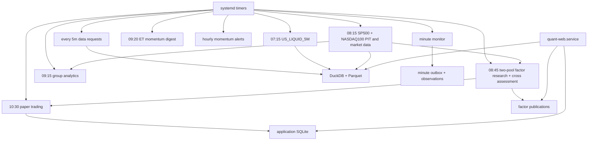

# SG 生产运维总览

更新日期：2026-08-09

## 1. 当前部署状态

| 范围 | 状态 |
|---|---|
| 本地 `/Users/huozhihong/Documents/Quant` | 提交 `3a52611`；409 项测试通过；SP500/MAG7 正式数据和研究已重发 |
| SG `/home/projects/quant` | 本轮尚未建立 SSH 连接；不得用本地结果推断服务器已经部署 |

SG 发布使用精确白名单 rsync，不从未推送的本地 `main` 做远端 `git pull`。部署标记保存在
`/home/projects/quant/.deploy-commit`。本次候选提交为 `3a52611`，部署时仍须排除 `.git`、`data`、
`outputs`、`logs`、虚拟环境和密钥文件。

## 2. 目标生产拓扑



## 3. 预期服务

| Unit | 目标状态 | 关键职责 |
|---|---|---|
| `quant-web.service` | enabled + active | FastAPI 页面/API |
| `quant-us-daily-refresh.timer` | enabled | `US_LIQUID_5M` 正式版本 |
| `quant-market-data.timer` | enabled | SP500/NASDAQ100 PIT、SP500/NASDAQ100/MAG7 行情 |
| `quant-factor-research.timer` | enabled | 两个核心池研究、MAG7 参考结果和跨池发布 |
| `quant-group-analytics-eod.timer` | enabled | 读取正式 SP500 version 的板块研究 |
| `quant-paper-trading.timer` | enabled | active 模拟盘账户 |
| `quant-data-requests.timer` | enabled | Watchlist 缺数队列 |
| `quant-premarket-digest.timer` | enabled | 只发送 momentum 盘前摘要 |
| `quant-momentum-alerts.timer` | enabled | 10:00–15:59 ET 小时摘要 |
| `quant-intraday-momentum-monitor.timer` | enabled | 分钟 shadow 与五日自动晋级 |

服务器应以 `systemctl list-unit-files 'quant-*'`、`systemctl list-timers --all 'quant-*'` 和 journal
为事实来源。

## 4. 存储职责

| 存储 | SG 路径 | 备份重点 |
|---|---|---|
| DuckDB catalog | `/home/projects/quant/data/catalog/quant.duckdb` | 版本指针和质量审计 |
| Parquet lake | `/home/projects/quant/data/lake/` | 正式不可变行情和 PIT 冻结副本 |
| PIT publication | `/home/projects/quant/data/pit_universes/` | SP500/NASDAQ100 PIT 与 metadata |
| SQLite app DB | `/home/projects/quant/outputs/quant_app.sqlite3` | 策略、Watchlist、回测、模拟盘、请求队列 |
| Research outputs | `/home/projects/quant/outputs/universes/` | 当前 factor publication 与 generation |
| Backtest artifacts | `/home/projects/quant/outputs/backtests/` | 大型结果和日志 |
| Intraday momentum state | `/home/projects/quant/outputs/intraday_momentum_monitor/state.sqlite3` | 信号、outbox、逐分钟观测、五日晋级证据 |

DuckDB 和 SQLite 都是嵌入式文件，不需要独立 daemon。Parquet 也是文件格式。数据只存在部署它们
的机器磁盘上，除非另行做备份或同步；本地和 SG 不是自动共享数据库。

## 5. 已完成的迁移里程碑

- 主行情使用 DuckDB catalog + 不可变 Parquet。
- 网页回测、策略排行、模拟盘统一通过 `MarketDataReader`。
- `next_open` 缺失时 fail closed，不回退 `close`。
- 策略、Watchlist、回测 task、模拟盘账户/账本和缺数队列进入 SQLite。
- SG 曾完成六个不同 target session 的行情全 OHLCV 精确影子核验和业务 SQLite 影子核验。
- 迁移期开关已经关闭；本地代码已进一步删除开关、影子脚本和旧读写实现。

历史影子观察是迁移审计证据，不再是每日生产健康检查。当前检查命令已经收敛为：

```bash
.venv/bin/python scripts/run_data_pipeline.py status
.venv/bin/python scripts/check_app_storage.py
```

### 5.1 待部署的研究池改造

本地新增 Research Universe registry、NASDAQ100 严格 PIT、四文件哈希、历史行业覆盖审计、跨池
原子 publication 和新版研究/交易页面。它们尚未进入 SG，不能引用本地页面或本地测试来证明
服务器已经具备这些能力。

当前本地 NASDAQ100 candidate 因 FMP 为 `EA`、Nasdaq 官方为 `HONA` 而失败。这是预期的
fail-closed 结果。部署后也不得绕过；只有来源重新一致或加入有正式公告支持的精确规则后，才能
发布 NASDAQ100。

完整部署顺序见
[`research_universe_redesign_implementation.md`](research_universe_redesign_implementation.md)。

因子数据浏览器也尚未部署到 SG。本地 `/research/factor-data` 已完成日期截面、单股历史、CSV 和
旧单股入口收敛，但它只接受当前完整 publication 合同。SG 上线和性能门槛见
[`factor_data_explorer_implementation.md`](factor_data_explorer_implementation.md)。

## 6. 2026-08-08 SG 发布与验收记录

一致性备份位于：

```text
/home/projects/quant-backups/20260808T183044+0800/
```

它包含代码、完整 `data/outputs/logs`、`/etc/quant`、systemd units、SQLite Backup API 副本、
DuckDB 副本、各次精确 release archive 和 `SHA256SUMS`。发布过程排除了 `.git`、`data`、
`outputs`、`logs`、两个虚拟环境和环境变量文件，未用代码覆盖状态目录。

验收结果：

- `systemd-analyze verify` 通过；唯一提示来自腾讯云 `tat_agent.service` 的旧 `/var/run` 路径。
- SG 的 Web、writer、research、paper 和动量 worker 全部使用同一个 `.venv`。
- 最终完整测试为 `326 passed`；新版 Starlette 只有测试客户端弃用 warning。
- 页面验收发现冻结策略快照的成分行缺少方向字段，导致成功回测详情页 500；补齐字段并增加模板
  回归测试后，未认证首页返回 401，认证后的六个主页面及真实 Strategy、Watchlist、Backtest、
  Paper 详情页全部返回 200。
- `scripts/run_data_pipeline.py status`：MAG7、SP500、US_LIQUID_5M 都指向 2026-08-07 正式版。
- `scripts/check_app_storage.py` 和 SQLite `PRAGMA integrity_check` 通过。
- group timer 已从旧 07:45 改为 09:15；缺数 timer 恢复为每 5 分钟。
- `systemctl --failed` 没有 Quant unit；宿主机原有的 IPMI、kdump、mcelog 三个失败 unit 与本项目
  无关，应由服务器基础设施层另行处理。

### 6.1 真实业务对象

| 对象 | ID | 结果 |
|---|---|---|
| Strategy | `42bafed1-df08-47d4-95bd-9c25a7d54e3c` | MOM_12M 0.6 + VOL_60D -0.4 |
| Watchlist | `76f37adb-5a45-449a-89ba-23ac045488d5` | 10 只真实美股，等权 |
| 最终回测 | `db026d38-0b27-46a5-bdf8-3d26240fe26a` | WAITING 自动恢复后 success |
| Paper account | `df937dec-c04c-486e-aac7-3cd547628944` | next-open 成交和故障恢复通过，验收后 paused |

Watchlist 专属数据池是
`WATCHLIST_76F37ADB5A45449A89BA23AC045488D5_5684832A95B7`，最终正式版本是
`a95650c5dc37488795248c75f72322ce`：2020-07-06 至 2026-08-07，14,114 行、10 票、
目标日覆盖 100%。

### 6.2 缺数与重启恢复

- 实测 pending -> running；第二个独立领取进程返回空列表，没有重复领取。
- stale running 故障注入后安全回到 pending，attempts 保留。
- 发现并修复了 IPO 前覆盖率误判、扩大日期范围不向后回补、短版本静默截断、Web 重启后
  未初始化 WAITING monitor、批 worker 残留 reader 调用五个问题。
- Web 关闭时数据请求 success、回测仍保持 WAITING；新 Web lifespan 日志明确记录
  `submitted 1 backtests whose data is ready`，随后任务 success。

### 6.3 交易账本故障注入

- 回测逐票 `trades.parquet` 的成本合计、按日 `costs.parquet` 合计和任务 diagnostics 完全一致。
- 模拟盘使用 2026-07-01 next open 成交，逐票保存动态滑点、佣金、SEC/TAF/CAT、清算和
  pass-through 成本。
- 注入“fills 已写、orders 写失败”后，fill ledger 增至 4 行、orders 仍为 pending；同日重试后
  fill ID 数仍为 4，orders 全部 filled，累计成交数量逐单精确一致。
- 重启 Web 后账户现金、权益、orders、fills、runs、positions 和历史 frame 均从 SQLite 恢复。

## 7. 当前限制

- 这个 10 票 Watchlist 没有发布 sector metadata，且小于 `neutralize_min_obs=30`；本次 runtime
  factor 日志明确提示行业中性化未执行。它适合验证数据和交易链路，不应作为行业中性策略的
  正式研究样本。
- SG 仍保留备份窗口前的旧 `data/raw/ohlcv`、`data/processed` 等文件；当前代码不读取它们。
  它们应在保留期确认后移到服务器外部归档，不要与 `data/lake` 一起删除。
- 当前部署来自校验归档，本地提交尚未推送到共享远端仓库。
- Web 原始 18823 端口若直接公网 HTTP 暴露，Basic Auth 不能提供传输加密。
- 统一告警尚未覆盖所有 systemd 失败。
- 研究池改造尚未部署；SG 当前没有正式 NASDAQ100 PIT、行情、8 因子研究或跨池结论。
- 因子数据浏览器尚未部署；不得用本地隔离测试结果声称 SG 已提供该页面。

日常命令见 [`server_daily_runbook.md`](server_daily_runbook.md)，存储细节见
[`unified_data_storage.md`](unified_data_storage.md)。
