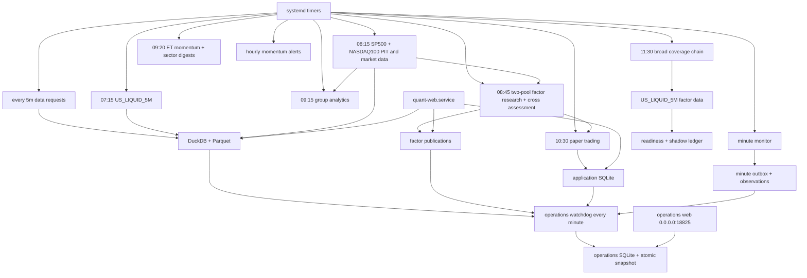

# SG 生产运维总览

更新日期：2026-08-16

## 1. 当前部署状态

| 范围 | 状态 |
|---|---|
| 本地 `/Users/huozhihong/Documents/Quant` | 全美宽基、可恢复首次链与独立运维站代码完成，待提交共享仓库 |
| SG `/home/projects/quant` | 宽基代码和独立运维站已部署；主 Web、双核心研究池、既有调度与运维采集均已验收 |
| 全美宽基 v1 | PROSPECTIVE_ONLY Security Master 与正式 coverage 已发布；PIT 全量构建运行中，因子待上游完成，五日影子为 0/5 |

SG 发布使用精确白名单 rsync，不从未推送的本地 `main` 做远端 `git pull`。当前部署标记
`/home/projects/quant/.deploy-commit` 为 `3a52611`，服务器仓库 HEAD 为 `026ae89fad53`；
2026-08-11 NASDAQ100 修复和 2026-08-12 全美宽基代码均作为审核热修复部署，仍需提交共享仓库。
部署始终排除 `.git`、项目根目录的 `data/outputs/logs`、虚拟环境和密钥文件。rsync 排除项必须写成
`/data/`、`/outputs/` 等根锚定形式；非锚定 `data/` 会误排除代码目录 `src/data/`。

## 2. 目标生产拓扑



## 3. 预期服务

| Unit | 目标状态 | 关键职责 |
|---|---|---|
| `quant-web.service` | enabled + active | FastAPI 页面/API |
| `quant-operations-web.service` | enabled + active | `0.0.0.0:18825` 独立只读运维站，强制独立认证，不注册主业务路由 |
| `quant-operations-watchdog.timer` | enabled | 每分钟汇总 DuckDB、SQLite、JSON 和 systemd 证据，不发送 Discord 运维告警 |
| `quant-us-daily-refresh.timer` | enabled | `US_LIQUID_5M` 正式版本 |
| `quant-market-data.timer` | enabled | SP500/NASDAQ100 PIT、SP500/NASDAQ100/MAG7 行情 |
| `quant-factor-research.timer` | enabled | 两个核心池研究、MAG7 参考结果和跨池发布 |
| `quant-group-analytics-eod.timer` | enabled | 读取正式 SP500 version 的板块研究 |
| `quant-paper-trading.timer` | enabled | active 模拟盘账户 |
| `quant-data-requests.timer` | enabled | Watchlist 缺数队列 |
| `quant-premarket-digest.timer` | enabled | 分别发送 momentum 与 sector rotation 盘前摘要 |
| `quant-momentum-alerts.timer` | enabled | 10:00–15:59 ET 小时摘要 |
| `quant-intraday-momentum-monitor.timer` | enabled | 分钟 shadow；五日验收后人工武装推送 |
| `quant-us-equity-coverage.timer` | **已安装、未启用** | 11:30 串行发布 Security Master、全美 coverage、PIT 宽基和八因子数据；首次完整链通过后才启用 |
| `quant-broad-factor-data.service` | 由上游 `OnSuccess` 触发 | 宽基八因子月分片增量发布 |
| `quant-broad-research-readiness.service` | 由 factor `OnSuccess` 触发 | 检查正式宽基研究门槛；当前预期 `BLOCKED` |
| `quant-broad-shadow-observation.service` | 由 factor `OnSuccess` 触发 | 完整哈希、真实排名查询和五日台账 |

服务器应以 `systemctl list-unit-files 'quant-*'`、`systemctl list-timers --all 'quant-*'` 和 journal
为事实来源。当前有 9 个业务 timer 加 1 个运维 watchdog timer，共 10 个 active timer；宽基
timer 正式启用后总数增加为 11 个。

## 4. 存储职责

| 存储 | SG 路径 | 备份重点 |
|---|---|---|
| DuckDB catalog | `/home/projects/quant/data/catalog/quant.duckdb` | 版本指针和质量审计 |
| Parquet lake | `/home/projects/quant/data/lake/` | 正式不可变行情和 PIT 冻结副本 |
| Security Master | `/home/projects/quant/data/lake/security_master/` + DuckDB pointer | 稳定证券身份、ticker 区间和分类快照 |
| PIT publication | `/home/projects/quant/data/pit_universes/` | SP500/NASDAQ100 PIT 与 metadata |
| SQLite app DB | `/home/projects/quant/outputs/quant_app.sqlite3` | 策略、Watchlist、回测、模拟盘、请求队列 |
| Research outputs | `/home/projects/quant/outputs/universes/` | 当前 factor publication 与 generation |
| Backtest artifacts | `/home/projects/quant/outputs/backtests/` | 大型结果和日志 |
| Intraday momentum state | `/home/projects/quant/outputs/intraday_momentum_monitor/state.sqlite3` | 信号、outbox、逐分钟观测、五日晋级证据 |
| Operations ledger | `/home/projects/quant/outputs/operations/operations.sqlite3` | 任务运行、数据新鲜度、投递和异常台账；Web 读取独立原子快照 |

DuckDB 和 SQLite 都是嵌入式文件，不需要独立 daemon。Parquet 也是文件格式。数据只存在部署它们
的机器磁盘上，除非另行做备份或同步；本地和 SG 不是自动共享数据库。

## 5. 已完成的迁移里程碑

- 主行情使用 DuckDB catalog + 不可变 Parquet。
- 网页回测、策略排行、模拟盘统一通过 `MarketDataReader`。
- `next_open` 缺失时 fail closed，不回退 `close`。
- 策略、Watchlist、回测 task、模拟盘账户/账本和缺数队列进入 SQLite。
- SG 曾完成六个不同 target session 的行情全 OHLCV 精确影子核验和业务 SQLite 影子核验。
- 迁移期开关已经关闭；本地代码已进一步删除开关、影子脚本和旧读写实现。

历史影子观察是迁移审计证据，不再是每日生产健康检查。当前检查命令已经收敛为：

```bash
.venv/bin/python scripts/run_data_pipeline.py status
.venv/bin/python scripts/check_app_storage.py
```

### 5.1 双核心研究池生产状态

2026-08-11 已完成 NASDAQ100 来源差异的正式、可审计修正，并发布：

- PIT：目标日 `2026-08-10`，40 个快照，0 条不一致；
- 行情：`9c5abc4b58a5414e911153cdda6a429c`，165 票、248,893 行、目标日覆盖 100%；
- 研究：`763f89c3-3b62-4fd2-9d6b-968f3bf4b4b2`，8 因子完成；
- 跨池：`ROBUST=3`、`SEGMENT_SPECIFIC=1`、`INSUFFICIENT=4`。

临时排除 NASDAQ100 的两个 drop-in 已停用并归档。实际启动行情和研究 unit 均返回
`Result=success`、`ExecMainStatus=0`。因子数据页面和 snapshot/history API 已在 SG 返回 200。
审核规则与来源见
[`research_universe_redesign_implementation.md`](research_universe_redesign_implementation.md)。

### 5.2 2026-08-11 systemd 依赖链修复

部署验收时发现五个旧 root unit 仍把已经删除的 `runlog/` 写成必须存在的
`ReadWritePaths`，导致 Python 启动前即以 `226/NAMESPACE` 失败。仓库模板和实际 unit 已统一改为：

```ini
ReadWritePaths=/home/projects/quant/data /home/projects/quant/outputs /home/projects/quant/logs
ReadWritePaths=-/home/projects/quant/runlog
```

受影响 unit 为 group analytics、US daily refresh、intraday monitor、momentum alerts 和 premarket
digest。原 unit 已备份到本次回滚目录。修复后的实跑结果：

- US_LIQUID_5M 版本 `ff9c8527e3a54f3aaade58d8ef939f68`：2,953 票、361,216 行、
  目标日覆盖率 99.93%、失败下载 0，并预计算 97 个动量候选；
- group analytics 的 sector 与 sub-industry 两个 EOD 产物均为 `SUCCESS`；
- momentum alerts 在美股休市时返回 `skipped_market_closed`；
- premarket digest 已改为 `--channel all`，窗口外 smoke 明确识别 momentum 与
  sector-rotation 两个频道并返回 `SKIPPED_OUTSIDE_WINDOW`；
- intraday monitor 实际进入 running，五秒 smoke 后正常停止；
- 最终 `systemctl --failed` 中没有 Quant unit，9 个 Quant timer 均为 active/waiting。

2026-08-10 美股时段没有通知的直接原因就是上述 `226/NAMESPACE`：盘前、盘中分钟监控和
小时动量进程都未进入 Python。修复后，`2026-08-10` sector/sub-industry 正式产物已通过
盘前 dry-run，覆盖 `502/502`，两个频道的独立 Webhook 也均已配置。分钟监控不会绕过风险
门槛；截至 2026-08-12，`2026-08-11` 完整 session 已通过，五日观察为 `1/5 PASS`，
`delivery_armed=false`、有效模式为 `shadow`。达到 `5/5` 只取得上线资格，人工打开独立发送
开关后，`--auto` 才会在后续 session 进入 Discord live。小时动量告警不受该晋级闸门约束，
但只有交易时段存在合格信号时才发送。

### 5.3 全美宽基 v1 SG 首次上线记录

2026-08-12 已实现并部署到 SG：

- `US_EQUITY_COVERAGE` 月分片行情、PIT `US_LIQUID_5M`、八因子 long Parquet；
- Security Master 全局搜索，MDB/AEVA 不再依赖指数成分；
- 每日三阶段编排、350 MB/15 GB 启动资源门槛、900 MB cgroup 硬上限；
- 按不同 XNYS target session 计数的五日影子台账；
- 页面默认宽基开关，当前固定为 `false`。

生产验收记录：

- 一致性备份：`/home/projects/quant-backups/broad-migration-20260812T230832CST`，约 251 MB，含代码、
  `data/outputs`、`/etc/quant` 和 systemd；
- `systemd-analyze verify` 已通过；唯一提示是腾讯云 `tat_agent.service` 的旧 `/var/run`；
- SG 资源预检通过：可用内存约 976 MB、可用磁盘约 66.8 GB；业务 SQLite
  `PRAGMA integrity_check=ok`，DuckDB 可只读打开；
- 本地和 SG 均为 `488 passed`；宽基 4 个 service 和 1 个 timer 已安装，timer 保持 `disabled`；
- Security Master 第一次发布得到 10,200 个证券、5,397 个活跃普通股，耗时 4 分 46 秒，峰值
  526 MB；覆盖回填在第 4 个 100 票批次后主动暂停，未推进 coverage 正式 pointer；
- 真实回填发现 `OCCIP` 被 FMP 错标为普通股，以及第一次候选未检查自身 CUSIP/ISIN 多重映射。
  代码已增加 Nasdaq 紧凑优先股、warrant/unit 分类、严格同 issue 身份归并、歧义键隔离、候选
  自检与重复构建幂等测试。第一次主表 generation `116a74a6d7ca49a5abab6077592494ba` 仅作为
  问题证据保留，不得作为正式 coverage 回填父版本；
- Web 已重启。`/research`、`/research/factor-data`、meta API、MDB 和 AEVA 搜索均返回 200，响应
  约 0.07-0.44 秒。MDB/AEVA 当前明确显示 `coverage_status=MISSING`，宽基 meta 明确显示未发布，
  没有回退到 SP500；
- 美股盘中监控保持 active，小时动量在 22:36 SGT 成功发送 Discord。首次重任务因与盘中窗口
  重叠而暂停，后续只在安全窗口恢复。

### 5.4 独立运维站已投产

2026-08-13 已完成 `quant-operations-watchdog.timer` 和 `quant-operations-web.service` 部署。
运维站使用独立 `18825`、独立 Basic Auth 和只读原子 SQLite 快照，不注册到主业务 Web，也不发送
Discord 运维告警。SG 生产监听 `0.0.0.0:18825`，直接入口为
`http://43.156.89.232:18825/`；认证缺失时服务拒绝公网启动，无认证请求返回 `401`。直接 IP
目前使用 HTTP，长期仍应迁移到 HTTPS 反向代理。公网切换回滚备份位于
`/home/projects/quant-backups/operations-public-20260813T093923+0800`；外部直连已返回预期 401，
服务器内六个认证页面与 `/healthz` 均返回 200。连续自动采集已证明 11/11 个任务均能从 SG 的
DuckDB、SQLite、JSON 和 systemd 读取结构化证据。完整验收记录、访问方式和状态定义见
[`operations_observability.md`](operations_observability.md)。

当前 SG 上旧 07:15 `US_LIQUID_5M` 仍服务动量扫描；它与新的 derived PIT universe 是不同存储
职责，不能把旧 180D 版本当成宽基历史研究证据。首次正式链完成前仍必须保持：

- `data.broad_factor_data.web_default_enabled=false`；
- `quant-us-equity-coverage.timer=disabled`；
- 不恢复绑定旧 Security Master 的
  `run=20260812T152208Z_57bca7cb`，但保留其 checkpoint 和 Parquet 证据；
- 用修复后的主表重新开始 coverage 回填，再发布 PIT、八因子并进入 5 个不同交易日观察。

具体上线步骤见
[`us_broad_factor_research_implementation.md`](us_broad_factor_research_implementation.md)。

2026-08-13 11:35 SGT 的修复后重跑结果：盘中动量已退出，资源预检通过，timer 和 writer 均保持
关闭；新冻结源候选 `run=20260813T033828Z_c7c84071` 正确排除了 OCCIP 等特殊证券，但在
Security Master 的 100% 身份覆盖门槛失败。具体是 FMP 把 HSPT/SLBT 复用了同一组 ISIN/CUSIP，
又把 VACH/VRXA 复用了同一 ISIN；系统正确隔离了歧义 provider 键且没有静默合并，却导致已退市的
HSPT、VACH 没有剩余身份键，最终覆盖为 10,184/10,186。使用同一冻结源重建
`run=20260813T035020Z_2ddf08cb` 后，security ID、业务主表、别名和 identity-key 结果精确一致，
幂等校验通过，但同一质量门槛仍失败。

进一步核查 SEC 文件后确认，HSPT/SLBT 与 VACH/VRXA 分别是两笔真实业务合并后的 ticker 连续，
不是需要拆分的身份碰撞。代码新增严格、带 SEC 来源的修正登记；字段或日期漂移即失败，不降低
100% 身份门槛。两次真实冻结源候选均 PASS，身份覆盖 100%，四张核心表及 Parquet 哈希完全一致。

2026-08-14 已备份并发布正式 Security Master generation
`231b5b53d46a47d9a3a463cab6b06766`，target 为 2026-08-12。旧 4 批 checkpoint 仍绑定旧 generation、
时间戳未变，未被恢复。可恢复首次编排、唯一 checkpoint 匹配、部分批次重试、因子分片进度和
运维站实时阶段已部署，SG 最终回归 `498 passed`。

持久 `quant-broad-initial-rollout-scheduled.timer` 将于 **2026-08-15 11:35 SGT** 启动，服务失败后
按精确输入合同恢复；服务器重启也不会丢失计划。`quant-us-equity-coverage.timer` 仍为 `disabled`，
`web_default_enabled` 仍为 `false`。首次链通过后还需人工验收首日 shadow、MDB/AEVA、资源、日志和
页面，再启用日常 timer；网页默认宽基仍必须等待五个不同交易日通过。

## 6. 2026-08-08 SG 发布与验收记录

一致性备份位于：

```text
/home/projects/quant-backups/20260808T183044+0800/
```

它包含代码、完整 `data/outputs/logs`、`/etc/quant`、systemd units、SQLite Backup API 副本、
DuckDB 副本、各次精确 release archive 和 `SHA256SUMS`。发布过程排除了 `.git`、`data`、
`outputs`、`logs`、两个虚拟环境和环境变量文件，未用代码覆盖状态目录。

验收结果：

- `systemd-analyze verify` 通过；唯一提示来自腾讯云 `tat_agent.service` 的旧 `/var/run` 路径。
- SG 的 Web、writer、research、paper 和动量 worker 全部使用同一个 `.venv`。
- 最终完整测试为 `326 passed`；新版 Starlette 只有测试客户端弃用 warning。
- 页面验收发现冻结策略快照的成分行缺少方向字段，导致成功回测详情页 500；补齐字段并增加模板
  回归测试后，未认证首页返回 401，认证后的六个主页面及真实 Strategy、Watchlist、Backtest、
  Paper 详情页全部返回 200。
- `scripts/run_data_pipeline.py status`：MAG7、SP500、US_LIQUID_5M 都指向 2026-08-07 正式版。
- `scripts/check_app_storage.py` 和 SQLite `PRAGMA integrity_check` 通过。
- group timer 已从旧 07:45 改为 09:15；缺数 timer 恢复为每 5 分钟。
- `systemctl --failed` 没有 Quant unit；宿主机原有的 IPMI、kdump、mcelog 三个失败 unit 与本项目
  无关，应由服务器基础设施层另行处理。

### 6.1 真实业务对象

| 对象 | ID | 结果 |
|---|---|---|
| Strategy | `42bafed1-df08-47d4-95bd-9c25a7d54e3c` | MOM_12M 0.6 + VOL_60D -0.4 |
| Watchlist | `76f37adb-5a45-449a-89ba-23ac045488d5` | 10 只真实美股，等权 |
| 最终回测 | `db026d38-0b27-46a5-bdf8-3d26240fe26a` | WAITING 自动恢复后 success |
| Paper account | `df937dec-c04c-486e-aac7-3cd547628944` | next-open 成交和故障恢复通过，验收后 paused |

Watchlist 专属数据池是
`WATCHLIST_76F37ADB5A45449A89BA23AC045488D5_5684832A95B7`，最终正式版本是
`a95650c5dc37488795248c75f72322ce`：2020-07-06 至 2026-08-07，14,114 行、10 票、
目标日覆盖 100%。

### 6.2 缺数与重启恢复

- 实测 pending -> running；第二个独立领取进程返回空列表，没有重复领取。
- stale running 故障注入后安全回到 pending，attempts 保留。
- 发现并修复了 IPO 前覆盖率误判、扩大日期范围不向后回补、短版本静默截断、Web 重启后
  未初始化 WAITING monitor、批 worker 残留 reader 调用五个问题。
- Web 关闭时数据请求 success、回测仍保持 WAITING；新 Web lifespan 日志明确记录
  `submitted 1 backtests whose data is ready`，随后任务 success。

### 6.3 交易账本故障注入

- 回测逐票 `trades.parquet` 的成本合计、按日 `costs.parquet` 合计和任务 diagnostics 完全一致。
- 模拟盘使用 2026-07-01 next open 成交，逐票保存动态滑点、佣金、SEC/TAF/CAT、清算和
  pass-through 成本。
- 注入“fills 已写、orders 写失败”后，fill ledger 增至 4 行、orders 仍为 pending；同日重试后
  fill ID 数仍为 4，orders 全部 filled，累计成交数量逐单精确一致。
- 重启 Web 后账户现金、权益、orders、fills、runs、positions 和历史 frame 均从 SQLite 恢复。

## 7. 当前限制

- 这个 10 票 Watchlist 没有发布 sector metadata，且小于 `neutralize_min_obs=30`；本次 runtime
  factor 日志明确提示行业中性化未执行。它适合验证数据和交易链路，不应作为行业中性策略的
  正式研究样本。
- SG 仍保留备份窗口前的旧 `data/raw/ohlcv`、`data/processed` 等文件；当前代码不读取它们。
  它们应在保留期确认后移到服务器外部归档，不要与 `data/lake` 一起删除。
- 当前 NASDAQ100 热修复已经部署，但本地改动仍需提交并推送到共享远端，消除 SG 与仓库漂移。
- Web 原始 18823 端口若直接公网 HTTP 暴露，Basic Auth 不能提供传输加密。
- 2026-08-11 登录时观察到 109 次失败的 root SSH 尝试；应迁移到普通运维用户、禁用 root 密码
  登录并配置安全组/防火墙白名单。
- 统一告警尚未覆盖所有 systemd 失败。
- 因子数据截面冷缓存实测 2.56 秒，尚未达到内部 `<2s` 目标；热缓存约 0.077 秒，历史查询
  约 0.20 秒。
- 全美宽基 unit 已部署，但正式数据尚未完成，11:30 timer 仍禁用；在五日影子完成前，页面默认
  入口不能切到宽基。
- 当前 Security Master 行业是 latest-known 快照，正式宽基 IC/ICIR/confidence 必须继续阻断。

日常命令见 [`server_daily_runbook.md`](server_daily_runbook.md)，存储细节见
[`unified_data_storage.md`](unified_data_storage.md)。

## 8. 2026-08-16 宽基首次链故障处置

现网复核确认 `47/78` 不是仍在推进的任务。首次 coverage 进程在 DuckDB 全局校验阶段受到持续内存
回收压力，检查点长期不更新；服务已安全停止，两个宽基 timer 均保持 `disabled`，旧 staging 和
checkpoint 只保留为审计与可能的精确恢复证据。

部署前取证备份位于：

```text
/home/projects/quant-backups/broad-stall-20260816T0055CST/evidence-and-code.tar.gz
/home/projects/quant-backups/broad-stall-fix-20260816T1045CST/predeploy-files.tar.gz
/home/projects/quant-backups/operations-status-fix-20260816T013709CST
```

本地完整回归为 `518 passed`；SG 安全修复部署后完整回归为 `502 passed`，本次运维状态边界测试为
`11 passed`。宽基相关 unit 的 `systemd-analyze verify` 通过，唯一提示仍来自腾讯云 `tat_agent`。
`quant-web.service` 和 `quant-operations-web.service` 保持 active，其他既有定时任务未被本次处置关闭。

最新冻结源候选审计为：

```text
/home/projects/quant/outputs/data_audits/security_master_candidates/asof=2026-08-14/run=20260815T172937Z_9b750f01/audit.json
```

它以 `overlapping ticker intervals` 失败关闭。运维站现按“最新同日质量证据优先”显示：证券主表
`BLOCKED`；行情显示“旧检查点保留在 47/78 批，不代表任务仍在运行”；PIT 和八因子显示被上游
阻断。不得仅修改 checkpoint 状态、手工标记成功或恢复首次链。下一步须先完成逐组 SEC/第二供应商
核验，并决定缺失历史证券采用替代数据源还是 `PROSPECTIVE_ONLY`。

最终核验还发现 2026-08-14 的盘前动量与盘中突破曾因 `US_LIQUID_5M` 数据门禁失败：当日 07:15
候选的 target-session coverage 只有 97.85%，系统没有发布不完整版本；同日晚间板块轮动已成功发送，
但动量通道返回 `MOMENTUM_PUBLISHED_DATA_NOT_READY`，盘中监控因
`stale_target_session/latest_session_coverage` 退出。这不是宽基服务直接关闭业务任务，而是共享行情
输入按合同失败关闭。

2026-08-15 的日更已成功发布 target `2026-08-14`、版本
`e3bfa3cb2a1a4b3b9567ace484e0b32d`，目标日覆盖率 99.93%、失败抓取 0。SPY/QQQ 动量读取预检通过；
历史 failed 标志已清理，`systemctl --failed` 中不再有 Quant unit。盘前摘要和盘中监控 timer 保持
active，将在下一个美股交易日按原计划运行；历史失败投递仍保留在运维台账，不应删除。

## 9. 2026-08-16 PROSPECTIVE_ONLY 恢复上线

项目负责人已批准无法证明历史的证券采用 `PROSPECTIVE_ONLY`，而不是猜测换码日期、降低质量门槛
或恢复旧检查点。配置 `configs/research_history_policy.yaml` 是公开审计台账，最终共 66 条：30 条活跃
证券从 2026-08-14 起向未来摄取，36 条非活跃证券因历史不可验证从历史 coverage 排除。Security
Master manifest 新增第五份 `history_policy` 产物；配置选择器发生 identity/ticker/name/status 漂移
时构建立即失败。

同一冻结 provider source 两次候选均 `PASS`，五表行数及 SHA-256 完全一致。40 票 FMP pilot 覆盖
全部 30 条前瞻证券和 MDB/AEVA，40/40 有行情且没有 alias/provider failure。第一次 80 批扫描又
发现 THCB、RTPY、DMYI、RMRM 四个不可复现旧身份；精确 partial 重试仍全部失败后才追加到台账。
本地完整回归为 `523 passed`。

发布前备份：

```text
/home/projects/quant-backups/prospective-policy-final-20260816T022251CST
/home/projects/quant-backups/prospective-policy-publish-20260816T023411CST
```

正式 generation `c61df53691f24bb6917a0776df4759a0`、manifest
`f593b1d39d929ba09fec87d48f456f18367604ab79f19a8b70dfa0733937e304` 已从 DuckDB 指针重新加载
验证。全新 coverage run `20260815T183958Z_e30c3c27` 绑定该版本，选择 7,956 个证券、80 批；其
resume diagnostics 明确拒绝旧 `47/78` 和 40 票 pilot。首次完整链和人工验收前，
`quant-us-equity-coverage.timer`、旧一次性 timer 与 `web_default_enabled` 继续保持关闭。

第一次全范围扫描完成 80/80，76 批成功、4 批 partial，10,370,668 行 staging 保留审计且未发布。
恢复分支的 `batches` 初始化顺序缺陷已修复并备份到
`/home/projects/quant-backups/coverage-resume-fix-20260816T054427CST`；修复后的 4 批精确重试再次确认
四个历史接口为 0 行。最终 66 条配置 SHA-256 为
`11339e66b4d8d6ff9ad6eaaf4b15c97d4b40c0792aed90908c5e298b735166cd`。下一次回填必须绑定按该
配置重发的新 Security Master generation，不能恢复 62 条政策版本的 staging。

最终 66 条配置随后使用同一冻结源做了第二轮双候选验证：
`run=20260815T215704Z_506fb253` 与 `run=20260815T220128Z_09ccce60` 均为 `PASS`，五张
Parquet 表的行数、SHA-256 和文件字节完全相同。发布备份为
`/home/projects/quant-backups/prospective-policy-final66-publish-20260816T063000CST`。当前正式
Security Master 已切换为 generation `fb434632cd434b9289b71453e774c68e`，manifest SHA-256 为
`31a39d2f3c2215eef434c5f1f1662ba0926f22f8d9908717a60447f54f06447e`；DuckDB 当前指针和五个发布
产物均已反向验收。

最终 coverage 使用新 run `20260815T221208Z_b1d33eaf`，证券数为 7,952、共 80 批。恢复审计明确
拒绝旧 47/78、pilot 和 62 条政策版本 staging；36 个历史排除身份没有进入 universe/alias，30 个
前瞻身份的抓取起点全部严格等于 2026-08-14。运行到 8/80 的现场快照为 8 批全部成功、0 个 alias
failure，运维 API 已同步显示该 run。首次链结束前，日常 coverage timer 和网页默认开关继续关闭。

## 10. 2026-08-16 Coverage 发布与 PIT 续跑

最终源回填随后完成 80/80 批和 10,370,668 条原始记录。供应商原始数据含 1,445 条确定性坏条，
其中 1,108 条为非正价格、337 条为 OHLC 边界不一致；原 run 失败关闭并原样保留。经过 640 个源
文件哈希复核后，系统发布其精确有效补集：coverage 版本
`ad5de5cfd10d47e2ae21364f1808248d`，有效记录 10,369,223 条、92 个自然月分片、目标交易日坏条
为 0，manifest SHA-256 为
`6fbe3bc28ac4e477b782fa9cc337a3618a75875b4c3f31bf6676d9b481c8b7c0`。修复没有覆盖或删除原始
staging，正式 Reader 会同时验证行情索引和隔离台账哈希。

PIT 初次生产执行暴露 2 GB 主机上的性能热点，未发现口径错误。全历史覆盖核验已经改为按自然月
有界连接，PIT 输入投影为五个必要列，重复身份字符串使用普通对象字典编码。v1-v4 均未产生正式
PIT publication，已安全停止并保留 systemd/journal 证据；截至 15:28 CST，v5 保持单核约 98% CPU，
现场调用栈已不再出现 Arrow set-lookup，内存由 systemd 限制在 `700M/900M` 合同内。v5 完成前
不得把页面“运行中”解释为质量通过，也不得启用 `quant-us-equity-coverage.timer`。

## 12. 2026-08-20 日更恢复与供应商阻断

target 2026-08-14 的 PIT V2 已正式发布为 universe version
`3db1ed595a9a4dca98bf85fb9cad6797`。NUR 按已批准规则加入前瞻台账后，政策总数变为 67：31 条
`PROSPECTIVE_ONLY`、36 条 `EXCLUDED_UNVERIFIABLE_HISTORY`。当前正式 Security Master 为
generation `559f310170984b67bcee18d0f12c44dc`、manifest SHA-256
`a329cb8ec5583433686b5805bf5448a203d44ce385e435d67dea51742703c0d7`，双冻结源五表精确幂等通过。

coverage 日更已改为 FMP 官方建议的“每个尚未发布交易日一份 EOD bulk”，不再在每次运行中重抓
21 天窗口。Security Master 新身份通过 canonical 历史接口补到父 coverage target，之后才由 bulk
接管；两类来源不重叠。provider cache 绑定 parent version、Security Master generation/manifest、
target 和 session 列表，每个目录复验日期、行数和 SHA-256 后才能恢复。

当前缓存 binding 为 `b4a378e25ac74347964f11cccc777d164673295e72261caa41c216a1c171c6fd`，已保存
34 个 identity delta 的 29,829 行历史，失败与 fallback 均为 0。父 coverage target 为 2026-08-14，
所以恢复只需 2026-08-17、18、19 三个交易日。v10 在第一天遇到 FMP 供应商端连续 read timeout 和
`502 Bad Gateway`，报告保存在：

```text
outputs/data_audits/broad_daily_pipeline/target=2026-08-19/
  run=20260820T063540Z_c122abe8.json
```

开发机对同一 stable endpoint 的单次只读调用也返回 502，排除 SG 本地资源和路由独占问题。v10
峰值内存约 316 MB，正式 coverage 指针未推进，PIT/因子未启动，shadow 不计数。恢复期间必须保持：

- `quant-us-equity-coverage.timer=disabled`；
- `data.broad_factor_data.web_default_enabled=false`；
- 正式 coverage `ad5de5cfd10d47e2ae21364f1808248d` 和所有旧 staging/quarantine/cache 原样保留；
- FMP 恢复后从上述 exact cache 重试，不得改用旧 Security Master、跳过日期或手工标记成功。

本地完整回归为 `533 passed`，SG 针对性回归为 `38 passed`。部署备份见
`/home/projects/quant-backups/eod-bulk-resume-20260820T1418CST`、
`provider-cache-v2-20260820T1430CST` 和 `append-only-bulk-20260820T1435CST`。

独立业务检查还确认：2026-08-19 的盘中动量失败原因为核心 `US_LIQUID_5M` 的
`stale_target_session/latest_session_coverage`，发生在宽基 v8-v10 之前，不是宽基服务抢占资源。
主业务 Web、运维 Web、watchdog 与十个既有 timer 仍在运行；该历史失败必须保留并在下一交易日前
复核核心日更输入，不能用清理 systemd failed 标志代替数据验收。

FMP 冷却后仍不可用，因此已创建一次性 transient
`quant-broad-provider-retry.timer`，触发时间为 **2026-08-20 15:53 CST/SGT**。该 timer 只重试
target 2026-08-19 的受控日更链，使用同一锁和 `700M/900M` 资源上限；它没有启用
`quant-us-equity-coverage.timer`，也不会把供应商失败日计入 shadow。

14:57 CST 的恢复验收确认核心 `US_LIQUID_5M` 已是 target 2026-08-19、版本
`839aa104e09249a988c40afcb6949254`、目标日覆盖率 100%。盘中生产候选读取为 2,940/2,940，盘前
动量读取绑定同一版本，Discord `--component all` 路由检查通过。随后只执行
`systemctl reset-failed` 清除盘中监控和盘前摘要的历史失败状态，没有手工启动或补发；两项服务
当前为正常的 `inactive/dead`，继续由 21:20 timer 触发。2026-08-19 的失败 journal 和投递 SQLite
证据仍保留，板块轮动当日的成功消息也没有重复发送。

15:54 CST 的一次性宽基重试成功发布 coverage `74ab17464aff4156becdc0416580c018`，target 为
2026-08-19；随后继续在同一受控 service 内构建 PIT。运维适配器同步修复了证据优先级：同一目标日
的新正式 publication 覆盖旧失败报告的“当前状态”，但旧失败仍保留在运行和 incident 历史；同时
识别活动中的 transient 恢复 service。因此页面当前应显示 coverage“正常”、PIT“运行中”、专项
“运行中”，而不是继续显示 FMP 失败。SG 针对性回归为 `17 passed`。

## 13. 2026-08-21 PIT 超时根因与生产恢复

一次性 provider retry 在 coverage 成功后运行满两小时被 systemd 超时终止。现场证据为
`Result=timeout`、`ExecMainStatus=15`、CPU 1 小时 52 分、内存峰值 748.8 MB，且无内核 OOM；
因此不能把这次失败归因于 FMP 或服务器内存。真正问题是旧 PIT 与新 coverage 绑定不同 Security
Master，构建器却误走增量路径。

生产修复规则如下：

- PIT 增量要求 Security Master generation 与 manifest SHA-256 均不变；
- 身份代次变化自动全量重建，仍执行完整 PIT 历史逐日行情覆盖门禁；
- journal 中的 `PIT_STAGE` 是当前阶段证据，不能再用长时间无输出推断卡死；
- coverage 已发布时只续跑 PIT，不重抓 FMP；目标交易日已变化时才运行完整 daily pipeline；
- 八因子服务必须带 `--auto-resume`，且只恢复唯一、精确匹配全部不可变输入的 checkpoint。

修复后 target 2026-08-19 的 PIT 在 85 秒内成功；随后 target 2026-08-20 的正式 daily pipeline
成功发布 coverage `b12824a4bcba41aeb6e122208de860a8` 和 PIT
`b3fd075787524b38ad21751408642585`。资源峰值 701.7 MB、无 swap，质量门禁全部通过。八因子正式
generation `bab021a29e7547f0a95e2963d96bd067` 已开始按 640 个分片写 checkpoint。首次因子发布、
readiness、首日 shadow 和人工页面验收完成前，不得启用 `quant-us-equity-coverage.timer`。

## 14. 2026-08-21 非交易日数据事故与首日上线验收

旧因子 generation 完成 640 个分片后发布失败，根因是 FMP 历史接口返回了 424 条非 XNYS
交易日记录，而不是任务停滞。记录横跨 278 个日期、7 个证券；QVCG 的周日记录破坏了全截面的
20 行换手率窗口，其他历史周末记录对应动量、波动率和反转的少数 clean 消失。质量门槛正确地
阻止了该 generation 成为正式数据。

生产现强制执行 `NON_XNYS_SESSION` 隔离、coverage 发布日历门槛和
`BROAD_FACTOR_INPUT_V2_XNYS_ONLY` 因子输入指纹。新 coverage
`5ed0bc1f4b104e4f8b85256f15efba45` 保留 10,399,985 行，累计隔离 1,881 行，其中 424 行为本次
非交易日记录；所有 92 个子分片、manifest 和隔离台账哈希通过，正式数据中非交易日为 0。旧
coverage、旧失败 generation、staging 和三个历史隔离台账均未删除。

全量 PIT 已发布为 `8b37e3ec99eb46d8b2d52a1a54808690`，八因子正式 generation 为
`844e6a7a8bd642a0a0466bfb137529cf`，640/640 分片通过。首日 shadow 为 2026-08-20，进度 1/5；
MDB 与 AEVA 查询、主业务页面、运维 API、watchdog、逐分片哈希和版本绑定全部通过。SG 完整回归
为 `526 passed`。`systemd-analyze verify` 只有腾讯云 `tat_agent` 的旧 `/var/run` 路径提示，Quant
相关 unit 无错误。

当前生产开关：

- `data.broad_factor_data.web_default_enabled=false`；
- `quant-us-equity-coverage.timer=disabled/inactive`，1/5 时未绕过持久任务保护；
- 既有 SG 自动跟进任务继续按交易日受控执行资源检查、daily pipeline 和 shadow；
- 达到 5/5 前不得打开网页默认开关，失败日不得计数；
- readiness 的 `PIT_CLASSIFICATION_POLICY`、`PIT_INDUSTRY_COVERAGE` 是已知研究阻断，基础行情、
  PIT、因子数据和查询能力已经通过首日生产验收。

备份位于：

```text
/home/projects/quant-backups/xnys-calendar-contract-20260821T1450CST
/home/projects/quant-backups/xnys-calendar-publication-20260821T1452CST
```
