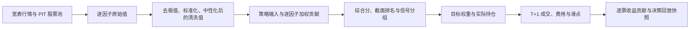

# 策略决策回放

## 目标

策略决策回放用于回答一个可审计的问题：

> 在历史上的某个交易日，策略当时看到了什么数据，如何计算每个因子和综合分，如何排名，最终决定持有什么，以及后续真实发生了什么？

它同时服务于回测和模拟盘。页面入口位于回测详情、模拟盘详情中的“查看决策回放”按钮。

## 时间口径

页面把信息明确分成三段，避免把未来数据混入当日决策：

1. **T 日已知行情**：T 日收盘价、T 日涨跌幅、成交量。
2. **T 日策略决策**：因子原始值、清洗值、策略输入、综合分、排名、分组、资格、目标权重。
3. **T+1 及以后后验结果**：成交日、成交价、滑点、费用、持有期收益和收益贡献。

当成交时点为 `next_open` 时，T 日收盘后生成信号，最早只能使用下一个交易日的开盘价成交。页面中的成交价和后续收益属于审计结果，不属于 T 日可用信息。

## 生成流程



回测完成后一次性冻结完整区间；模拟盘每运行一个决策日，就按日期幂等追加或替换当天快照。
同一账户和同一快照目录都有线程锁与进程文件锁，重复运行同一天不会产生重复行，并发运行也
不会互相覆盖日期。

## 快照目录

每个回测任务或模拟盘账户的运行目录下会生成：

```text
decision_replay/
├── manifest.json
├── daily_summary.parquet
├── market/
│   ├── close.parquet
│   ├── daily_return.parquet
│   ├── volume.parquet
│   └── effective_return.parquet
├── signals/
│   ├── composite.parquet
│   ├── rank.parquet
│   ├── percentile.parquet
│   ├── daily_signal_group.parquet
│   ├── decision_group.parquet
│   ├── held_group.parquet
│   ├── eligible.parquet
│   ├── tradable.parquet
│   ├── pit_membership.parquet
│   └── exclusion_reason.parquet
├── factors/<factor_id>/
│   ├── raw.parquet
│   ├── clean.parquet
│   ├── strategy_input.parquet
│   └── contribution.parquet
└── portfolio/
    ├── daily_weights.parquet
    ├── return_weights.parquet
    ├── daily_contributions.parquet
    └── decision_target_weights.parquet
```

这些矩阵统一使用“日期为行、股票代码为列”的宽表结构。因子目录中的四种值分别表示：

- `raw`：因子公式直接计算出的原始值。
- `clean`：完成去极值、标准化和已启用中性化后的值。
- `strategy_input`：策略融合前真正使用的输入；当前组合逻辑会对清洗值再次按日做截面标准化。
- `contribution`：`strategy_input × 归一化因子权重`。

多因子融合采用完整截面策略：某个 `date × ticker` 只要缺少任一已配置因子，该股票当天的
综合分就为空，不会把缺失因子暗中当成 0。每个策略成分权重必须是有限非零数。

因子方向也必须在回测前固定为 `+1` 或 `-1`，不能看完整测试期收益后再选择方向。策略权重是
有符号的；新建策略时正向因子默认正权重、负向因子默认负权重。历史策略不会被自动改写，
页面会标出权重方向与因子预设方向相反的成分，供人工确认。

## 信号与持仓字段

- `daily_signal_group`：每天根据当日有效综合分重新划分的信号组，用于观察当天股票强弱。
- `decision_group`：仅在调仓日形成、实际交给回测执行逻辑的分组。
- `held_group`：从最近一次调仓延续下来的实际持有分组。
- `eligible`：同时满足 PIT 股票池、因子非空和可交易规则。
- `decision_target_weights`：调仓日的目标权重；普通观察日为空。
- `daily_weights`：当天持仓权重。
- `return_weights`：计算当日组合收益时使用的逐票权重。
- `daily_contributions`：逐票收益贡献，等于 `return_weights × effective_return`。

因此，“今天排名靠前”不等于“今天一定交易”。普通观察日只更新信号；实际是否交易以调仓日、目标权重和订单/成交记录为准。

回测能够完整冻结日初持仓与持有期收益，因此会生成并校验逐票收益贡献。模拟盘当前只有运行时的日末持仓和账户权益；当日开盘发生过成交时，使用日末权重乘收盘到收盘收益并不能得到真实逐票 P&L。系统因此把模拟盘的 `daily_contributions` 保持为空，并在 manifest 中写入 `portfolio_contribution_available: false`，避免展示伪精确结果。后续只有在引入日初持仓和现金流 P&L 台账后才应打开该字段。

## 强制审计

快照生成时会执行两项硬校验，失败就中止任务，不发布 `manifest.json`：

```text
每只股票综合分 = Σ(每个因子的分数贡献)
组合当日毛收益 = Σ(每只持仓股票的收益贡献)
```

允许误差为 `1e-8`。缺失值位置也属于审计内容，不能利用 `NaN` 绕过加总校验。实际最大误差
写入 `manifest.json` 的 `audit` 字段。每个 Parquet 文件还会记录 SHA-256；读取时会先验证
文件集合和每个哈希，缺文件、多文件或内容被替换都会拒绝加载。

Parquet 文件均先写临时文件再原子替换，`manifest.json` 最后发布。因此，只要通过 manifest
校验，页面读取到的就是一组完整快照。内存只缓存最新一代快照，任一文件的大小或修改时间
改变都会触发重新验证。

策略使用的因子原始值与清洗值也有独立的
`factor_matrix_manifest.json`。研究流水线将 `factor_raw_values.parquet` 和
`factor_values.parquet` 作为同一 generation 发布，记录预处理配置与 SHA-256；策略合成器
拒绝混用不同批次或旧版无 manifest 的两份文件。

## 页面功能

- 全部交易日与仅调仓日切换。
- 时间轴点击、日期输入和前后日期步进。
- 按股票代码、资格、动作、信号组筛选。
- 展开单只股票，查看逐因子原始值、清洗值、策略输入和贡献。
- 查看目标权重、实际权重、成交状态、成交价、滑点、费用和后续收益。
- 打开股票侧栏，查看完整历史价格、综合分、排名百分位和选定日期因子拆解。

默认日期是最近一个存在合格股票的快照日，避免回测区间最后一天因为缺少下一交易日开盘价而显示空截面。

## 旧任务

历史上已经完成、但创建于本功能上线前的回测任务没有冻结这些中间矩阵。系统不会使用当前因子数据反向拼接历史决策，因为那会破坏可复现性。

旧任务的页面会明确显示“没有决策回放快照”。需要使用原策略和原参数重新运行一次回测，才会生成完整快照。

## 主要代码

- `src/decision_replay/builder.py`：构建回测和模拟盘快照并执行审计。
- `src/decision_replay/store.py`：原子存储、按日期幂等更新和读取快照。
- `src/decision_replay/query.py`：把宽表投影成日期截面和单票历史 API。
- `src/backtest/runner.py`：回测完成后冻结快照。
- `src/papertrading/runner.py`：模拟盘运行后追加当天快照。
- `src/webapp/decision_replay_routes.py`：页面与 JSON API。
- `src/webapp/static/js/decision_replay.js`：时间轴、筛选、表格和股票侧栏交互。
