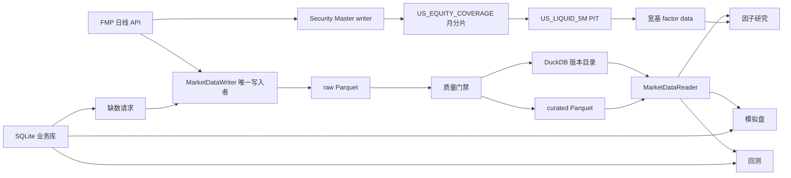

# 统一数据与存储架构

更新日期：2026-08-12

本文描述当前实现，不保留旧 JSON 影子、逐票日线缓存或迁移期双写说明。

## 1. 先建立一个简单认识

系统里有四类性质完全不同的数据：

| 数据 | 例子 | 特征 | 主存储 |
|---|---|---|---|
| 大型不可变行情 | 2026-08-07 的 AAPL OHLCV | 行数多、按列分析、发布后不改 | Parquet |
| 数据版本目录 | SP500 当前应读哪一版 | 数据小、需要原子切换和审计 | DuckDB |
| 可变业务对象 | 一个策略、一个 Watchlist、模拟盘订单 | 经常增删改、需要事务 | SQLite |
| 分析产物 | 因子矩阵、IC、回测净值 | 可以由输入和参数重建 | Parquet/JSON/PNG |

所以“统一”不是把所有内容硬塞进同一个文件，而是统一读写边界、版本号和责任人。



## 2. 每种数据真实长什么样

### 2.1 Parquet 行情

`bars.parquet` 是长表，一行代表“一只股票在一个交易日的一根日线”：

| date | ticker | open | high | low | close | adj_close | volume |
|---|---|---:|---:|---:|---:|---:|---:|
| 2026-08-07 | AAPL | 218.10 | 221.30 | 217.42 | 220.74 | 220.74 | 48,231,100 |
| 2026-08-07 | MSFT | 527.20 | 531.80 | 525.91 | 530.11 | 530.11 | 21,440,200 |

其中 `open/high/low/close` 是拆股调整后的可执行价格；`adj_close` 是含现金分红的总回报价格，
不能用于模拟成交、最低股价或美元成交额。Parquet 是列式文件格式，不是常驻服务型数据库。
Python、DuckDB 和 pandas 都可以直接读取。它适合行情，因为计算因子时经常只读
`adj_close`、`volume` 等少数列，而且一批就是多年、数百只股票。文件本身跟随项目数据目录
存放，不需要单独启动 Parquet 服务。

### 2.2 DuckDB 目录

`data/catalog/quant.duckdb` 不是另一份重复行情。它主要保存“这批文件是什么、是否合格、当前
正式版是哪一个”。例如 `published_versions` 的一行可以理解为：

| universe | version_id | published_at |
|---|---|---|
| SP500 | 511ee86d... | 2026-08-02 13:45:13 UTC |

再通过 `dataset_versions` 找到：

```text
version_id      = 511ee86d...
target_session  = 2026-07-31
bars_path       = data/lake/curated/.../version=511ee86d.../bars.parquet
membership_path = data/lake/curated/.../membership.parquet
bars_sha256     = d45078f6...
row_count       = 711247
ticker_count    = 591
```

读取器先查 DuckDB 得到正式 `version_id`，再读取该版 Parquet，并核对 SHA-256。这样页面不会
碰巧读到一半写完的新文件，也不会把两个日期或两个股票池的文件混在一起。

DuckDB 是嵌入式数据库，Python 包直接打开项目中的 `.duckdb` 文件；不需要在服务器启动一个
DuckDB 守护进程。

### 2.3 SQLite 业务库

`outputs/quant_app.sqlite3` 保存会被用户或 worker 修改的小型业务状态。`app_records` 的一条
策略记录，概念上类似：

```json
{
  "kind": "strategy",
  "record_id": "c0f4...",
  "payload": {
    "name": "Momentum + Low Vol",
    "factors": [
      {"factor_id": "MOM_12M", "weight": 0.7},
      {"factor_id": "VOL_20D", "weight": 0.3}
    ]
  },
  "checksum_sha256": "..."
}
```

主要逻辑表：

| 表 | 保存什么 |
|---|---|
| `app_records` | strategy、watchlist、backtest、paper_account 的 JSON 主记录和 checksum |
| `app_frames` | 模拟盘某张表的列、行数和 checksum |
| `app_frame_rows` | orders、fills、positions、nav 等模拟盘表的逐行内容 |
| `data_requests` | 自定义股票池缺数请求及 pending/running/success/failed 状态 |
| `data_request_consumers` | 哪个回测或账户正在等待哪条请求 |
| `schema_migrations` | SQLite schema 版本 |

SQLite 同样是项目中的单文件嵌入式数据库，不需要启动服务。当前单机 Web 和 worker 使用 WAL、
`BEGIN IMMEDIATE`、外键和 checksum。以后变成多台 Web/worker 同时写，才考虑迁到 PostgreSQL。

### 2.4 研究和回测产物

一个因子目录包括：

```text
outputs/universes/SP500/factors/MOM_12M/
  factor_raw_values.parquet
  factor_values.parquet
  factor_matrix_manifest.json
  ic.parquet
  ic_summary.json
  confidence.json
  group_nav.parquet
  group_metrics.parquet
  *.png
```

`outputs/universes/SP500/research_publication.json` 是整批因子研究的发布清单。它记录：

```json
{
  "status": "PUBLISHED",
  "publication_id": "cb051282-...",
  "universe": "SP500",
  "data_foundation": {
    "version_id": "511ee86d...",
    "target_session": "2026-07-31",
    "bars_sha256": "d45078f6...",
    "membership_sha256": "b84fba94..."
  },
  "factors": {
    "MOM_12M": {
      "generation_id": "99e324e2-...",
      "manifest_sha256": "1d176613..."
    }
  }
}
```

它的作用不是保存全部因子值，而是证明页面、回测和模拟盘读取的每个因子来自同一批行情、同一
个 PIT 股票池和一组完整 generation。

全美宽基另有 `factor_data_publication.json`。它绑定 coverage DatasetVersion、derived universe、
Security Master 和八因子月分片，只证明 raw/clean/rank 可查询，不证明 IC、ICIR 或 confidence
通过。两种 publication 不得互相冒充。

## 3. 当前目录边界

```text
data/
  catalog/                 # DuckDB 目录、writer lock、研究发布 lock
  lake/                    # 不可变 raw/curated 行情版本
    security_master/       # 身份、ticker 区间、分类和历史研究政策的不可变 generation
    universes/             # 由 coverage 派生的 PIT membership/eligibility
  pit_universes/           # 当前正式 SP500/NASDAQ100 PIT 文件和元数据
  raw/pit/                 # PIT 供应商事件、修正和构建诊断
  raw/universe/            # FMP 当前证券快照，如 US_ACTIVE
  raw/market_regime/       # 独立大盘状态研究的外部原始源
  raw/intraday/            # 独立分钟监控缓存
  cache/                   # 可重建的 matplotlib 和扫描缓存
  reference/               # 可选人工维护的 security master
  pit_classifications/     # 可选历史行业分类
  theme_exposures/         # 可选主题暴露

outputs/
  quant_app.sqlite3        # 可变业务主库
  universes/               # 正式因子和 group analytics 发布物
    US_LIQUID_5M/factor_data/ # 宽基 long Parquet generation 与 pointer
  backtests/               # 大型回测结果与日志
  market_regime_research/  # 独立研究产物
  momentum_alerts/         # 独立告警状态/产物
```

以下旧路径已经不在本地项目目录，也没有生产代码读取：

```text
data/raw/ohlcv/
data/processed/
outputs/factors/
outputs/strategies/
outputs/watchlists/
outputs/papertrading/
outputs/backtests/_index.json
outputs/backtests/*/task.json
outputs/backtests/*/metrics.json
```

回测的 `returns.parquet`、`nav.parquet`、`holdings.parquet`、`trades.parquet` 和
`costs.parquet` 仍是有效的大型产物，不属于旧影子。

SG 发布会刻意排除整个 `data/` 和 `outputs/` 状态目录，因此服务器上升级前遗留的旧路径仍然
保留，当前生产代码不会读取。这样做是为了可审计回滚，而不是继续双写；保留期结束后应先复制到
服务器外部归档，再从项目目录移出。

## 4. 唯一读写契约

日线网络写入只能经过：

```text
scripts/run_data_pipeline.py
scripts/refresh_us_active.py
scripts/run_data_requests.py
  -> MarketDataWriter

scripts/build_security_master.py
scripts/backfill_us_equity_coverage.py
scripts/update_us_equity_coverage.py
scripts/build_us_liquid_pit.py
scripts/run_broad_factor_data.py
  -> 全美宽基专用、串行且版本绑定的 writer 链
```

研究和交易消费者只能经过：

```text
src/data/access.py
  -> MarketDataReader
  -> 明确 DatasetVersion
  -> DataContract
```

动量突破再由 `src/breakouts/daily_data.py` 把同版本长表转换为内存 ticker frames；Web、盘前、
小时提醒和分钟 monitor 不得各自重新解析 latest 或读取 raw universe。

合法的直接 FMP 使用只剩供应商证券快照、搜索、quote、分钟线和独立外部研究源。它们不能在
回测缺数时充当日线回退。

## 5. 一天的生产时间线

时间均为新加坡时间，周二至周六对应上一美股交易日收盘后：

| 时间 | 任务 | 做什么 |
|---|---|---|
| 07:15 | `quant-us-daily-refresh` | 刷新 US_ACTIVE 当前证券快照，按流动性生成 `US_LIQUID_5M` 成员，增量拉取日线，质量校验并发布不可变版本 |
| 08:15 | `quant-market-data` | 分别严格发布 SP500/NASDAQ100 PIT，再增量发布 SP500/NASDAQ100/MAG7 行情版本 |
| 08:45 | `quant-factor-research` | 绑定当日版本，发布两池因子研究、MAG7 参考结果和跨池结论 |
| 09:15 | `quant-group-analytics-eod` | 从正式 SP500 行情版本生成 sector/sub-industry 强弱产物 |
| 10:30 | `quant-paper-trading` | 校验行情和研究版本后运行 active 模拟盘账户 |
| 11:30 | `quant-us-equity-coverage` | 已部署、首次链验收前保持关闭；正式启用后刷新 Security Master、月分片 coverage、PIT 宽基，成功后发布八因子并记录影子 |
| 每 5 分钟 | `quant-data-requests` | 处理 Watchlist 缺数请求，成功后恢复等待中的消费者 |

行情更新通常是增量的：如果某只股票的现有历史已经覆盖本次要求的起点，就从最后日期往前 21 个
日历日重拉，和旧数据去重后形成新版本；如果要求的起点早于该股票当前最早数据，则从新起点做
完整历史回补，不能只补最近 21 天。因子研究目前按完整研究窗口重算，不是只追加一天。原因是
复权值可能被供应商修订，去极值、z-score、IC、稳定性和分组结果又是跨股票、跨时间的关联计算。
它通过“相同版本已经有有效发布则 NOOP”避免无意义重复运行。

宽基日链采用不同策略：每个交易日只刷新 21 日 overlap，重建受影响的行情月份；因子按“因子 x
月份”比较输入指纹，只重算真正变化的月份。完整历史回填是上线一次和方法变化时的低频工作，不是
每天重复。11:30 是为了避开 07:15-10:30 既有任务；服务器从美股收盘到下一次开盘仍有足够窗口，
首次全量重建还可以使用周末并依靠 checkpoint 续跑。

## 6. Watchlist 缺数队列

Watchlist 数据集 ID 同时包含 Watchlist UUID 和 ticker 集合 hash：

```text
WATCHLIST_<UUID>_<TICKER_SET_HASH>
```

完整状态机：

```text
创建或修改 Watchlist
  -> SQLite 保存快照并创建 data_request
  -> 消费者预检发现没有正式版本
  -> WAITING_FOR_DATA
  -> worker 事务领取 pending 请求
  -> MarketDataWriter 拉取并执行质量门禁
  -> 发布专属不可变版本
  -> 请求 success
  -> 等待中的回测重新提交；模拟盘下次运行读取
```

多个 worker 不能领取同一请求；陈旧 `running` 会重新排队；达到重试上限才进入 `failed`。

专属版本还有三条历史约束：

- membership 必须在消费者要求的 warm-up 起点建立基线；当前回测预检要求 400 个日历日历史。
- 每只股票从实际观察到第一根日线开始才记为 active，因此 IPO 前没有行情不会被误判为缺数；
  某个交易日没有任何 active 股票时，PIT 覆盖率按 100% 处理。
- 若已发布版本的 membership 起点晚于要求，回测保持 `WAITING_FOR_DATA` 并创建扩大区间的请求，
  不能静默缩短回测窗口。

Web 进程启动时会初始化后台 runner，并立刻扫描 `WAITING_FOR_DATA` 任务；其数据请求已经 success
时会自动重新提交。运行中还会周期扫描，所以数据 worker 和 Web 重启的先后顺序不会改变结果。

## 7. 版本绑定为什么重要

一次回测或模拟盘至少保存：

- `data_universe`、`dataset_version_id`、`dataset_run_id`；
- `target_session`、`bars_sha256`、`membership_sha256`；
- 命名池的 `factor_publication_id` 和各因子 `generation_id`；
- Watchlist 现场计算的 `runtime_factor_id`；
- 缺数覆盖诊断。

计算结束前还会再次核验研究清单。若运行过程中正式发布被替换，任务失败，而不是把开始时和
结束时的两版数据拼接成一个看似正常的结果。

## 8. 2026-08-08 清理与部署记录

清理前，旧业务 JSON/Parquet 与 SQLite 做了逐对象、逐 frame checksum 核验，结果无差异。
随后创建压缩归档：

```text
/Users/huozhihong/Documents/Quant-archives/legacy-storage-20260808.tar.gz
```

原文件又以可恢复方式移到：

```text
/Users/huozhihong/Documents/Quant-archives/legacy-storage-20260808-files/
```

本次本地移出的就是第 3 节列出的旧路径。没有删除 `data/lake`、DuckDB、PIT、当前研究发布、
SQLite 或大型回测结果。

统一存储代码已在 SG 完成独立备份后部署。服务器一致性备份位于：

```text
/home/projects/quant-backups/20260808T183044+0800/
```

SG 上升级前的旧数据文件没有删除，也不会被当前代码读取；部署归档明确排除了 `data/`、`outputs/`
和环境文件，防止代码发布覆盖生产状态。完整验收对象、版本和故障注入结果见
`docs/sg_operations_overview.md`。

## 9. 健康检查

```bash
python scripts/run_data_pipeline.py status
python scripts/check_app_storage.py
```

第一条应列出每个正式股票池的 target session、覆盖率和 version ID。第二条会执行 SQLite
`PRAGMA integrity_check`，并核验所有业务记录和 frame checksum、孤儿行以及请求状态。

需要定位数据流时，推荐依次阅读：

1. `scripts/run_data_pipeline.py`
2. `src/data/foundation.py` 的 `MarketDataWriter`
3. 同文件的 `MarketDataReader`
4. `src/storage/app_db.py`
5. `scripts/run_factor_research.py`
6. `scripts/run_mvp.py`

## 10. 删除边界

可以随时清空但会自动重建：`data/cache/`。

经过确认后可以按保留策略归档：旧的未发布 candidate version、旧研究 run 和旧回测结果，但应
先确认 DuckDB/SQLite 没有引用并保留审计备份。

禁止直接删除：

- `data/catalog/quant.duckdb`；
- `published_versions` 指向的 `data/lake` 版本；
- active 模拟盘账户依赖的 `outputs/quant_app.sqlite3`；
- `data/pit_universes/SP500.parquet`；
- 当前 `research_publication.json` 指向的因子 generation。
