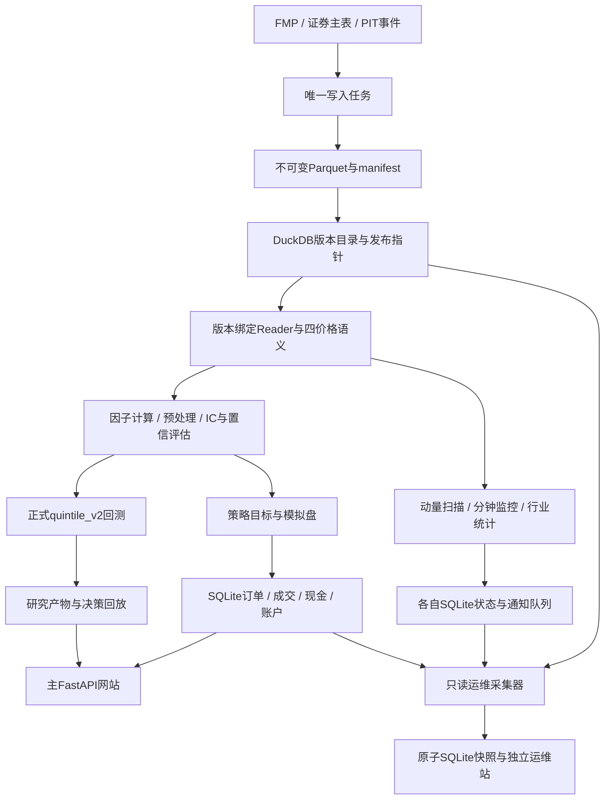

**Quant 首次接触式代码审查 · 2026-09-05**

审查基线为根仓库 `1149764d13539da6159ab0e927594d49d1f181f0`。本次重新建立文件清单、阅读全文、追踪调用链并构造新测试数据，没有使用历史审查报告或旧运行结果作为证据。业务代码、真实行情和账户均未修改。

结论：发现了足以改变研究结论的实现错误，尤其是正式回测的资金与费用计算、宽基价格连续性和历史成员筛选。现在的质量门禁主要证明文件完整、字段有效和版本身份一致，不能充分证明经济含义正确。应先修复这些问题，再重新生成受影响的研究结果。

本报告收录28项审查发现：27项代码缺陷和1项已声明但未隔离的账户功能缺口，其中6项优先处理。全部有本轮合成实验支持；前置条件和当前未开放路径另作说明。原仓库全量测试 **661 passed，2 warnings**，语法编译通过，交付的6个复现进程也全部退出成功。复现脚本断言的是“错误确实存在”，不是“错误已经修复”。

可继续查看[数据与因子详报](/Users/huozhihong/Documents/Quant/reviews/2026-09-05-fresh-audit/data_factors_report.md)、[回测/账户/Web详报](/Users/huozhihong/Documents/Quant/reviews/2026-09-05-fresh-audit/trading_web_report.md)、[动量与行业详报](/Users/huozhihong/Documents/Quant/reviews/2026-09-05-fresh-audit/signals_groups_report.md)、[市场研究与运维详报](/Users/huozhihong/Documents/Quant/reviews/2026-09-05-fresh-audit/root_report.md)、[逐文件阅读清单](/Users/huozhihong/Documents/Quant/reviews/2026-09-05-fresh-audit/reading_coverage.json)和[验证说明](/Users/huozhihong/Documents/Quant/reviews/2026-09-05-fresh-audit/validation.md)。

**本次范围与阅读方式**

按“固定版本与清单 → 四条业务链全文阅读 → 跨模块契约核对 → 隔离复现 → 按影响排序”的计划完成。三名协作审查者分别负责数据与因子、回测与账户/Web、动量与行业；主审负责市场研究、运维、公共配置、部署以及结论交叉核验。

| 阅读范围 | 文件数 | 文本行数，含注释和空行 |
|---|---:|---:|
| src：Python、JavaScript、HTML、CSS | 240 | 84,686 |
| scripts | 43 | 12,963 |
| tests 与 fixture | 77 | 22,828 |
| configs | 13 | 2,797 |
| deploy | 59 | 1,474 |
| Notebook，包含 JSON 与代码单元 | 1 | 196 |
| README、依赖、CI、忽略规则、目录占位文件 | 13 | 331 |
| 上述合计 | **446** | **125,275** |

另全文阅读9份架构/设计文档；部分其他设计文档仅作局部参考，不将它们计为全文读完。3份既往审查/修复记录主动排除，MSCI外部PDF不是本次源代码审查对象。详细路径、状态和SHA256见本目录的阅读清单。

根目录还有未跟踪的独立旧仓库 `quant-factor-framework/`，其HEAD不同。本次按根仓库及README声明的工程入口审查，不把旧副本混入当前调用关系，也不读取运行缓存和密钥文件。

**实际框架和流程**

普通数据链由 `MarketDataWriter` 统一下载、处理重叠区间、重基准、质量检查和发布，研究与网页通过发布版本读取。宽基另外维护稳定 `security_id`、证券生命周期、分月行情、月末完整成员快照和退市退出事件，再按因子与月份发布 raw/clean/rank 数据。SP500和NASDAQ100承担主要/次要验证，MAG7是固定参考池；宽基factor-data与正式IC研究有不同开放门槛。

因子链是行情宽表 → 原始因子 → PIT成员过滤及预处理 → 前向收益审计/IC/HAC → 分组回测 → 置信评估和版本化产物。当前配置暂停行业和市值中性化，避免用最新快照冒充历史数据。这些明确关闭的能力没有被本次审查误判为实现故障。

策略任务和模拟账户冻结策略配方及输入身份。账户以不可变成交和现金事件恢复状态，再处理挂单、分红、估值及下一轮目标。主Web管理业务对象并读取研究结果；独立运维站只读采集后的快照。

动量模块从发布日线准备候选，小时时间粒度合入报价，一分钟监控再计算开盘区间、VWAP、突破和杯柄形态。盘前摘要把预计算与限时投递分开；行业模块使用独立分类、覆盖率和发布规则。

大盘顶底研究是一条独立研究链：FMP/Cboe/FRED长期来源 → 可用时间校验 → 因果特征与未来结果标签 → 留出隔离及滚动筛选 → 研究状态页。它与动量模块简单的市场过滤器不是同一模型；当前完整PIT研究、最终生产批准和实时概率未开放，不应把历史候选当成今日信号。

**优先处理的六项代码缺陷**

1. **正式回测缺少真实持仓权重漂移。** [quintile_v2.py:172](/Users/huozhihong/Documents/Quant/src/backtest/quintile_v2.py:172) 每天简单平均成员收益，再独立生成交易明细。A、B初始各500，A先上涨至600、B保持500，下一段A再涨10%时，真实收益应为5.4545%，程序报5%；之后成员不变的调仓又输出0单。旧入口已经接入有状态引擎，但正式runner和研究入口调用的是v2。错误权重还能在回放中相互加总通过审计。详见TW-1。

2. **多空成本互相抵消。** [quintile_v2.py:219](/Users/huozhihong/Documents/Quant/src/backtest/quintile_v2.py:219) 用已经各自扣费的两腿相减，将空头腿费用加回。平盘、两腿各收10bps，程序多空收益为0，正确为−20bps。因子方向为负时，当前公式还会翻转成本方向。详见TW-2。

3. **宽基日更拼接不同复权基准。** [update_us_equity_coverage.py:806](/Users/huozhihong/Documents/Quant/scripts/update_us_equity_coverage.py:806) 直接拼接冻结父版本和新日期数据，没有普通writer的历史重基准步骤。合成2:1拆股的100→50，被真实发布链接受并输出−50%总收益；全部8项后置质量检查通过。该问题独立影响宽基因子与历史收益。详见DF1。

4. **PIT价格门槛含有未来拆股信息。** [derived_universe.py:493](/Users/huozhihong/Documents/Quant/src/data/derived_universe.py:493) 把拆股调整后的历史close直接与固定1美元门槛比较。同一历史日期、名义价格2美元且ADV600万美元的股票，在后来10:1拆股重写历史为0.2美元后，从历史成员中消失。即使修好第3项的收益连续性，这个历史选股偏差仍然存在。详见DF2。

5. **分钟线最终值会被首次临时值挡住。** [rolling.py:59](/Users/huozhihong/Documents/Quant/src/breakouts/live/rolling.py:59) 对已经出现的时间戳完全忽略后续数据，而入口允许当前未结束分钟进入存储。临时close=105、volume=100，最终close=95、volume=1000，下一周期仍使用105/100计算信号。读取时排除未完成分钟不足以修复存储中冻结的旧值。详见SG-1。

6. **模拟盘可以用未来卖款资助更早买单。** [runner.py:507](/Users/huozhihong/Documents/Quant/src/papertrading/runner.py:507) 先按SELL优先排序，再逐单寻找首个可用开盘并更新现金。有待成交买卖单、截止日跨至周三补跑，且卖出股票周二缺价时，周三卖款会资助周二的买单。复现结果最终现金0，但按实际成交日期重放，周二现金为−1000。必须按成交时间推进账本。详见TW-3。

这六项应优先修复。其中回测问题会改变净值、费用、容量与回放；数据问题会改变因子输入和历史样本；分钟数据问题会改变实时信号。不是仅调整显示文字就能解决。

**一项必须单独说明的账户边界**

模拟盘文档已经声明尚未包含拆股处理，但代码没有在跨拆股版本时阻断继续记账。旧成交账恢复出100股，2:1拆股后的最新价格50，账户正常发布权益5000；经济上应为200股、权益10000。这个问题应描述为“已声明但未隔离的功能缺口”，不能伪装成作者承诺了完整公司行动支持。检测并拒绝不兼容单位，或建立拆股事件及数量/成本调整，是继续信任账户净值的前提。定位：[runner.py:460](/Users/huozhihong/Documents/Quant/src/papertrading/runner.py:460)，详见TW-4。

**其他已经定位的问题**

以下编号对应分模块报告中的完整触发条件、原始结果和修复方向。P2表示应修复，但影响面或触发条件比前述六项更有限。

| 编号 | 问题与实际影响 | 主要定位 |
|---|---|---|
| DF3 | MAG7默认研究把基准QQQ也作为成员：实际8列，QQQ成员mask为True；污染标准化、排名和分组 | [run_mvp.py:260](/Users/huozhihong/Documents/Quant/scripts/run_mvp.py:260) |
| DF4 | 同一Security Master generation内，月中没有新事件的PIT增量报“没有合格股票”，相同数据全量重建通过 | [derived_universe.py:415](/Users/huozhihong/Documents/Quant/src/data/derived_universe.py:415) |
| DF5 | 修改预处理参数后续跑仍接受旧completed月份，使一次发布混合不同处理规则 | [run_broad_factor_data.py:578](/Users/huozhihong/Documents/Quant/scripts/run_broad_factor_data.py:578) |
| TW-5 | SQLite先读frame元信息、再读行数据，无同一读事务；正常并发更新可误报数据损坏 | [app_db.py:465](/Users/huozhihong/Documents/Quant/src/storage/app_db.py:465) |
| TW-6 | 日结消息ID固定、payload时间戳每次改变，同日第二次运行在投递前发生不可变内容冲突 | [notifications.py:477](/Users/huozhihong/Documents/Quant/src/papertrading/notifications.py:477) |
| TW-7 | 非空因子收益审计触发`json`未导入的NameError；空数据烟测不会发现 | [routes.py:238](/Users/huozhihong/Documents/Quant/src/webapp/routes.py:238) |
| TW-8 | 最大回撤漏掉初始本金：连续两次−10%，报−10%，应−19% | [metrics.py:95](/Users/huozhihong/Documents/Quant/src/backtest/metrics.py:95) |
| TW-9 | 双排序显式四价格接口仍把旧的`open_df=None`传给成交器；接通PIT市值后第一笔交易会失败 | [double_sort.py:265](/Users/huozhihong/Documents/Quant/src/backtest/double_sort.py:265) |
| TW-10 | 合法策略名`O'Brien`破坏删除按钮；特制名称还可在点击相关删除按钮时执行注入的脚本 | [strategy_list.html:38](/Users/huozhihong/Documents/Quant/src/webapp/templates/strategy_list.html:38) |
| SG-2 | Web自选列表永远绕过缓存，又禁止即时构建；非默认筛选组合也没有相应后台生成路径 | [application.py:389](/Users/huozhihong/Documents/Quant/src/breakouts/application.py:389) |
| SG-3 | 历史事件的MAE/MFE包含开盘退出后的整日高低点，持有期±1%被报成±50% | [historical_backtest.py:136](/Users/huozhihong/Documents/Quant/src/breakouts/historical_backtest.py:136) |
| SG-4 | 全部信号都在数据最后一天时，删失结果缺列，汇总`.dropna()`崩溃 | [historical_backtest.py:265](/Users/huozhihong/Documents/Quant/src/breakouts/historical_backtest.py:265) |
| SG-5 | 小时扫描以整批最新时间给所有报价定日；前日报价能冒充今日数据并通过严格筛选 | [engine.py:304](/Users/huozhihong/Documents/Quant/src/alerts/engine.py:304) |
| SG-6 | 杯柄零成交量生成Infinity和假MATCH，随后严格JSON序列化使周期保存失败 | [cup_handle.py:461](/Users/huozhihong/Documents/Quant/src/breakouts/live/cup_handle.py:461) |
| SG-7 | 行业服务忽略配置的reviewed group ID映射路径，实际与配置声称的来源不一致 | [service.py:209](/Users/huozhihong/Documents/Quant/src/group_analytics/service.py:209) |
| SG-8 | `require_benchmark=False`时，缺少可选基准的发布版本仍使有效股票的行业统计整体失败 | [adapters.py:799](/Users/huozhihong/Documents/Quant/src/group_analytics/adapters.py:799) |

DF4和TW-9属于有明确前置条件的缺陷：正常宽基整链通常更换master而改走全量；双排序目前又被PIT市值门槛阻断。不能把它们描述成今天每次正常任务都会报错。

**市场研究及运维的补充核验**

主审新增复现脚本单独检查统计指标、研究区间、来源刷新和快照时效。细节见`root_report.md`，包括以下五个问题：

- 当前默认1990–2026区间，即使PIT完全齐备，SPY从1993开始带来的EW-CW空值仍使该列覆盖率最高约91.56%，无法达到全历史95%的full_pit门槛。不是降低数据质量阈值的问题，需要正确处理特征可得起点。[pipeline.py:154](/Users/huozhihong/Documents/Quant/src/market_regime_research/pipeline.py:154)
- 默认`prepare`只因文件不存在或schema变化才刷新Cboe数据。已有文件落后一天时，不调用下载器而直接报stale，使常规刷新命令无法更新来源。[sources.py:950](/Users/huozhihong/Documents/Quant/src/market_regime_research/sources.py:950)
- Average Precision没有合并相同预测分数。完全相同的四个预测值，只改样本排列，得分会从1变为0.4167，正确值都应为0.5；离散特征和截尾产生的并列分数可能污染筛选指标。[screening.py:354](/Users/huozhihong/Documents/Quant/src/market_regime_research/screening.py:354)
- 配置允许`embargo=1`与60日标签并存。最后开发日期2021-12-30的标签用到2022-03-28，跨入声明封存的2022区间；默认60/60配置不触发此问题。[settings.py:484](/Users/huozhihong/Documents/Quant/src/market_regime_research/settings.py:484)
- 采集器停机后，运维站不根据快照年龄降级状态。2000年的快照仍显示采集器SUCCESS，健康接口为ok、没有快照过期事件。[store.py:747](/Users/huozhihong/Documents/Quant/src/operations/store.py:747)

**建议的修复顺序**

先统一正式回测与有状态资金账，并让交易、持仓、净值和回放使用同一计算结果；同时修好多空费用。随后修复宽基公司行动连续性和PIT名义价格门槛，重算受影响的输入版本和研究结果。账户的成交日期推进与拆股单位保护应在继续评价模拟盘绩效之前完成。再处理分钟线更新及逐条报价新鲜度，最后修复恢复、一致性读取、研究边界和界面故障。

测试应放在**实际正式入口**，至少覆盖持有权重漂移、成员不变但需要再平衡、两腿都扣费、跨版本公司行动、缺价造成的跨日成交以及同时间戳行情修订。当前已有测试通过，并不能替代这些经济和时间边界测试。

本次没有证明真实历史产物已经受到多大影响，也没有运行线上服务、真实行情请求或通知投递。具体受影响日期和结果需要在修复口径确定后另做版本重算对照；本次交付的是源码和合成实验支持的缺陷清单。
